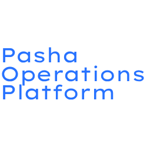
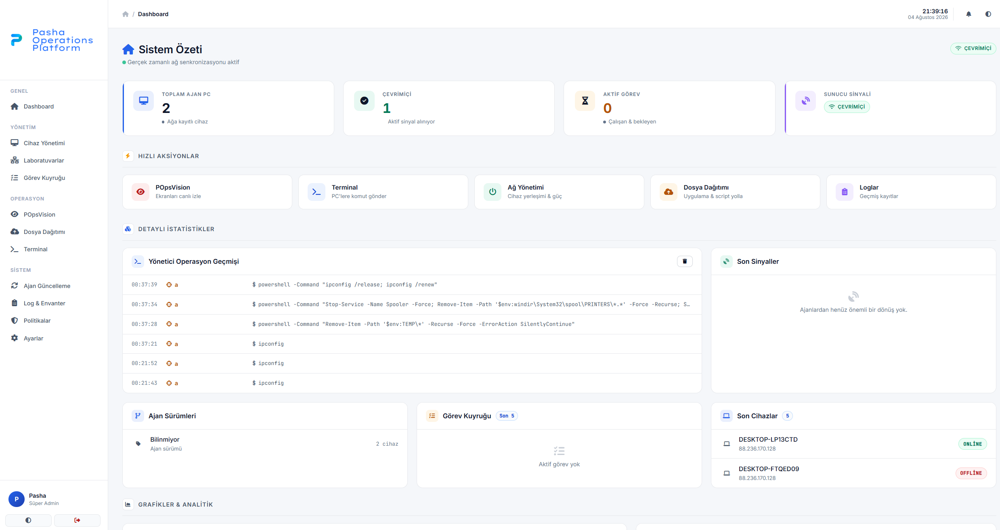
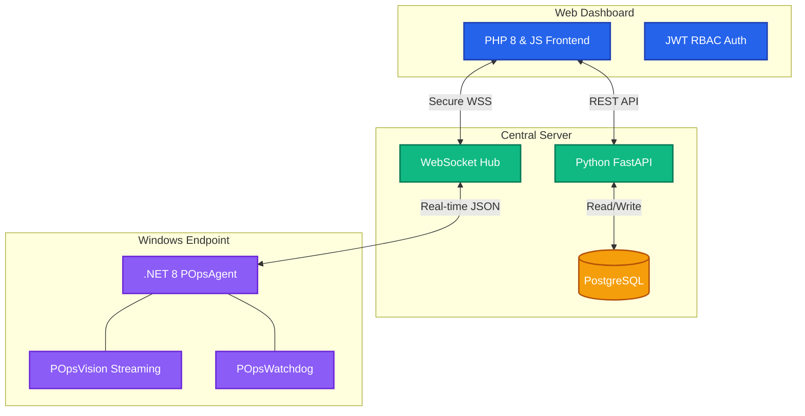
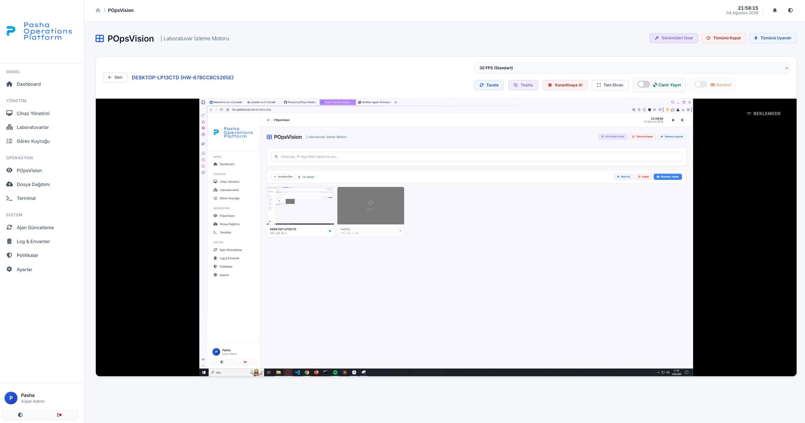
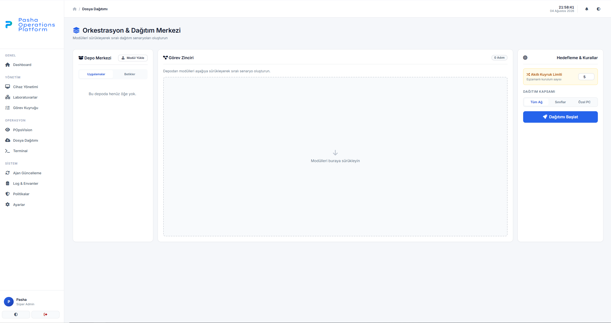
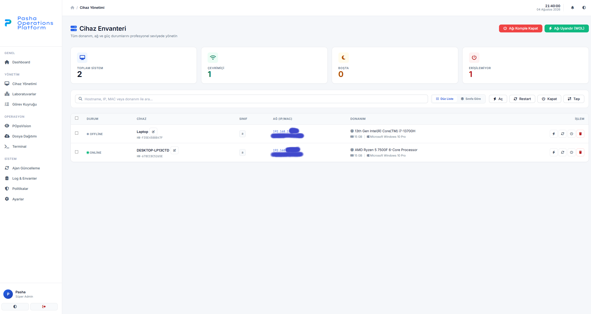
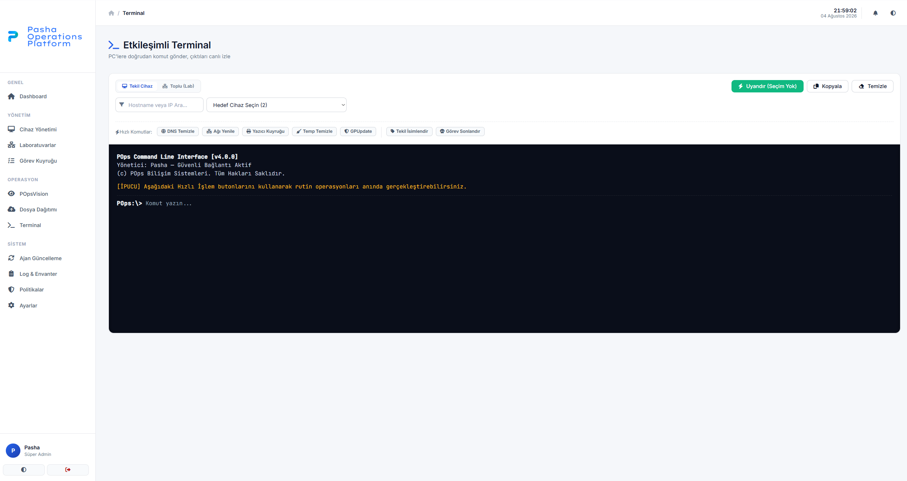

  
  
  # POps
  
  POps is an open-source endpoint operations platform that combines device management, remote assistance, software deployment and infrastructure automation into a single system.
  
   

  
  
  
  
  
   
  
  ⭐ **Open Source** &nbsp;&nbsp;•&nbsp;&nbsp; 🛡️ **Transparent by Design** &nbsp;&nbsp;•&nbsp;&nbsp; ⚡ **Real-time** &nbsp;&nbsp;•&nbsp;&nbsp; 🏫 **Built for Education & Teams**

 

> **🚧 Development Status**
> 
> POps is currently under active development. 
> 
> Documentation is being published first while the core components are gradually moved into this public repository. Early commits will mainly contain documentation, architecture, and infrastructure before source code is published.

---

## 🧠 Philosophy

POps was created around one simple idea:

> **Administrators should have powerful tools. Users should always know when those tools are being used.**

We believe transparency builds trust, and trusted systems create better institutions. That is why our core principle is being **Transparent by Design**.

---

## 📖 Why POps Exists

### The Problem

Modern IT teams still rely on fragmented tools for inventory, remote assistance, software deployment, monitoring, and policy management. Administrators often juggle multiple thick clients, spreadsheets, and web portals just to maintain a fleet of devices. 

### The Solution

**POps (Pasha Operations Platform)** brings these capabilities together in a single transparent platform designed for schools, IT teams, and managed environments. 

Instead of hiding administrative activity from users, POps embraces **transparency by design**, providing clear notifications, immutable audit logs, and privacy-conscious remote assistance.

  

 

---

## 🏗 Architecture

POps relies on a dual-socket, asynchronous architecture to guarantee responsiveness across thousands of devices.

For a deep dive into the 5-component agent system (Agent, Tray, Vision, Watchdog, Updater), read our full [Architecture Specification](docs/architecture.md).

---

## 📸 Screenshots

<b>View Gallery</b>

 

| Remote Assistance (Vision) | Software Deployment |
| :---: | :---: |
|  |  |

| Device Inventory | Remote Terminal |
| :---: | :---: |
|  |  |

---

## ✨ Core Features

| Feature | Description |
| :--- | :--- |
| **Endpoint Inventory** | Automatically track devices using immutable Hardware IDs (HWID). |
| **Live Monitoring** | Real-time telemetry, active window tracking, and idle detection. |
| **Remote Assistance** | POpsVision provides 1-5 FPS adjustable streaming and remote I/O control. |
| **Software Deployment** | Orchestrate ZIP and MSI installations across your entire fleet instantly. |
| **OTA Updates** | Agents update themselves seamlessly via the backend update server. |
| **Terminal** | Execute remote PowerShell commands directly from the web panel. |
| **Device Identity** | Secure device authentication blocking unauthorized agent spoofing. |
| **Audit Logs** | Comprehensive tracking of every action, maintaining full accountability. |
| **Role Based Access** | Strict JWT-based RBAC separating Admins, Managers, and Viewers. |
| **Multi Lab Management**| Group devices into logical labs for isolated policy enforcement. |

---

## 🚀 Roadmap

### v1.0 (Current Phase)
- [x] Dashboard & System Overview
- [x] Device Inventory & Heartbeats
- [x] Remote Assistance (POpsVision)
- [x] Mass Software Deployment Engine
- [x] Real-time Remote Terminal

### v2.0 (Coming Next)
- [ ] Active Directory (LDAP) Integration
- [ ] Advanced Group Policies
- [ ] Extensible Plugin SDK
- [ ] Linux & macOS Agents

*See the full [ROADMAP.md](ROADMAP.md) for more details.*

---

## 📚 Documentation

The `docs/` directory contains comprehensive guides for deploying, configuring, and extending POps.

- [Architecture & Design](docs/architecture.md)
- [Installation Guide](docs/installation.md)
- [Security Model](docs/security.md)
- [REST API Reference](docs/api.md)
- [Agent Specifications](docs/agent.md)

---

## 💻 Tech Stack

- **Agent:** `.NET 8`, `C#`, `Windows Forms`
- **Backend:** `Python 3.12`, `FastAPI`, `WebSockets`, `Uvicorn`
- **Database:** `PostgreSQL`, `SQLite`
- **Dashboard:** `PHP 8`, `Vanilla JS`, `CSS Custom Properties`

---

## 🤝 Contributing

We believe in open development. Whether it's fixing bugs, adding new features, or improving documentation, we welcome contributions! 

Please read our [Contributing Guidelines](CONTRIBUTING.md) and [Code of Conduct](CODE_OF_CONDUCT.md) before submitting a Pull Request.

---

## 🏢 About Pasha Core

POps is actively developed and maintained by **Pasha Core**.

[🌐 Website](https://pashacore.com.tr) • [🏢 Company LinkedIn](https://www.linkedin.com/company/112521167/) • [👤 Founder LinkedIn](https://www.linkedin.com/in/p4sha/) • [🐙 GitHub](https://github.com/PashaCore)

 

*Copyright © 2026 POps — Pasha Operations Platform. Licensed under the [Apache 2.0 License](LICENSE).*
