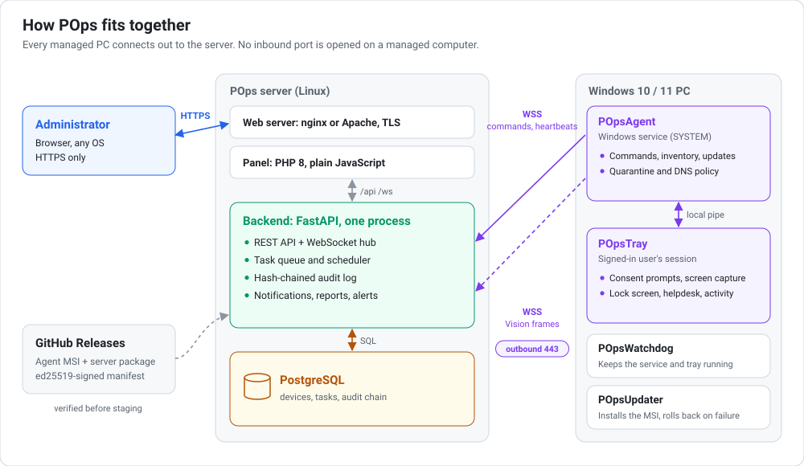
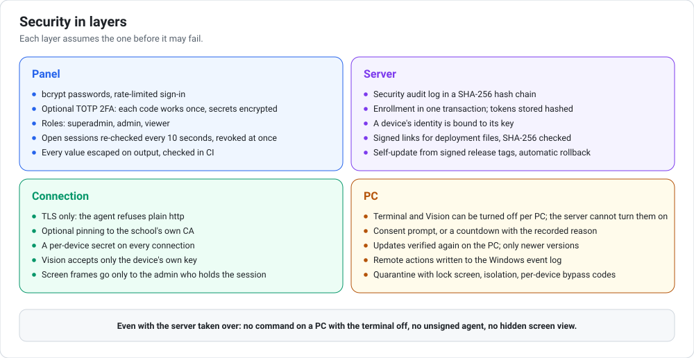
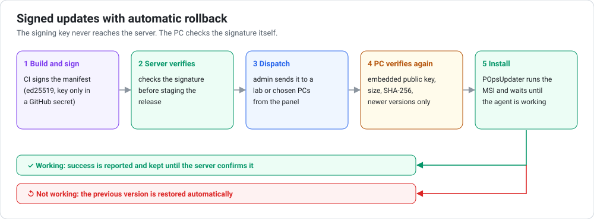
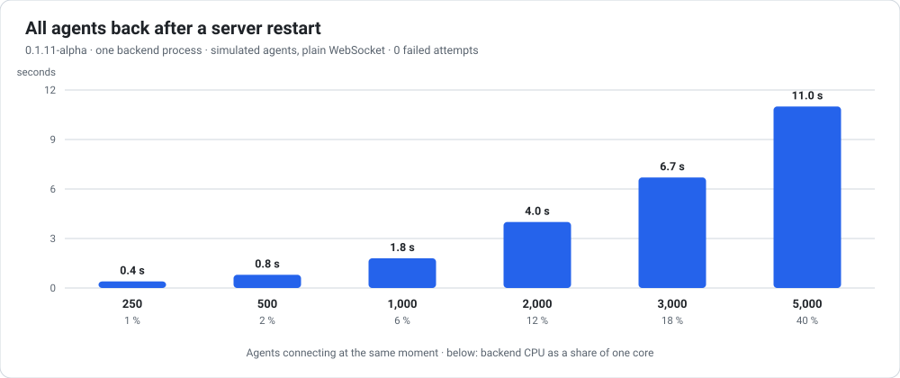
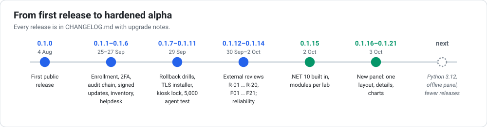

<div align="center">

  

  # POps

  **Open-source operations platform for school labs and managed Windows fleets:** inventory, remote support,
  software deployment, signed updates and audit in one system that is transparent to the people at the keyboard.

  <br />

  [](https://pashacore.com.tr)
  [](https://github.com/PashaCore/POps/tree/main/docs)
  [](https://github.com/PashaCore/POps/releases)
  [](https://github.com/PashaCore/POps/blob/main/LICENSE)

  [](https://github.com/PashaCore/POps/actions/workflows/ci.yml)
  [](https://github.com/PashaCore/POps/actions/workflows/codeql.yml)

  ⭐ **Open Source** &nbsp;•&nbsp; 🛡️ **Transparent by Design** &nbsp;•&nbsp; ⚡ **Real-time** &nbsp;•&nbsp; 🏫 **Built for Education & Teams**

  **English** · [Türkçe](README.tr.md)

</div>

<br />

> [!WARNING]
> **Alpha software.** The current version is on the [releases page](https://github.com/PashaCore/POps/releases/latest).
> The whole path from enrollment to a signed update with automatic rollback has been run on real Windows PCs, and the
> findings of external reviews have been worked through one by one. POps is
> still **not hardened for large or enterprise production**: read [`SECURITY.md`](SECURITY.md) for the threat model
> and the risks that remain, and [`ROADMAP.md`](ROADMAP.md) for what comes next.

> [!NOTE]
> The panel's interface is in **Turkish**. The documentation, the API and this README are in English; a Turkish
> README is [here](README.tr.md).

---

## Contents

- [At a glance](#-at-a-glance)
- [Why POps](#-why-pops)
- [What you can do with it](#-what-you-can-do-with-it)
- [How it works](#-how-it-works)
- [Security](#-security)
- [Transparency for the people at the PC](#-transparency-for-the-people-at-the-pc)
- [Signed updates and rollback](#-signed-updates-and-rollback)
- [Performance](#-performance)
- [Screenshots](#-screenshots)
- [Quick start](#-quick-start)
- [Requirements](#-requirements) · [Known limitations](#known-limitations)
- [Release history](#-release-history)
- [Quality and testing](#-quality-and-testing)
- [Repository layout](#-repository-layout)
- [Documentation](#-documentation)
- [Roadmap](#-roadmap)
- [Origins](#-origins)
- [Contributing, security reports and licence](#-contributing-security-reports-and-licence)

---

## 📌 At a glance

| | |
| :--- | :--- |
| **One server, many labs** | A single backend process brought **5,000 simulated agents** back within **11 seconds** of a restart, with no failed attempt ([report](docs/kapasite/README.md)). |
| **No inbound ports on PCs** | Each PC keeps two outbound connections to the server over TLS (port 443). Nothing listens on the managed computer. |
| **Updates that undo themselves** | Agent releases are ed25519-signed in CI, verified by the server *and again by the PC*, and rolled back automatically if the new version does not come up. |
| **Proof of who did what** | Security-relevant actions go to a SHA-256 hash-chained audit log on the server and to the Windows event log on the PC itself. |
| **Off means off** | A school can turn the remote terminal and screen view off per PC. The server can switch them off, never back on. |
| **Reviewed in the open** | Code-level security reviews requested by the maintainer (the reports themselves are not published) are tracked finding by finding (F1…F14, R-01…R-20, F01…F21) in [`CHANGELOG.md`](CHANGELOG.md), with the fix for each. |

---

## 🧠 Why POps

### The problem

A school's IT team usually keeps a lab running with a handful of separate tools: one for inventory, one for remote
help, a share for installers, a spreadsheet for licences, and nothing at all for "who did what on which PC". Those
tools are built for hidden administration of company laptops. In a school, the people at the keyboard are often
minors, and data protection law (KVKK in Türkiye) expects them to know when someone looks at their screen.

### The answer

**POps (Pasha Operations Platform)** puts inventory, remote support, deployment, updates, quarantine and audit
behind one web panel, and builds transparency in rather than bolting it on:

> **Administrators should have powerful tools. Users should always know when those tools are being used.**

POps is the operations layer *under* the classroom. It does not try to replace classroom-management software such
as Veyon; the two can run side by side ([positioning](docs/positioning.md)).

---

## ✨ What you can do with it

### Know the fleet

| Feature | What it does |
| :--- | :--- |
| **Devices and labs** | Every PC gets a stable hardware-derived ID. Group PCs into labs; new PCs can land in a lab automatically. |
| **Live state** | Online/offline, the signed-in user, the foreground program (name only, never window titles) and the agent's own health. |
| **Hardware inventory** | CPU, RAM, motherboard, GPU, disks, Windows version, IP and MAC per device. |
| **Software and Windows Update** | Installed programs and patch state per PC; install updates on request. |
| **Licences** | Count installations against purchased seats; warnings before expiry and on over-use. |
| **Reports** | Fleet, security events, software and updates, with formula-safe CSV export. |

### Act on it

| Feature | What it does |
| :--- | :--- |
| **Task queue** | Send a command to one PC, a lab or everyone, with a concurrency limit. Pause, resume, cancel (the process is stopped on the PC) and retry. Exit codes and honest states: `Failed`, `Interrupted`, `Unknown`, `Timed Out`. |
| **Terminal** | Run commands as SYSTEM from the browser and see the output, with quick actions for everyday fixes. |
| **Software deployment** | Build a chain of ZIP/MSI/script steps and send it to a lab. Files are downloaded through signed links and their SHA-256 is checked before anything runs. |
| **Scheduled tasks** | Once, daily or on chosen weekdays; written atomically so a run is never half-queued. |
| **Vision** | Live screen at 1–5 FPS with remote mouse and keyboard (Turkish layout from 0.1.14), only in an accepted or announced session. |
| **Wake-on-LAN** | Wake one PC, a lab or everything with a known MAC address. |
| **Quarantine** | Lock screen plus network isolation (only the POps server stays reachable). Lifted from the panel or offline with a per-device code that works once. |
| **DNS policy** | Detects visits to listed domains per category and can quarantine a PC that crosses a threshold. |

### Run it calmly

| Feature | What it does |
| :--- | :--- |
| **Helpdesk** | Students and staff open tickets from the tray ("Sorun bildir"); IT answers from the panel. |
| **Notifications** | Failed updates, takeover attempts, policy alerts, a full disk or an expiring certificate reach **Bildirimler** in the panel, e-mail or a webhook. |
| **Server self-update** | Update the backend from the panel to the latest release tag, with a health check and automatic rollback. |
| **Backups** | A nightly backup that is test-restored into a scratch database every time, with an optional off-site copy. |
| **Observability** | JSON logs with request IDs, Prometheus `/metrics`, and a diagnostics page with load figures. |
| **Retention** | Old event logs, finished tasks and read notifications are deleted on a schedule; the audit chain is kept. |

---

## 🏗 How it works

<picture>
  <source media="(prefers-color-scheme: dark)" srcset="assets/readme/architecture.en-dark.svg">
  
</picture>

- **One backend process** (Python, FastAPI) holds every agent, panel and Vision connection and stores state in
  PostgreSQL. The PHP panel is served by nginx or Apache next to it; the installer sets up HTTPS with a school CA
  or Let's Encrypt.
- **On each PC**, `POpsAgent` runs as a Windows service. It opens a **command channel** (heartbeats, tasks,
  results) and, when needed, a **Vision channel** for screen frames. `POpsTray` lives in the signed-in user's
  session: it asks for consent, captures the screen, shows the lock screen and the helpdesk, and talks to the service
  over a local pipe. `POpsWatchdog` keeps both running; `POpsUpdater` installs new versions and rolls back.
- **Agents connect out.** Nothing has to be opened on the PCs, and they keep working behind NAT. The agent refuses
  plain `http`, and can be pinned to the school's own certificate authority.

Details: [`docs/architecture.md`](docs/architecture.md), [`docs/agent.md`](docs/agent.md), and the reasoning
behind each design in [`docs/decisions.md`](docs/decisions.md).

---

## 🛡 Security

<picture>
  <source media="(prefers-color-scheme: dark)" srcset="assets/readme/security.en-dark.svg">
  
</picture>

The design assumes that any single layer can fail, including the server itself:

| If someone took over the POps server, could they… | |
| :--- | :--- |
| run a command on a PC whose terminal was turned off at install? | **No.** The capability policy lives on the PC; the server can only switch it off. |
| push a modified agent to the fleet? | **No.** The PC verifies the release signature with a key compiled into the agent; the signing key never reaches the server. |
| watch a screen without the person knowing? | **No.** A live session needs the user's consent, or shows a full-screen countdown with the recorded reason; previews are announced in the tray. |
| quietly erase what they did? | **Not quietly.** The audit chain breaks on edits, and each PC keeps its own record of remote actions in the Windows event log. |
| enroll a fake device under a real device's name? | **No.** A device that already has a key can only be re-enrolled after a superadmin allows it once. |

What the panel itself does: bcrypt passwords and rate-limited sign-in, optional TOTP 2FA (each code works once,
secrets encrypted at rest), roles (superadmin, admin, viewer), sessions re-checked every 10 seconds and revocable at
once, CSRF protection, and output escaping that CI checks on every change.

Read more: [`SECURITY.md`](SECURITY.md) (threat model, residual risks, how to report),
[`docs/security.md`](docs/security.md) (every control, with an operator checklist).

---

## 👁 Transparency for the people at the PC

POps is **transparent by design** ([decision D-17](docs/decisions.md)):

- **Consent first.** A routine Vision session starts only after the user accepts a prompt that names the
  administrator and the reason. A mandatory session (for example during an exam) shows a full-screen countdown
  before it starts, and its reason is recorded.
- **Nothing hidden.** The tray icon is always visible; there is no stealth mode and no keystroke logging.
- **"What did IT do on this PC?"** The tray lists the remote sessions, commands and quarantines of the last 30 days.
- **A record that stays on the PC.** Remote commands, sessions and quarantines are also written to the Windows event
  log (source "POps Agent"), independent of the server.
- **KVKK.** A notice template and a data inventory are in [`docs/kvkk-aydinlatma.md`](docs/kvkk-aydinlatma.md)
  (Turkish).

---

## 🔄 Signed updates and rollback

<picture>
  <source media="(prefers-color-scheme: dark)" srcset="assets/readme/updates.en-dark.svg">
  
</picture>

An update counts as successful only when the new agent is actually working. If it is not, `POpsUpdater` puts the
previous version back without anyone touching the PC, and the result reaches the panel and the Windows event log.
The rollback path has been drilled on real machines. The server updates itself the same way: to the newest signed
release tag, with a health check and automatic rollback ([`docs/self-update.md`](docs/self-update.md)).

---

## ⚡ Performance

<picture>
  <source media="(prefers-color-scheme: dark)" srcset="assets/readme/capacity.en-dark.svg">
  
</picture>

Measured on 0.1.11-alpha with one backend process, simulated agents and the agent's real reconnect back-off
(8 vCPU VM, PostgreSQL shared with other sites). In steady state 5,000 agents used about **40 % of one core**
(PostgreSQL 17 %) and **~69 MB + 0.16 MB per agent** of memory.

**What these numbers do not cover yet:** TLS, the health telemetry of 0.1.12, the batched heartbeat writes of
0.1.14 and Vision streams. A new run is planned. Full report with hardware sizing:
[`docs/kapasite/README.md`](docs/kapasite/README.md) (Turkish); raw data: [`BENCHMARKS.md`](BENCHMARKS.md).

---

## 📸 Screenshots

| Overview | Devices |
| :---: | :---: |
|  |  |
| **Vision** | **Software deployment** |
|  |  |

<details>
<summary><b>More screenshots</b></summary>
<br>

| Labs | Terminal |
| :---: | :---: |
|  |  |
| **Tasks** | **Logs and inventory** |
|  |  |
| **Policies** | **System and updates** |
|  |  |

</details>

---

## 🚀 Quick start

**1. Server** (Linux with systemd; AlmaLinux/RHEL/Rocky and Debian/Ubuntu are tested):

```bash
git clone https://github.com/PashaCore/POps.git
cd POps
sudo Installer/server/install.sh
```

The installer sets up PostgreSQL, the Python environment, the `.env` with generated secrets, the service, nginx
with PHP and HTTPS (a school CA by default, or Let's Encrypt), and prints the panel's **admin password** at the end.

**2. Panel:** open `https://<your-server>/`, sign in as `admin`, change the password and set up 2FA on **Ayarlar**.
On **Sistem**, create an **enrollment token** for a lab.

**3. Agent** on each Windows PC (no prerequisites: the .NET runtime comes with the agent), from an elevated prompt:

```
msiexec /i POps-Agent-<version>-win-x64.msi /qn SERVER_URL=https://<your-server> ENROLL_TOKEN=<token>
```

Add `TERMINAL_ENABLED=0` and/or `VISION_ENABLED=0` on PCs that do not need those features. The PC shows up in
**Cihazlar** within seconds.

Step by step: [`docs/quick-start.md`](docs/quick-start.md). Docker Compose is available as an option
([`docs/docker.md`](docs/docker.md)).

---

## 🧾 Requirements

| Part | Requirement |
| :--- | :--- |
| **Server** | Linux with systemd, PostgreSQL 13+, Python 3.10+ (3.12 recommended), PHP 8 with `curl`, nginx or Apache, a host name with a TLS certificate. A small VM is enough for a school ([sizing](docs/kapasite/README.md)). |
| **Managed PCs** | Windows 10 or 11, 64-bit. Nothing else: the agent brings its own .NET 10 runtime. |
| **Network** | Outbound HTTPS (443) from the PCs to the server, with the WebSocket upgrade allowed through proxies and firewalls. Wake-on-LAN needs UDP broadcasts to the lab subnet. |
| **Browser** | Any current browser. The panel loads nothing from other hosts (fonts and icons are bundled), so it works on a network without internet. |

Freeze software (Deep Freeze, Shadow Defender) works when the agent is enrolled before freezing
([details](Agent/README.md#machines-with-freeze-software)). See
[`docs/getting-started.md`](docs/getting-started.md#supported-systems).

### Known limitations

- **Screen view (Vision)** captures the primary monitor only, as JPEG frames. Remote Desktop and multi-user sessions,
  the UAC prompt (secure desktop), the sign-in screen and display scaling other than 100 % are not supported or not
  tested.
- **Checked by hand, not in CI:** the real MSI update and rollback on Windows (run on real PCs for every agent
  release), the Vision tunnel and the quarantine lock screen. CI runs the agent's unit tests, the server's
  integration tests and the deploy scripts against fakes ([`docs/testing.md`](docs/testing.md)).
- **One backend process.** No high availability yet; 5,000 simulated agents were measured on one process
  ([capacity](docs/kapasite/README.md)). Several schools or a district on one server is not a tested setup.
- **Unsigned Windows binaries.** Release manifests are ed25519-signed and checked by the server and the PC, but the
  executables have no Authenticode signature yet, so SmartScreen and some antivirus products may warn.
- **Release tags are SSH-signed from 0.1.22-alpha on**; earlier tags are not. To make self-update accept only signed
  tags, install [`keys/allowed_signers`](keys/allowed_signers) as `/etc/pops/allowed_signers`
  ([`docs/self-update.md`](docs/self-update.md)).
- **DNS** is detection and reporting only; blocking is planned. **API:** session-based only, no API tokens yet.
- **Panel language:** Turkish; the English interface is in progress.

---

## 🗓 Release history

<picture>
  <source media="(prefers-color-scheme: dark)" srcset="assets/readme/timeline.en-dark.svg">
  
</picture>

Every release, with upgrade notes, is in [`CHANGELOG.md`](CHANGELOG.md). Packages and signed manifests are on the
[releases page](https://github.com/PashaCore/POps/releases).

---

## ✅ Quality and testing

- **Backend:** twelve test suites, eleven of them against a real PostgreSQL and a running server: security invariants,
  2FA, agent authorization, remote-control rules, per-device keys, hardening, 20 simultaneous enrollments, agents
  from 0.1.11 to 0.1.14 against the current server, features, helpdesk and licences, operations. flake8 at zero.
- **Agent:** about 700 xUnit test runs on .NET 10 and on the .NET Framework 4.7.2 MSI custom actions, with a
  coverage floor in CI.
- **Install and operations:** migrations from an empty database, backup with test-restore, the TLS tool, release
  signing, and the deploy and self-update scripts (rollback, signed tags, unsafe settings) are tested in CI.
- **Panel:** PHP syntax and a check that refuses unescaped HTML output.
- **Supply chain:** CodeQL on every change, Dependabot, GitHub Actions pinned to commit SHAs, ed25519-signed
  releases whose CI job waits for the full test suite.
- **In the field:** update and rollback drills and release field tests on real Windows PCs.

How to run the suites locally: [`docs/testing.md`](docs/testing.md).

---

## 🗂 Repository layout

| Path | Contents |
| :--- | :--- |
| [`Agent/`](Agent) | Windows agent (.NET 10): `POps.Agent` service, `POpsTray`, `POpsWatchdog`, `POpsUpdater`, shared library `POps.Shared`, tests `POps.Tests`. |
| [`Backend/`](Backend) | FastAPI backend: `pops/` package, routers, migrations, tests. |
| [`Dashboard/`](Dashboard) | PHP 8 panel (Turkish UI). |
| [`Installer/`](Installer) | WiX MSI for the agent; server installer, deploy, self-update, backup and TLS scripts. |
| [`docs/`](docs) | Operator and developer documentation. |
| [`tools/`](tools) | Release signing, agent simulator for load tests, the panel's HTML output check. |
| [`docker/`](docker), [`docker-compose.yml`](docker-compose.yml) | Optional container setup. |
| [`keys/`](keys) | Release public key and the key procedures. |

---

## 📚 Documentation

| Start here | Operate | Understand |
| :--- | :--- | :--- |
| [Getting started](docs/getting-started.md) | [Configuration](docs/configuration.md) | [Architecture](docs/architecture.md) |
| [Quick start](docs/quick-start.md) | [Deployment](docs/deployment.md) | [Design decisions](docs/decisions.md) |
| [Installation](docs/installation.md) | [TLS](docs/tls.md) | [Security](docs/security.md) |
| [FAQ](docs/faq.md) | [Backup and restore](docs/backup.md) | [Agent](docs/agent.md) |
| [Troubleshooting](docs/troubleshooting.md) | [Server self-update](docs/self-update.md) | [Backend](docs/backend.md) |
| | [Docker](docs/docker.md) | [Database](docs/database.md) |
| | [Dashboard](docs/dashboard.md) | [REST and WebSocket API](docs/api.md) |
| | [Vision](docs/vision.md) | [Testing](docs/testing.md) |
| | [KVKK notice (TR)](docs/kvkk-aydinlatma.md) | [Positioning](docs/positioning.md) |

---

## 🧭 Roadmap

Next: the 0.1.14 reliability round (database time limits, batched heartbeats, retention, disk and certificate
alerts, Turkish keyboard in remote control), then an architecture round: a full task state machine, signed commands,
mTLS, an append-only audit role, lab-scoped permissions, high availability, RDP support, a new 5,000-agent run over
HTTPS and end-to-end tests on a Windows test machine. The whole list, with design notes: [`ROADMAP.md`](ROADMAP.md).

---

## 🌱 Origins

POps grew out of a graduation project. An earlier version ran for about two to three months in a real computer lab
of a Turkish public university's IT department, with the department's knowledge. Automating those machines, keeping
an inventory, and doing it openly for the people at the keyboard shaped the current design. This repository is the
open-source redesign of that work, within clear legal and ethical bounds.

---

## 🤝 Contributing, security reports and licence

- **Contributing:** read [`CONTRIBUTING.md`](CONTRIBUTING.md) and the [Code of Conduct](CODE_OF_CONDUCT.md).
  Bug reports, documentation and tests are as welcome as features.
- **Security:** do not open a public issue; e-mail **security@pashacore.com.tr** ([`SECURITY.md`](SECURITY.md)).
- **Licence:** [Apache 2.0](LICENSE).

### 🏢 About Pasha Core

POps is developed and maintained by **Pasha Core**. Created by Mehmet Ali Avcı
([LinkedIn](https://www.linkedin.com/in/p4sha/) · [GitHub](https://github.com/TheP4SHA)).

[🌐 Website](https://pashacore.com.tr) • [🏢 Company LinkedIn](https://www.linkedin.com/company/112521167/) • [👤 Founder LinkedIn](https://www.linkedin.com/in/p4sha/) • [🐙 GitHub](https://github.com/PashaCore)

<br/>

*Copyright © 2026 POps — Pasha Operations Platform. Licensed under the [Apache 2.0 License](LICENSE).*
