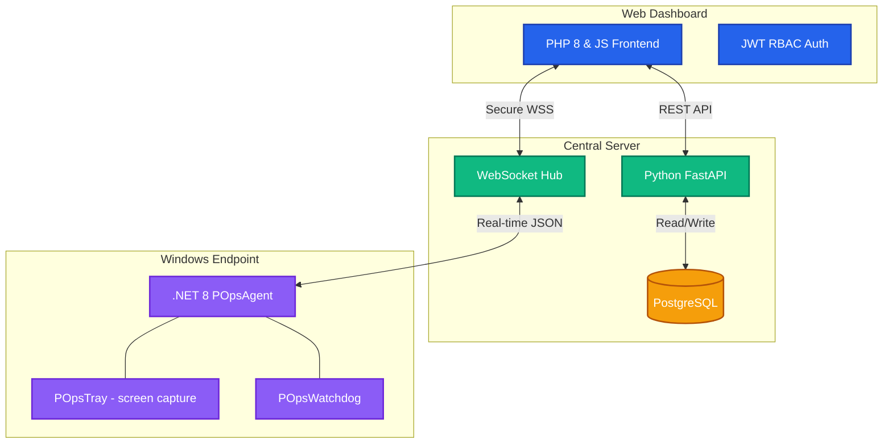

  
  
  # POps
  
  POps is an open-source endpoint operations platform that combines device management, remote assistance, software deployment and infrastructure automation into a single system.
  
   

  
  
  
  
  
   
  
  ⭐ **Open Source** &nbsp;&nbsp;•&nbsp;&nbsp; 🛡️ **Transparent by Design** &nbsp;&nbsp;•&nbsp;&nbsp; ⚡ **Real-time** &nbsp;&nbsp;•&nbsp;&nbsp; 🏫 **Built for Education & Teams**

 

> **🚧 Status: Alpha**
> 
> POps is in active development (alpha). The agent, backend and dashboard source are published and build in CI, and the full device-enrollment, per-device authentication and signed over-the-air update flow has been validated end to end on a real Windows machine. It is **not yet hardened for large-scale or enterprise production** — see [`SECURITY.md`](SECURITY.md) for the threat model and the current residual risks. Opt-in **2FA**, a **tamper-evident audit hash-chain**, and an agent-side **capability policy** (hard-disable terminal/Vision per device) have all landed; remaining hardening such as **mTLS** is on the roadmap.

---

## 🧠 Philosophy

POps was created around one simple idea:

> **Administrators should have powerful tools. Users should always know when those tools are being used.**

We believe transparency builds trust, and trusted systems create better institutions. That is why our core principle is being **Transparent by Design**.

---

## 🌱 Origins

POps grew out of a graduation project: an earlier version was built for, and ran in, a real computer lab at a Turkish public university's IT department for roughly two to three months (with the department's awareness). That real-world use — automating machines, keeping an inventory, and doing it transparently for the people at the keyboard — is what shaped the current design. This repository is the open-source redesign of that work within clear legal and ethical bounds.

---

## 📖 Why POps Exists

### The Problem

Modern IT teams still rely on fragmented tools for inventory, remote assistance, software deployment, monitoring, and policy management. Administrators often juggle multiple thick clients, spreadsheets, and web portals just to maintain a fleet of devices. 

### The Solution

**POps (Pasha Operations Platform)** brings these capabilities together in a single transparent platform designed for schools, IT teams, and managed environments. 

Instead of hiding administrative activity from users, POps embraces **transparency by design**, providing clear notifications, an administrative audit trail, and privacy-conscious remote assistance.

  

 

---

## 🏗 Architecture

POps relies on a dual-socket, asynchronous architecture to stay responsive across a lab or a multi-lab fleet. Measured, reproducible capacity of the **command channel** (**[capacity report with charts](docs/kapasite/README.md)**, Turkish; raw numbers in [`BENCHMARKS.md`](BENCHMARKS.md)): with 0.1.11-alpha, simulated agents connecting and sending heartbeats over plain WebSocket on the same host, one server process brought **5,000 agents back within 11 seconds** of a restart with no failed attempt, and in steady state used 40 % of one core (PostgreSQL 17 %) and ~69 MB + 0.16 MB per agent. Not measured yet: TLS, the health telemetry added in 0.1.12, the batched heartbeat writes of 0.1.14, and Vision streams; a new run is planned. Hardware guidance by fleet size is in the report. More workers + Redis are about availability, not capacity.

```mermaid
graph TD
    classDef frontend fill:#2563EB,stroke:#1E40AF,stroke-width:2px,color:#fff;
    classDef backend fill:#10B981,stroke:#047857,stroke-width:2px,color:#fff;
    classDef agent fill:#8B5CF6,stroke:#6D28D9,stroke-width:2px,color:#fff;
    classDef db fill:#F59E0B,stroke:#B45309,stroke-width:2px,color:#fff;

    subgraph "Web Dashboard"
        UI[PHP 8 & JS Frontend]:::frontend
        Auth[JWT RBAC Auth]:::frontend
    end

    subgraph "Central Server"
        API[Python FastAPI]:::backend
        WS[WebSocket Hub]:::backend
        DB[(PostgreSQL)]:::db
    end

    subgraph "Windows Endpoint"
        Agent[.NET 8 POpsAgent]:::agent
        Vision[POpsTray - screen capture]:::agent
        Watchdog[POpsWatchdog]:::agent
    end

    UI <-->|REST API| API
    UI <-->|Secure WSS| WS
    API <-->|Read/Write| DB
    WS <-->|Real-time JSON| Agent
    
    Agent --- Vision
    Agent --- Watchdog
```

For a deep dive into the agent (service, tray with screen capture, watchdog and updater, sharing one helper library), read the [Architecture Specification](docs/architecture.md).

---

## 📸 Screenshots

<b>View Gallery</b>

 

| Remote Assistance (Vision) | Software Deployment |
| :---: | :---: |
|  |  |

| Device Inventory | Remote Terminal |
| :---: | :---: |
|  |  |

---

## ✨ Core Features

| Feature | Description |
| :--- | :--- |
| **Endpoint Inventory** | Automatically track devices using stable, hardware-derived IDs (HWID). |
| **Live Monitoring** | Online/offline state, heartbeats, hardware inventory, the signed-in user and the foreground program (name only, never window titles) per device and lab. |
| **Remote Assistance** | Vision: 1-5 FPS screen view (captured by the tray) for admins with an open, audited session; remote mouse/keyboard only while the user has accepted or been notified of that session. |
| **Software Deployment** | Orchestrate ZIP and MSI installations across your entire fleet instantly. |
| **Signed Updates** | Agent MSIs are ed25519-signed, dispatched from the panel (downloaded from GitHub or uploaded offline) and rolled back automatically if the new version does not start. The server updates itself from the panel too. |
| **Scheduled Tasks** | Run a command once, daily or on chosen weekdays on all devices, a lab or selected devices. |
| **Notifications** | Update failures, takeover attempts, policy violations and similar events under the panel bell, optionally by e-mail or webhook. |
| **Reports** | Fleet, security-event, software and Windows update reports with CSV export. |
| **Terminal** | Execute remote PowerShell commands directly from the web panel. |
| **Device Identity** | Secure device authentication blocking unauthorized agent spoofing. |
| **Audit Logs** | Security-relevant actions recorded in a tamper-evident, hash-chained log (see `SECURITY.md`). |
| **Role Based Access** | Superadmin, admin and viewer roles with per-page permissions; sessions can be revoked at once. |
| **Multi Lab Management**| Group devices into logical labs for isolated policy enforcement. |

---

## 🚀 Roadmap

What is done, what is being built and what is planned is kept in one place: [ROADMAP.md](ROADMAP.md). The
changes in each release are in [CHANGELOG.md](CHANGELOG.md).

---

## 📚 Documentation

The `docs/` directory contains comprehensive guides for deploying, configuring, and extending POps.

- [Architecture & Design](docs/architecture.md)
- [Installation Guide](docs/installation.md)
- [Security Model](docs/security.md)
- [REST API Reference](docs/api.md)
- [Agent Specifications](docs/agent.md)

---

## 💻 Tech Stack

- **Agent:** `.NET 8`, `C#`, `Windows Forms`
- **Backend:** `Python 3.9+`, `FastAPI`, `WebSockets`, `Uvicorn`
- **Database:** `PostgreSQL`
- **Dashboard:** `PHP 8`, `Vanilla JS`, `CSS Custom Properties`

---

## 🤝 Contributing

We believe in open development. Whether it's fixing bugs, adding new features, or improving documentation, we welcome contributions! 

Please read our [Contributing Guidelines](CONTRIBUTING.md) and [Code of Conduct](CODE_OF_CONDUCT.md) before submitting a Pull Request.

---

## 🏢 About Pasha Core

POps is actively developed and maintained by **Pasha Core**.

[🌐 Website](https://pashacore.com.tr) • [🏢 Company LinkedIn](https://www.linkedin.com/company/112521167/) • [👤 Founder LinkedIn](https://www.linkedin.com/in/p4sha/) • [🐙 GitHub](https://github.com/PashaCore)

 

*Copyright © 2026 POps — Pasha Operations Platform. Licensed under the [Apache 2.0 License](LICENSE).*
