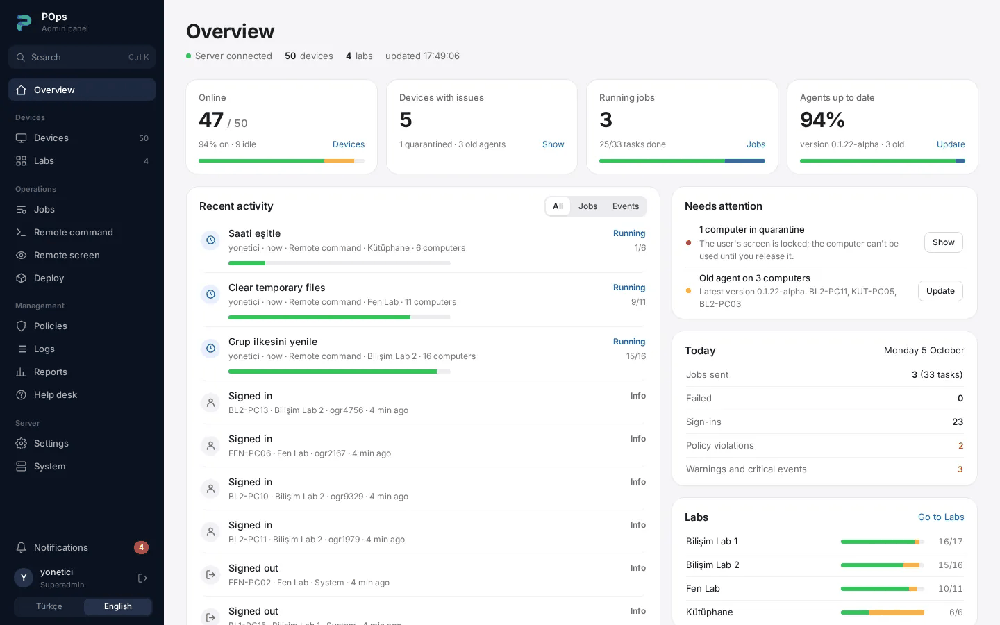
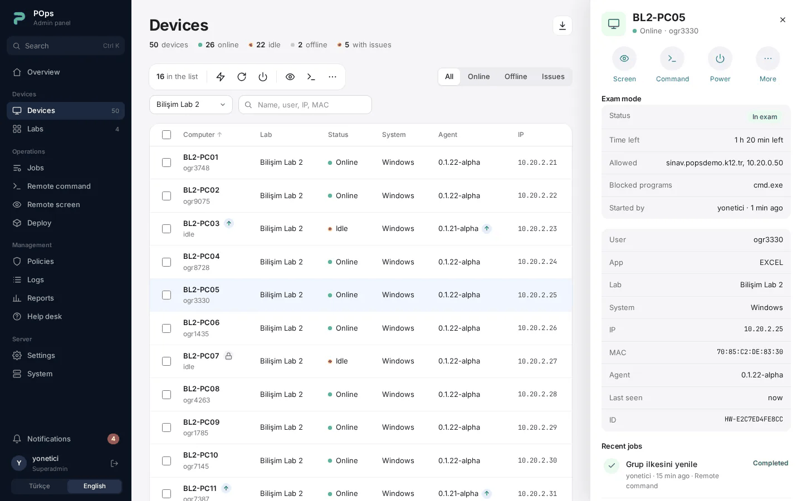
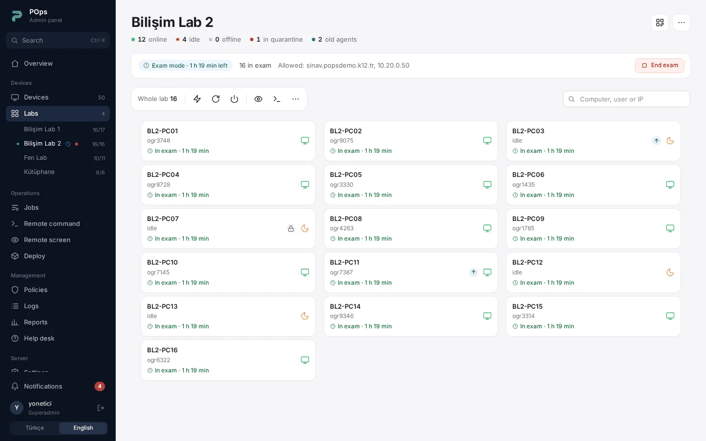
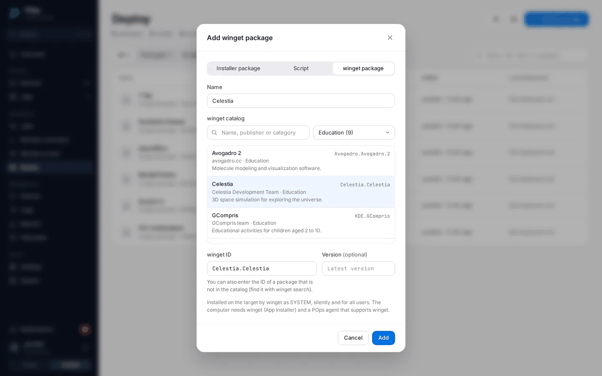
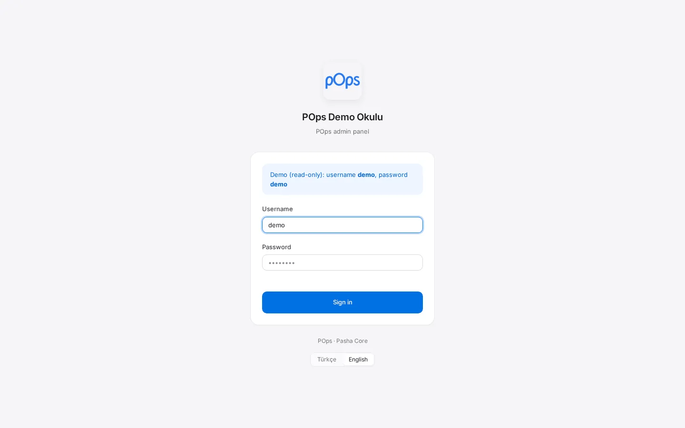
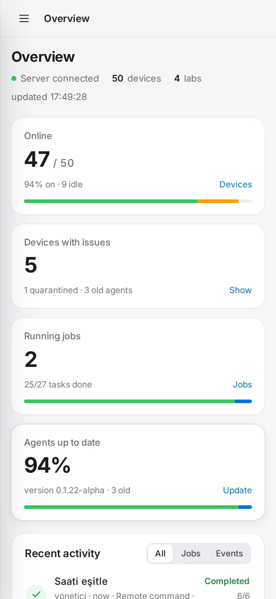

<div align="center">

  

  # POps

  **Open-source operations platform for school labs and managed Windows fleets:** inventory, remote support,
  software deployment, signed updates and audit in one system that is transparent to the people at the keyboard.

  <br />

  [](https://pashacore.com.tr)
  [](https://github.com/PashaCore/POps/tree/main/docs)
  [](https://github.com/PashaCore/POps/releases)
  [](https://github.com/PashaCore/POps/blob/main/LICENSE)

  [](https://github.com/PashaCore/POps/actions/workflows/ci.yml)
  [](https://github.com/PashaCore/POps/actions/workflows/codeql.yml)
  [](https://scorecard.dev/viewer/?uri=github.com/PashaCore/POps)

  ⭐ **Open Source** &nbsp;•&nbsp; 🛡️ **Transparent by Design** &nbsp;•&nbsp; ⚡ **Real-time** &nbsp;•&nbsp; 🏫 **Built for Education & Teams**

  **English** · [Türkçe](README.tr.md)

</div>

<br />

> [!WARNING]
> **Alpha software.** The current version is on the [releases page](https://github.com/PashaCore/POps/releases/latest).
> The whole path from enrollment to a signed update with automatic rollback has been run on real Windows PCs, and the
> findings of external reviews have been worked through one by one. POps is
> still **not hardened for large or enterprise production**: read [`SECURITY.md`](SECURITY.md) for the threat model
> and the risks that remain, and [`ROADMAP.md`](ROADMAP.md) for what comes next.

> [!NOTE]
> Every page of the panel is in **Turkish** and **English**, chosen per browser. The documentation, the API and this
> README are in English; a Turkish README is [here](README.tr.md).

> [!TIP]
> **Try it without installing:** a public, read-only demo runs at
> [demo.pashacore.com.tr](https://demo.pashacore.com.tr) (user `demo`, password `demo`). It shows a made-up school
> with 50 PCs and two weeks of history, and it is reset every night. Nothing can be changed there.

---

## Contents

- [At a glance](#-at-a-glance)
- [Why POps](#-why-pops)
- [What you can do with it](#-what-you-can-do-with-it)
- [How it works](#-how-it-works)
- [Security](#-security)
- [Transparency for the people at the PC](#-transparency-for-the-people-at-the-pc)
- [Signed updates and rollback](#-signed-updates-and-rollback)
- [Performance](#-performance)
- [Screenshots](#-screenshots)
- [Quick start](#-quick-start)
- [Requirements](#-requirements) · [Known limitations](#known-limitations)
- [Linux and Pardus](#-linux-and-pardus)
- [Release history](#-release-history)
- [Quality and testing](#-quality-and-testing)
- [Repository layout](#-repository-layout)
- [Documentation](#-documentation)
- [Roadmap](#-roadmap)
- [Origins](#-origins)
- [Contributing, security reports and licence](#-contributing-security-reports-and-licence)

---

## 📌 At a glance

| | |
| :--- | :--- |
| **One server, many labs** | A single backend process brought **5,000 simulated agents** back within **11 seconds** of a restart, with no failed attempt ([report](docs/kapasite/README.md)). Several workers with Redis are optional ([`docs/ha.md`](docs/ha.md)). |
| **Schools and districts** | Organisational units (district → school): each admin and API token sees and acts only on its own schools, checked by the server on every endpoint. Sign-in with Active Directory/LDAP or OpenID Connect. |
| **No inbound ports on PCs** | Each PC keeps two outbound connections to the server over TLS (port 443). Nothing listens on the managed computer, unless an admin turns on the optional lab peer cache for updates (off by default; TCP 8817, local subnet only). |
| **Updates that undo themselves** | Agent releases are ed25519-signed in CI, verified by the server *and again by the PC*, and rolled back automatically if the new version does not come up. |
| **Proof of who did what** | Security-relevant actions go to a SHA-256 hash-chained audit log on the server and to the Windows event log on the PC itself. |
| **Off means off** | A school can turn the remote terminal, screen view, exam mode, file transfer, power actions, messages and the peer cache off per PC. The server can switch them off, never back on. |
| **Reviewed in the open** | Code-level security reviews requested by the maintainer (the reports themselves are not published) are tracked finding by finding (F1…F14, R-01…R-20, F01…F21) in [`CHANGELOG.md`](CHANGELOG.md), with the fix for each. |

---

## 🧠 Why POps

### The problem

A school's IT team usually keeps a lab running with a handful of separate tools: one for inventory, one for remote
help, a share for installers, a spreadsheet for licences, and nothing at all for "who did what on which PC". Those
tools are built for hidden administration of company laptops. In a school, the people at the keyboard are often
minors, and data protection law (KVKK in Türkiye) expects them to know when someone looks at their screen.

### The answer

**POps (Pasha Operations Platform)** puts inventory, remote support, deployment, updates, quarantine and audit
behind one web panel, and builds transparency in rather than bolting it on:

> **Administrators should have powerful tools. Users should always know when those tools are being used.**

POps is the operations layer *under* the classroom. It does not try to replace classroom-management software such
as Veyon; the two can run side by side ([positioning](docs/positioning.md); in Turkish:
[POps ve Veyon birlikte](docs/tr/veyon-ile-birlikte.md)).

---

## ✨ What you can do with it

### Know the fleet

| Feature | What it does |
| :--- | :--- |
| **Devices and labs** | Every PC gets a stable hardware-derived ID. Group PCs into labs; new PCs can land in a lab automatically. Windows PCs, and Linux PCs with the first version of the Linux agent; the list shows each device's system. |
| **Live state** | Online/offline, the signed-in user, the foreground program (name only, never window titles), exam state and the agent's own health. |
| **Hardware inventory** | CPU, RAM, motherboard, GPU, disks, operating system, IP and MAC per device. |
| **Software and Windows Update** | Installed programs (installed packages on Linux) and Windows patch state per PC; install updates on request. |
| **Licences** | Count installations against purchased seats; warnings before expiry and on over-use. |
| **Reports** | Fleet, security events, software and updates, with formula-safe CSV export. |

### Act on it

| Feature | What it does |
| :--- | :--- |
| **Task queue** | Send a command to one PC, a lab or everyone, with a concurrency limit. Pause, resume, cancel (the process is stopped on the PC) and retry. Exit codes and honest states: `Failed`, `Interrupted`, `Unknown`, `Timed Out`. |
| **Terminal** | Run commands as SYSTEM (as root with `/bin/sh` on Linux) from the browser and see the output, with quick actions for everyday fixes. |
| **Software deployment** | Build a chain of ZIP/MSI/script steps and send it to a lab. Files are downloaded through signed links and their SHA-256 is checked before anything runs. |
| **winget packages** | Add a package from a catalogue of 69 school and office apps, or any winget ID with an optional version. winget installs it as SYSTEM, silently, for all users. |
| **Scheduled tasks** | Once, daily or on chosen weekdays; written atomically so a run is never half-queued. |
| **Vision** | Live screen with remote mouse and keyboard (Turkish layout), only in an accepted or announced session. With Vision v2 the PC captures with DXGI and sends only changed regions as binary frames; the viewer picks one screen or all side by side, sets quality, scale and up to 10 FPS, and can share text through the clipboard (up to 64 KB) in a session the user accepted. |
| **Exam mode** | Per lab, for at most 8 hours: the PCs reach only the POps server, DNS/DHCP and an allow list of up to 50 names, addresses or networks; the tray shows your message, listed programs are closed, and the exam ends on time even offline. The lab shows each PC's state. |
| **File transfer** | Send a file of up to 200 MB to the public desktop or the POps inbox of selected PCs, or fetch a file from a PC, always with a reason. Fetched files are kept 7 days. |
| **Power and messages** | Shut down, restart, sign out or lock, with a countdown of up to 10 minutes and a note the user sees. Send a message to the signed-in user, with an optional read receipt. |
| **Wake-on-LAN** | Wake one PC, a lab or everything with a known MAC address. |
| **Quarantine** | Lock screen plus network isolation (only the POps server stays reachable). Lifted from the panel or offline with a per-device code that works once. |
| **DNS policy** | Detects visits to listed domains per category and can quarantine a PC that crosses a threshold. |

### Run it calmly

| Feature | What it does |
| :--- | :--- |
| **Helpdesk** | Students and staff open tickets from the tray ("Sorun bildir"); IT answers from the panel. |
| **Notifications** | Failed updates, takeover attempts, policy alerts, a full disk or an expiring certificate reach **Bildirimler** in the panel, e-mail or a webhook. |
| **Server self-update** | Update the backend from the panel, with a health check and automatic rollback: to the latest release tag (stable channel), or to the latest `main` on a test server (preview channel). Before a migration that rewrites tables, the deploy takes a database dump. |
| **Backups** | A nightly backup that is test-restored into a scratch database every time, with an optional off-site copy. |
| **Observability** | JSON logs with request IDs, Prometheus `/metrics`, a diagnostics page with load figures, and charts of the last 24 hours, 7 days or 30 days on **Sistem → Genel bakış** (agents, CPU and memory, API requests, tasks, events, database and disk). |
| **Retention** | Old event logs, finished tasks and read notifications are deleted on a schedule; the audit chain is kept. Each agent keeps its own log folder to 30 days and 200 MB. |
| **Organisational units** | A tree of units (district → school) on **Ayarlar → Birimler**. Labs belong to units; users and API tokens get a scope and see only their own schools. Nothing changes until you create units. |
| **Directory sign-in** | Active Directory/LDAP (LDAPS or StartTLS) or OpenID Connect (Microsoft Entra ID, Google, Keycloak …). Groups map to roles, pages and units; local accounts keep working when the directory is down ([Turkish how-to](docs/tr/active-directory-ile-giris.md)). |
| **Modules** | **Sistem → Modüller** shows every module per organisation and lab, with its dependencies, and shows what will stop before you turn one off. |
| **API for automation** | A versioned `/api/v1` with REST names, API tokens with the viewer or admin role (shown once, stored only as a hash), and the OpenAPI file in the repository ([`docs/api.md`](docs/api.md)). Unknown fields in a request body are refused with `422`; timestamps are ISO 8601 with an offset. |
| **GLPI export** | Computers, installed software and helpdesk tickets go to GLPI's REST API on a schedule or on demand. Off by default ([`docs/integrations/glpi.md`](docs/integrations/glpi.md)). |
| **Several workers (optional)** | With `REDIS_URL` set, the backend runs as several workers or on several servers behind a load balancer, without sticky sessions ([`docs/ha.md`](docs/ha.md)). |
| **Your organisation** | Your organisation's name and logo on the sign-in page (**Ayarlar → Genel → Kurum**). |
| **Two languages** | Every panel page in Turkish and English, chosen per browser; the sign-in page follows the browser's language until you choose. |

---

## 🏗 How it works

<picture>
  <source media="(prefers-color-scheme: dark)" srcset="assets/readme/architecture.en-dark.svg">
  
</picture>

- **One backend process** (Python, FastAPI) holds every agent, panel and Vision connection and stores state in
  PostgreSQL. The PHP panel is served by nginx or Apache next to it; the installer sets up HTTPS with a school CA
  or Let's Encrypt. Optionally, several workers or servers share commands, screen frames, session grants and
  counters through **Redis** ([`docs/ha.md`](docs/ha.md)); if Redis is down, each worker keeps its own agents and
  panels running.
- **On each Windows PC**, `POpsAgent` runs as a Windows service. It opens a **command channel** (heartbeats, tasks,
  results) and, when needed, a **Vision channel** for screen frames. `POpsTray` lives in the signed-in user's
  session: it asks for consent, captures the screen, shows the lock screen, exam banner, countdowns, messages and
  the helpdesk, and talks to the service over a local pipe. `POpsWatchdog` keeps both running; `POpsUpdater`
  installs new versions and rolls back.
- **On a Linux PC** (first version), `pops-agent` is a systemd service written in Python on the distribution's own
  packages. It speaks the same protocol and uses the same enrollment, capability policy and signed updates; it has
  no screen view, quarantine or tray yet ([`Agent-Linux/README.md`](Agent-Linux/README.md)).
- **Agents connect out.** Nothing has to be opened on the PCs, and they keep working behind NAT. The agent refuses
  plain `http`, and can be pinned to the school's own certificate authority. The only exception is the optional
  lab peer cache for updates (below).
- **One protocol, negotiated features.** Every agent message is defined as JSON Schema in
  [`docs/protocol`](docs/protocol/README.md), with example messages that the backend and the agent tests share. The
  agent announces what it implements in an `X-Agent-Features` header (`exam`, `files`, `winget`, `power`, `message`,
  `peer_cache`) and the server lists its own features in `server_info`, so a new feature is sent only to agents that
  have it, and older agents are skipped or get the old command.

Details: [`docs/architecture.md`](docs/architecture.md), [`docs/agent.md`](docs/agent.md), and the reasoning
behind each design in [`docs/decisions.md`](docs/decisions.md).

---

## 🛡 Security

<picture>
  <source media="(prefers-color-scheme: dark)" srcset="assets/readme/security.en-dark.svg">
  
</picture>

The design assumes that any single layer can fail, including the server itself:

| If someone took over the POps server, could they… | |
| :--- | :--- |
| run a command, move a file, start an exam or shut down a PC where that was turned off at install? | **No.** The capability policy lives on the PC; the server can only switch it off. |
| push a modified agent to the fleet? | **No.** The PC verifies the release signature with a key compiled into the agent; the signing key never reaches the server. A package from a lab peer is accepted only if it matches the signed size and SHA-256. |
| watch a screen without the person knowing? | **No.** A live session needs the user's consent, or shows a full-screen countdown with the recorded reason; previews are announced in the tray. |
| quietly erase what they did? | **Not quietly.** The audit chain breaks on edits, and each PC keeps its own record of remote actions in the Windows event log. |
| enroll a fake device under a real device's name? | **No.** A device that already has a key can only be re-enrolled after a superadmin allows it once. |

What the panel itself does: bcrypt passwords and rate-limited sign-in, optional TOTP 2FA (each code works once,
secrets encrypted at rest), roles (superadmin, admin, viewer), sessions re-checked every 10 seconds and revocable at
once, CSRF protection, unknown request fields refused, and output escaping that CI checks on every change. Also:

- **Directory and single sign-on.** LDAP only over LDAPS or StartTLS with the certificate and host name verified;
  OpenID Connect with the code flow, PKCE, state and nonce, and a signed ID token. Local accounts never reach the
  directory and cannot be taken over by a directory or OIDC identity; the first local superadmin stays local, and
  2FA still applies. Provider secrets are encrypted at rest and never returned.
- **Organisational units.** The server enforces a scoped account's units on every endpoint, for the panel, the
  REST API, API tokens and the panel WebSocket alike; another school's devices answer `404`.
- **File transfer.** Each PC gets its own one-time token (1 hour, stored as a hash). Sending and fetching need an
  admin in a panel session (API tokens are refused), and every step is in the audit chain (metadata, never the
  content). Fetched files are kept 7 days and are not in backups.
- **Tested by attack.** Fuzzing (Atheris) of the agent WebSocket handler, the request models, the signed release
  manifest and the notification settings runs in CI; what the first runs found is fixed
  ([`docs/fuzzing.md`](docs/fuzzing.md)). The OpenSSF Scorecard rates the repository's supply chain on every push.

Read more: [`SECURITY.md`](SECURITY.md) (threat model, residual risks, how to report),
[`docs/security.md`](docs/security.md) (every control, with an operator checklist).

---

## 👁 Transparency for the people at the PC

POps is **transparent by design** ([decision D-17](docs/decisions.md)):

- **Consent first.** A routine Vision session starts only after the user accepts a prompt that names the
  administrator and the reason. A mandatory session (for example during an exam) shows a full-screen countdown
  before it starts, and its reason is recorded.
- **Not even while the PC is locked.** A mandatory session that starts while the PC is locked shows a banner the
  user cannot close as soon as their desktop returns, and no picture of the desktop is sent before it is on screen.
- **Nothing hidden.** The tray icon is always visible; there is no stealth mode and no keystroke logging. The
  clipboard is shared only in a session the user accepted, and the tray says so.
- **Power actions and messages are shown, never silent.** Before a shutdown, restart, sign-out or lock, the tray
  shows the administrator's note with a countdown of the chosen delay on top of the screen; a message opens in its
  own window.
- **Exam mode is a notice, not proctoring.** It restricts the network and closes listed programs; the tray shows a
  banner with the message and the end time for the whole exam. POps does not watch, record or analyse the screen,
  the camera or keystrokes during an exam, and a local administrator can switch exam mode off (the panel then shows
  the PC as left or refused).
- **"What did IT do on this PC?"** The tray lists the remote sessions, commands, quarantines and file transfers of
  the last 30 days.
- **A record that stays on the PC.** Remote commands, sessions, quarantines, exams, file transfers, power actions
  and messages are also written to the Windows event log (source "POps Agent"), independent of the server; message
  texts are never stored there.
- **Off means off.** Terminal, Vision, exam mode, file transfer, power actions, messages and the peer cache can each
  be switched off on the PC with an MSI property (`TERMINAL_ENABLED=0`, `VISION_ENABLED=0`, `EXAM_ENABLED=0`,
  `FILES_ENABLED=0`, `POWER_ENABLED=0`, `MESSAGE_ENABLED=0`, `PEER_CACHE_ENABLED=0`). The server can switch them
  off too, but never back on.
- **KVKK.** A notice template and a data inventory are in [`docs/kvkk-aydinlatma.md`](docs/kvkk-aydinlatma.md)
  (Turkish).

---

## 🔄 Signed updates and rollback

<picture>
  <source media="(prefers-color-scheme: dark)" srcset="assets/readme/updates.en-dark.svg">
  
</picture>

An update counts as successful only when the new agent is actually working. If it is not, `POpsUpdater` puts the
previous version back without anyone touching the PC, and the result reaches the panel and the Windows event log.
The rollback path has been drilled on real machines. While an update runs, **Sistem → Güncellemeler** shows the stage
each PC reports (received, downloaded, verified, installing) or why it refused the update. The agent downloads the
package with BITS, so a download that is cut off resumes. A signed release carries both the Windows MSI and the
Linux `.deb`; each PC gets the package for its platform.

**Lab peer cache (optional, off by default).** With "Sınıf içinde eşten dağıt" on, one PC per lab updates first,
and the rest of the lab then fetches the package from up to three PCs that already hold it, so the package crosses
the school's uplink once per lab. Only while this is on does a PC that holds a package listen on TCP 8817, for its
own subnet only, for at most 2 hours; nothing is served during quarantine or an exam. The manifest always comes
from the PC's own server, and a package from a peer is accepted only if it matches the signed size and SHA-256.
Design: [`docs/design/peer-cache.md`](docs/design/peer-cache.md).

The server updates itself the same way, with a health check and automatic rollback. On the stable channel it moves
to the newest release tag (releases come out weekly; tags are SSH-signed). A test server can follow `main` instead
(the preview channel). See [`docs/self-update.md`](docs/self-update.md).

---

## ⚡ Performance

<picture>
  <source media="(prefers-color-scheme: dark)" srcset="assets/readme/capacity.en-dark.svg">
  
</picture>

Measured on 0.1.11-alpha with one backend process, simulated agents and the agent's real reconnect back-off
(8 vCPU VM, PostgreSQL shared with other sites). In steady state 5,000 agents used about **40 % of one core**
(PostgreSQL 17 %) and **~69 MB + 0.16 MB per agent** of memory.

**What these numbers do not cover yet:** TLS, the health telemetry of 0.1.12, the batched heartbeat writes of
0.1.14 and Vision streams. A new run is planned. Full report with hardware sizing:
[`docs/kapasite/README.md`](docs/kapasite/README.md) (Turkish); raw data: [`BENCHMARKS.md`](BENCHMARKS.md).

Two smaller checks from 0.1.23: with 2,000 agents, an open device list now pulls about 76 KB a minute instead of
14.4 MB when nothing changes (`BENCHMARKS.md`), and two workers with Redis split 1,000 simulated agents 500 / 500
and all agents of a restarted worker were back within 30 seconds ([`docs/ha.md`](docs/ha.md#tests-and-measurements)).

---

## 📸 Screenshots

From the public demo (made-up school, demo data only):

| Overview | Devices, with a PC's details |
| :---: | :---: |
|  |  |
| **A lab during an exam** | **Deploy: adding a winget package** |
|  |  |

<details>
<summary><b>More screenshots</b></summary>
<br>

| Sign-in page | On a phone |
| :---: | :---: |
|  |  |

</details>

---

## 🚀 Quick start

**1. Server** (Linux with systemd; AlmaLinux/RHEL/Rocky and Debian/Ubuntu are tested):

```bash
git clone https://github.com/PashaCore/POps.git
cd POps
sudo Installer/server/install.sh
```

The installer sets up PostgreSQL, the Python environment, the `.env` with generated secrets, the service, nginx
with PHP and HTTPS (a school CA by default, or Let's Encrypt), and prints the panel's **admin password** at the end.

**2. Panel:** open `https://<your-server>/`, sign in as `admin`, change the password and set up 2FA on **Ayarlar**.
On **Sistem**, create an **enrollment token** for a lab.

**3. Agent** on each Windows PC (no prerequisites: the .NET runtime comes with the agent), from an elevated prompt:

```
msiexec /i POps-Agent-<version>-win-x64.msi /qn SERVER_URL=https://<your-server> ENROLL_TOKEN=<token>
```

Add `TERMINAL_ENABLED=0`, `VISION_ENABLED=0` (or `EXAM_ENABLED=0`, `FILES_ENABLED=0`, `POWER_ENABLED=0`,
`MESSAGE_ENABLED=0`, `PEER_CACHE_ENABLED=0`) on PCs that do not need those features. The PC shows up in
**Cihazlar** within seconds.

**Linux PCs** (first version), with the `.deb` from the same release:

```
sudo apt install ./pops-agent_<version>_all.deb
sudo pops-agent configure --server https://<your-server> --token <token>
```

Step by step: [`docs/quick-start.md`](docs/quick-start.md). Docker Compose is available as an option, with
ready-made images on GHCR ([`docs/docker.md`](docs/docker.md)).

**Upgrading a native server** from a release before 0.1.23: reinstall `Installer/server/pops-deploy-backend` as
`/usr/local/sbin/pops-deploy-backend` first, so the deploy takes a database dump before migration `0031` rewrites
large tables. The upgrade notes for every release are in [`CHANGELOG.md`](CHANGELOG.md) and
[`docs/deployment.md`](docs/deployment.md).

---

## 🧾 Requirements

| Part | Requirement |
| :--- | :--- |
| **Server** | Linux with systemd, PostgreSQL 13+, Python 3.10+ (3.12 recommended), PHP 8 with `curl`, nginx or Apache, a host name with a TLS certificate. A small VM is enough for a school ([sizing](docs/kapasite/README.md)). Redis 6 or newer only if you run several backend workers. |
| **Managed PCs** | Windows 10 or 11, 64-bit. Nothing else: the agent brings its own .NET 10 runtime. winget packages need winget (App Installer) on the PC. |
| **Linux PCs (first version)** | Pardus 23 / Debian 12 or later, Ubuntu 24.04: a 45 KB `.deb` on the distribution's `python3`, `python3-websockets` and `python3-cryptography` (`apt` installs them). Inventory and remote commands; no screen view, quarantine or tray yet ([`Agent-Linux/README.md`](Agent-Linux/README.md)). |
| **Network** | Outbound HTTPS (443) from the PCs to the server, with the WebSocket upgrade allowed through proxies and firewalls. Wake-on-LAN needs UDP broadcasts to the lab subnet. The optional peer cache uses TCP 8817 between PCs of the same subnet. The server reaches a directory (LDAPS or StartTLS), an OpenID Connect provider or GLPI only if you set them up. |
| **Browser** | Any current browser. The panel loads nothing from other hosts (fonts and icons are bundled), so it works on a network without internet. |

Freeze software (Deep Freeze, Shadow Defender) works when the agent is enrolled before freezing
([details](Agent/README.md#machines-with-freeze-software)). See
[`docs/getting-started.md`](docs/getting-started.md#supported-systems).

### Known limitations

- **New agent features need the new Windows agent.** Exam mode, file transfer, winget, power actions and messages,
  Vision v2 and the peer cache work only on PCs with the 0.1.23 agent or newer; older agents are recognised and
  skipped (or get the old shutdown command).
- **Not yet field-tested on real PCs:** exam mode, file transfer, winget, and power actions and messages are covered
  by unit, protocol and integration tests, but their run on real Windows lab PCs is still pending.
- **Screen view (Vision):** frames are JPEG (full frames and changed regions); there is no H.264 or other video
  codec. The UAC prompt, Ctrl+Alt+Del, the lock and the sign-in screens (the secure desktop) are neither shown nor
  controlled; the viewer gets a notice picture instead ([`docs/vision.md`](docs/vision.md#secure-desktop-uac-prompts-logon-screen)).
  Remote Desktop and multi-user sessions and display scaling other than 100 % are not supported or not tested.
- **Checked by hand, not in CI:** the real MSI update and rollback on Windows (run on real PCs for every agent
  release), the Vision tunnel and the quarantine lock screen. CI runs the agent's unit tests, the server's
  integration tests, the deploy scripts against fakes and the panel in a real browser
  ([`docs/testing.md`](docs/testing.md)).
- **Several schools on one server** are built as organisational units and tested in CI, but not yet at scale or in
  a real district. A scoped admin can still run commands as SYSTEM on its own schools' PCs: the scope limits where,
  not what.
- **Several backend workers** with Redis are tested in CI with two workers and checked with 1,000 simulated agents;
  PostgreSQL and Redis themselves are single instances unless you replicate them ([`docs/ha.md`](docs/ha.md)).
- **Unsigned Windows binaries.** Release manifests are ed25519-signed and checked by the server and the PC, but the
  executables have no Authenticode signature yet, so SmartScreen and some antivirus products may warn
  ([code signing policy](docs/code-signing.md)).
- **Release tags are SSH-signed from 0.1.22-alpha on**; earlier tags are not. To make self-update accept only signed
  tags, install [`keys/allowed_signers`](keys/allowed_signers) as `/etc/pops/allowed_signers`
  ([`docs/self-update.md`](docs/self-update.md)).
- **DNS** is detection and reporting only; blocking is planned.
- **Exam mode** restricts the network of PCs with standard user accounts; a local administrator can switch it off,
  and it does not reach phones or other devices ([`docs/security.md`](docs/security.md#exam-mode)).
- **Languages:** the panel is in Turkish and English, but server messages without an English entry and the
  Windows agent's own texts (tray, consent dialogs, lock screen) are Turkish only.
- **Linux agent (first version):** inventory, remote commands, restart and shut down, and signed updates only;
  screen view, quarantine, the tray, messages to the user, sign-out and lock, and DNS alerts are Windows-only for
  now. It has run in Debian 12 containers and on CI, not yet in a Pardus lab, and a dual-boot PC whose Windows side
  is enrolled is seen as the same hardware ([`Agent-Linux/README.md`](Agent-Linux/README.md)).

---

## 🐧 Linux and Pardus

**Status: first version, in [`Agent-Linux/`](Agent-Linux/README.md).** A single `pops-agent_<version>_all.deb`
runs on Pardus 23 and later, Debian 12 and Ubuntu 24.04. It is a systemd service written in Python 3 on the
distribution's own packages, with no virtual environment or `pip` (decision
[D-22](docs/decisions.md#d-22-the-linux-agent-is-python-3-on-the-distributions-own-packages)). It uses the same
protocol, enrollment token, per-device secret (a root-only file), capability policy and signed releases as the
Windows agent, and it:

- reports DMI identity, hardware inventory, installed packages and the signed-in user;
- runs remote commands as root with `/bin/sh`, under the Windows limits, and keeps results until the server
  acknowledges them;
- follows the panel's restart and shut-down buttons;
- updates itself from the signed release and rolls back to the previous `.deb` if the new one does not come up.

Not built yet: screen view, quarantine, the tray (messages, help desk, notices). It has run in Debian 12 containers
and on CI, not yet in a Pardus lab. The next steps are in the [roadmap](ROADMAP.md#linux-agent-pardus-first).

**Why it matters for schools in Türkiye:** many public schools use Pardus, the Debian-based distribution developed
by TÜBİTAK ULAKBİM, and many classroom interactive boards run Pardus ETAP. Those machines can be managed centrally
with Lider Ahenk, also developed by TÜBİTAK ULAKBİM. Integrating POps with Lider Ahenk, next to the Linux agent, is an
alternative path that has not been evaluated yet. There are no dates.

---

## 🗓 Release history

<picture>
  <source media="(prefers-color-scheme: dark)" srcset="assets/readme/timeline.en-dark.svg">
  
</picture>

The two most recent releases, both on 5 October 2026:

- **0.1.22-alpha:** Python 3.10+ with current FastAPI, Starlette and python-multipart (17 known vulnerabilities
  closed), a panel that works without internet, the organisation's name and logo on the sign-in page, Docker images
  on GHCR, the OpenSSF Scorecard and the first SSH-signed release tag.
- **0.1.23-alpha:** exam mode, file transfer, winget, power actions and messages, Vision v2 in the panel, the whole
  panel in English, LDAP/AD and OpenID Connect sign-in, organisational units, REST API v1 with tokens, the GLPI
  export, optional several workers with Redis, the Linux agent's first version and the public demo.

Every release, with upgrade notes, is in [`CHANGELOG.md`](CHANGELOG.md). Packages and signed manifests are on the
[releases page](https://github.com/PashaCore/POps/releases).

---

## ✅ Quality and testing

Counts from the CI run of the 0.1.23-alpha release commit:

- **Backend:** `python -m pytest` runs all 31 test files in `Backend/tests`. 28 of them are script suites against a
  real PostgreSQL and a running server: security invariants, 2FA, agent authorization, remote-control rules,
  per-device keys, hardening, old agents against the current server, features, helpdesk and licences, operations,
  API tokens, the read-only demo, file transfer, exam mode, winget, power and messages, the peer cache, LDAP and
  OIDC sign-in (with a real OpenLDAP), strict request bodies, GLPI, timestamps and organisational units. Plus 28
  unit tests without a server, the protocol suite, and a two-worker test with Redis in its own CI job. A coverage
  floor and flake8 at zero.
- **Agent protocol:** every message is a JSON Schema in [`docs/protocol`](docs/protocol/README.md) with shared
  example messages; the backend's real handlers, the Windows agent's tests and the Linux agent's tests all check
  against them.
- **Fuzzing:** four Atheris targets in [`fuzz/`](fuzz) (agent WebSocket messages, request models, signed release
  manifest, notification settings), 60 seconds each on every change ([`docs/fuzzing.md`](docs/fuzzing.md)).
- **Windows agent:** 68 xUnit test files, 1,339 test runs (1,276 on .NET 10, 63 on the .NET Framework 4.7.2 MSI
  custom actions), with a coverage floor in CI. The agent builds with the recommended .NET analyzers and treats
  warnings as errors; the list of files with nullable checks off only shrinks.
- **Linux agent:** 177 unit tests, a reproducible `.deb` built twice and compared, `dpkg -i` and purge,
  and an end-to-end test against the backend over TLS.
- **Install and operations:** migrations from an empty database, backup with test-restore, the TLS tool, release
  signing, and the deploy and self-update scripts (rollback, the pre-migration dump, signed tags, unsafe settings)
  are tested in CI.
- **Panel:** PHP syntax, a check that refuses unescaped HTML output, a translation check, 41 JavaScript unit tests
  (Node's test runner) and 56 end-to-end tests in a real browser (Playwright, 10 spec files): every page at desktop
  and phone width and the main flows, with no console errors and no requests to other hosts.
- **Supply chain:** CodeQL on every change, Dependabot, hash-locked backend dependencies and CI tools
  (`pip --require-hashes`), Docker base images pinned by digest, GitHub Actions pinned to commit SHAs, read-only
  workflow tokens by default, ed25519-signed releases whose CI job waits for the full test suite, SSH-signed release
  tags, Docker images with build provenance and an SBOM, and an OpenSSF Scorecard.
- **Docs:** CI fails when the README, ROADMAP or `docs/` call an old version the latest or state another Python or
  PostgreSQL minimum.
- **In the field:** update and rollback drills and release field tests on real Windows PCs.

How to run the suites locally: [`docs/testing.md`](docs/testing.md).

---

## 🗂 Repository layout

| Path | Contents |
| :--- | :--- |
| [`Agent/`](Agent) | Windows agent (.NET 10): `POps.Agent` service, `POpsTray`, `POpsWatchdog`, `POpsUpdater`, shared library `POps.Shared`, tests `POps.Tests`. |
| [`Agent-Linux/`](Agent-Linux) | Linux agent for Pardus/Debian (Python 3): `pops_agent/` package, `.deb` builder, systemd unit, tests. |
| [`Backend/`](Backend) | FastAPI backend: `pops/` package, routers, migrations, tests. |
| [`Dashboard/`](Dashboard) | PHP 8 panel (Turkish and English UI); page scripts in `Dashboard/assets/pages/`, English texts in `Dashboard/lang/en/`. |
| [`Installer/`](Installer) | WiX MSI for the agent; server installer, deploy, self-update, backup and TLS scripts. |
| [`docs/`](docs) | Operator and developer documentation, the agent protocol as JSON Schema with example messages ([`docs/protocol`](docs/protocol/README.md)), design notes ([`docs/design`](docs/design)), the GLPI export ([`docs/integrations`](docs/integrations)), Turkish guides ([`docs/tr`](docs/tr)) and the OpenAPI file. |
| [`fuzz/`](fuzz) | Atheris fuzz targets and their seed inputs ([`docs/fuzzing.md`](docs/fuzzing.md)). |
| [`tools/`](tools) | Release signing, the dependency locks, OpenAPI export, agent simulator for load tests, the demo fleet, the panel's HTML output and translation checks, the docs version check. |
| [`tests/`](tests) | Panel end-to-end tests (`tests/e2e/`, Playwright) and JavaScript unit tests (`tests/unit-js/`). |
| [`deploy/demo/`](deploy/demo/README.md) | The public read-only demo: Compose stack, seed data and nightly reset. |
| [`docker/`](docker), [`docker-compose.yml`](docker-compose.yml) | Optional container setup. |
| [`.github/`](.github) | CI, release, CodeQL, Scorecard and lock-refresh workflows; hash-locked CI tool requirements in `.github/requirements/`. |
| [`keys/`](keys) | Release public key, the tag-signing public key with `allowed_signers`, and the key procedures. |

---

## 📚 Documentation

| Start here | Operate | Understand |
| :--- | :--- | :--- |
| [Getting started](docs/getting-started.md) | [Configuration](docs/configuration.md) | [Architecture](docs/architecture.md) |
| [Quick start](docs/quick-start.md) | [Deployment](docs/deployment.md) | [Design decisions](docs/decisions.md) |
| [Installation](docs/installation.md) | [TLS](docs/tls.md) | [Security](docs/security.md) |
| [FAQ](docs/faq.md) | [Backup and restore](docs/backup.md) | [Agent](docs/agent.md) |
| [Troubleshooting](docs/troubleshooting.md) | [Server self-update](docs/self-update.md) | [Backend](docs/backend.md) |
| | [Docker](docs/docker.md) | [Database](docs/database.md) |
| [Capacity report (TR)](docs/kapasite/README.md) | [Dashboard](docs/dashboard.md) | [REST and WebSocket API](docs/api.md) |
| [Linux agent](Agent-Linux/README.md) | [Vision](docs/vision.md) | [Testing](docs/testing.md) |
| | [KVKK notice (TR)](docs/kvkk-aydinlatma.md) | [Positioning](docs/positioning.md) |
| | [Public demo](deploy/demo/README.md) | [Code signing policy](docs/code-signing.md) |
| | [Several workers (Redis)](docs/ha.md) | [Agent protocol](docs/protocol/README.md) |
| | [GLPI export](docs/integrations/glpi.md) | [Panel languages](docs/i18n.md) |
| | | [Fuzzing](docs/fuzzing.md) |
| | | [Design: lab peer cache](docs/design/peer-cache.md) |
| | | [Design: several workers](docs/design/worker-split.md) |

**Turkish guides for schools** (in Turkish): [Why POps?](docs/tr/neden-pops.md) ·
[POps and Veyon together](docs/tr/veyon-ile-birlikte.md) · [Pilot school setup](docs/tr/pilot-okul.md) ·
[Case study template](docs/tr/vaka-calismasi-sablonu.md) ·
[Sign-in with Active Directory](docs/tr/active-directory-ile-giris.md)

---

## 🧭 Roadmap

Next: Authenticode code signing through the SignPath Foundation comes first, then field tests of the new features in
pilot schools and an architecture round: a full task state machine, signed commands, mTLS, an append-only audit
role, RDP support, a new 5,000-agent run over HTTPS and end-to-end tests on a Windows test machine. For Linux: screen
view, quarantine and a tray. The whole list, with design notes: [`ROADMAP.md`](ROADMAP.md).

---

## 🌱 Origins

POps grew out of a graduation project. An earlier version ran for about two to three months in a real computer lab
of a Turkish state university's IT department, with the department's knowledge. Automating those machines, keeping
an inventory, and doing it openly for the people at the keyboard shaped the current design. This repository is the
open-source redesign of that work, within clear legal and ethical bounds.

---

## 🤝 Contributing, security reports and licence

- **Contributing:** read [`CONTRIBUTING.md`](CONTRIBUTING.md) and the [Code of Conduct](CODE_OF_CONDUCT.md).
  Bug reports, documentation and tests are as welcome as features.
- **Security:** do not open a public issue; e-mail **security@pashacore.com.tr** ([`SECURITY.md`](SECURITY.md)).
- **Licence:** [Apache 2.0](LICENSE).

### 🏢 About Pasha Core

POps is developed and maintained by **Pasha Core**. Created by Mehmet Ali Avcı
([LinkedIn](https://www.linkedin.com/in/p4sha/) · [GitHub](https://github.com/TheP4SHA)).

[🌐 Website](https://pashacore.com.tr) • [🏢 Company LinkedIn](https://www.linkedin.com/company/112521167/) • [👤 Founder LinkedIn](https://www.linkedin.com/in/p4sha/) • [🐙 GitHub](https://github.com/PashaCore)

<br/>

*Copyright © 2026 POps — Pasha Operations Platform. Licensed under the [Apache 2.0 License](LICENSE).*
