<div align="center">

  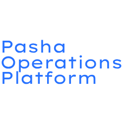

  # POps

  **Okul laboratuvarları ve yönetilen Windows filoları için açık kaynak işletim platformu:** envanter, uzaktan
  destek, yazılım dağıtımı, imzalı güncelleme ve denetim tek sistemde; klavyenin başındaki kişiye karşı şeffaf.

  <br />

  [](https://pashacore.com.tr)
  [](https://github.com/PashaCore/POps/tree/main/docs)
  [](https://github.com/PashaCore/POps/releases)
  [](https://github.com/PashaCore/POps/blob/main/LICENSE)

  [](https://github.com/PashaCore/POps/actions/workflows/ci.yml)
  [](https://github.com/PashaCore/POps/actions/workflows/codeql.yml)
  [](https://scorecard.dev/viewer/?uri=github.com/PashaCore/POps)

  ⭐ **Açık Kaynak** &nbsp;•&nbsp; 🛡️ **Tasarımdan Şeffaf** &nbsp;•&nbsp; ⚡ **Gerçek Zamanlı** &nbsp;•&nbsp; 🏫 **Eğitim ve Ekipler İçin**

  [English](README.md) · **Türkçe**

</div>

<br />

> [!WARNING]
> **Alfa yazılım.** Güncel sürüm [sürümler sayfasındadır](https://github.com/PashaCore/POps/releases/latest).
> Kayıttan imzalı güncellemeye ve kendiliğinden geri almaya kadar bütün yol gerçek Windows bilgisayarlarda denendi; dış
> incelemelerin bulguları madde madde kapatıldı. Yine de POps **büyük ölçekli ya
> da kurumsal üretim ortamı için henüz sağlamlaştırılmış değil**: tehdit modeli ve kalan riskler için
> [`SECURITY.md`](SECURITY.md), sıradaki işler için [`ROADMAP.md`](ROADMAP.md) dosyasına bakın.

> [!NOTE]
> Panelin arayüzü **Türkçedir**. Teknik belgeler ve API İngilizcedir; bu sayfa İngilizce README'nin Türkçesidir.

---

## İçindekiler

- [Bir bakışta](#-bir-bakışta)
- [Neden POps](#-neden-pops)
- [Neler yapabilirsiniz](#-neler-yapabilirsiniz)
- [Nasıl çalışır](#-nasıl-çalışır)
- [Güvenlik](#-güvenlik)
- [Bilgisayarın başındaki kişiye şeffaflık](#-bilgisayarın-başındaki-kişiye-şeffaflık)
- [Güncelleme: imzalı ve geri alınabilir](#-güncelleme-imzalı-ve-geri-alınabilir)
- [Performans](#-performans)
- [Ekran görüntüleri](#-ekran-görüntüleri)
- [Hızlı başlangıç](#-hızlı-başlangıç)
- [Gereksinimler](#-gereksinimler) · [Bilinen sınırlar](#bilinen-sınırlar)
- [Linux ve Pardus](#-linux-ve-pardus)
- [Sürüm geçmişi](#-sürüm-geçmişi)
- [Kalite ve testler](#-kalite-ve-testler)
- [Depo yapısı](#-depo-yapısı)
- [Belgeler](#-belgeler)
- [Yol haritası](#-yol-haritası)
- [Nereden çıktı](#-nereden-çıktı)
- [Katkı, güvenlik bildirimi ve lisans](#-katkı-güvenlik-bildirimi-ve-lisans)

---

## 📌 Bir bakışta

| | |
| :--- | :--- |
| **Tek sunucu, çok laboratuvar** | Tek bir backend süreci, yeniden başladıktan sonra **5.000 sanal ajanı 11 saniyede** geri bağladı; hiçbir deneme başarısız olmadı ([rapor](docs/kapasite/README.md)). |
| **Bilgisayarlarda açık port yok** | Her bilgisayar sunucuya TLS üzerinden (443) iki bağlantıyı kendisi açar. Yönetilen bilgisayarda dinleyen bir şey yoktur. |
| **Kendini geri alan güncelleme** | Ajan sürümleri CI'da ed25519 ile imzalanır, sunucu *ve bilgisayarın kendisi* imzayı doğrular; yeni sürüm ayağa kalkmazsa önceki sürüm kendiliğinden geri gelir. |
| **Kim ne yaptı, kanıtıyla** | Güvenlikle ilgili işlemler sunucudaki SHA-256 hash zincirli denetim kaydına ve bilgisayarın kendi Windows olay günlüğüne yazılır. |
| **Kapalı demek kapalı** | Okul, uzaktan terminali ve ekran izlemeyi bilgisayar bazında kapatabilir. Sunucu bunları kapatabilir, asla geri açamaz. |
| **Açıkta incelendi** | Proje sahibinin istediği kod düzeyindeki güvenlik incelemelerinin bulguları (F1…F14, R-01…R-20, F01…F21) ve her birinin düzeltmesi [`CHANGELOG.md`](CHANGELOG.md) içinde izlenir; raporların kendisi yayımlanmadı. |

---

## 🧠 Neden POps

### Sorun

Bir okulun BT ekibi laboratuvarı genellikle birbirinden kopuk araçlarla ayakta tutar: envanter için biri, uzaktan
yardım için biri, kurulum dosyaları için bir paylaşım, lisanslar için bir tablo ve "hangi bilgisayarda kim ne yaptı"
için hiçbir şey. Bu araçlar şirket bilgisayarlarının gizli yönetimi için yapılmıştır. Okulda klavyenin başındaki
kişi çoğu zaman reşit değildir ve KVKK, ekranına bakıldığında bunu bilmesini bekler.

### Çözüm

**POps (Pasha Operations Platform)** envanteri, uzaktan desteği, dağıtımı, güncellemeyi, karantinayı ve denetimi
tek bir web panelinde toplar; şeffaflığı sonradan eklemek yerine baştan tasarıma koyar:

> **Yöneticilerin güçlü araçları olmalı. Kullanıcılar da bu araçlar kullanıldığında her zaman bilmeli.**

POps sınıfın *altındaki* işletim katmanıdır. Veyon gibi ders yönetim yazılımlarının yerini almaya çalışmaz; ikisi
aynı bilgisayarda yan yana çalışabilir: [POps ve Veyon birlikte](docs/tr/veyon-ile-birlikte.md). Okul yönetimi ve BT
için ayrıntılı anlatım: [Neden POps?](docs/tr/neden-pops.md)

---

## ✨ Neler yapabilirsiniz

### Filoyu tanıyın

| Özellik | Ne yapar |
| :--- | :--- |
| **Cihazlar ve laboratuvarlar** | Her bilgisayara donanımdan türetilen kalıcı bir kimlik verilir. Bilgisayarlar laboratuvarlara ayrılır; yeni bilgisayarlar bir laba kendiliğinden düşebilir. |
| **Anlık durum** | Çevrimiçi/çevrimdışı, oturum açan kullanıcı, ön plandaki programın adı (pencere başlığı asla alınmaz) ve ajanın kendi sağlığı. |
| **Donanım envanteri** | İşlemci, RAM, anakart, ekran kartı, diskler, Windows sürümü, IP ve MAC. |
| **Yazılım ve Windows Update** | Kurulu programlar ve yama durumu; istenince güncellemeleri kurar. |
| **Lisanslar** | Kurulumları satın alınan koltuk sayısıyla karşılaştırır; süre bitmeden ve aşımda uyarır. |
| **Raporlar** | Filo, güvenlik olayları, yazılım ve güncellemeler; formül güvenli CSV dışa aktarma. |

### Harekete geçin

| Özellik | Ne yapar |
| :--- | :--- |
| **Görev kuyruğu** | Bir bilgisayara, bir laba ya da hepsine komut gönderir; eşzamanlılık sınırı vardır. Duraklat, sürdür, iptal et (bilgisayardaki işlem de durur), yeniden dene. Çıkış kodu ve dürüst durumlar: `Failed`, `Interrupted`, `Unknown`, `Timed Out`. |
| **Terminal** | Tarayıcıdan SYSTEM olarak komut çalıştırır, çıktıyı gösterir; günlük işler için hızlı butonlar. |
| **Yazılım dağıtımı** | ZIP/MSI/betik adımlarından bir zincir kurup laba gönderin. Dosyalar imzalı bağlantıyla iner, çalışmadan önce SHA-256 özeti denetlenir. |
| **Zamanlanmış görevler** | Bir kez, her gün ya da seçili günlerde; tek işlemde yazılır, yarım kalmaz. |
| **Vision** | Saniyede 1–5 kare canlı ekran, uzaktan fare ve klavye (0.1.14'ten itibaren Türkçe klavye); yalnızca kabul edilmiş ya da duyurulmuş oturumda. |
| **Wake-on-LAN** | MAC adresi bilinen bir bilgisayarı, bir labı ya da hepsini uyandırır. |
| **Karantina** | Kilit ekranı ve ağ yalıtımı (yalnızca POps sunucusuna erişim kalır). Panelden ya da çevrimdışıyken cihaza özel, bir kez geçen bir kodla kaldırılır. |
| **DNS politikası** | Kategorilere göre listelenen alan adlarına girişi tespit eder; eşiği aşan bilgisayarı karantinaya alabilir. |

### Rahat işletin

| Özellik | Ne yapar |
| :--- | :--- |
| **Yardım masası** | Öğrenci ve personel tepsiden talep açar ("Sorun bildir"); BT panelden yanıtlar. |
| **Bildirimler** | Başarısız güncelleme, ele geçirme denemesi, politika uyarısı, dolan disk ya da süresi biten sertifika zile, e-postaya ya da webhook'a düşer. |
| **Sunucunun kendini güncellemesi** | Backend panelden en son sürüm etiketine güncellenir; sağlık kontrolü ve kendiliğinden geri alma ile. |
| **Yedekler** | Her gece alınan yedek, her seferinde geçici bir veritabanına açılarak sınanır; isteğe bağlı başka makineye kopya. |
| **Gözlemlenebilirlik** | İstek kimlikli JSON loglar, Prometheus `/metrics` ve yük ölçümlerini gösteren tanılama sayfası. |
| **Saklama süresi** | Eski olay kayıtları, biten görevler ve okunmuş bildirimler takvime göre silinir; denetim zinciri korunur. |

---

## 🏗 Nasıl çalışır

<picture>
  <source media="(prefers-color-scheme: dark)" srcset="assets/readme/architecture.tr-dark.svg">
  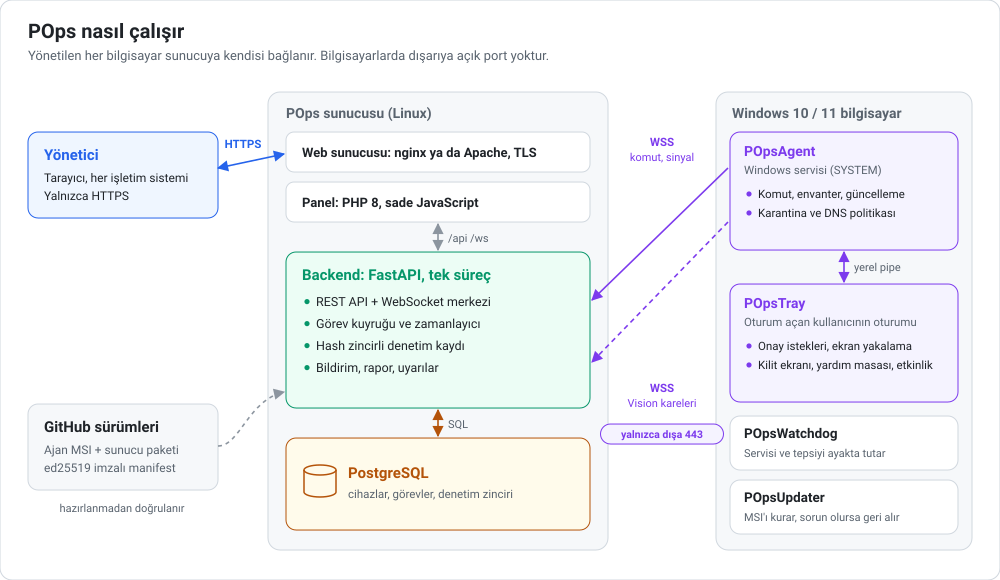
</picture>

- **Tek backend süreci** (Python, FastAPI) bütün ajan, panel ve Vision bağlantılarını tutar; durumu PostgreSQL'de
  saklar. PHP panel yanında nginx ya da Apache ile sunulur; kurulum betiği HTTPS'i okulun kendi sertifika
  otoritesiyle ya da Let's Encrypt ile kurar.
- **Her bilgisayarda** `POpsAgent` bir Windows servisi olarak çalışır. Bir **komut kanalı** (sinyal, görev, sonuç)
  ve gerektiğinde ekran kareleri için bir **Vision kanalı** açar. `POpsTray` oturum açan kullanıcının oturumunda
  çalışır: onay ister, ekranı yakalar, kilit ekranını ve yardım masasını gösterir, servisle yerel bir pipe üzerinden
  konuşur. `POpsWatchdog` ikisini ayakta tutar; `POpsUpdater` yeni sürümü kurar ve gerekirse geri alır.
- **Ajanlar dışarıya bağlanır.** Bilgisayarlarda port açmak gerekmez, NAT arkasında da çalışır. Ajan düz `http`'yi
  reddeder ve okulun kendi sertifika otoritesine sabitlenebilir.

Ayrıntılar (İngilizce): [`docs/architecture.md`](docs/architecture.md), [`docs/agent.md`](docs/agent.md) ve her
tasarım kararının gerekçesi [`docs/decisions.md`](docs/decisions.md).

---

## 🛡 Güvenlik

<picture>
  <source media="(prefers-color-scheme: dark)" srcset="assets/readme/security.tr-dark.svg">
  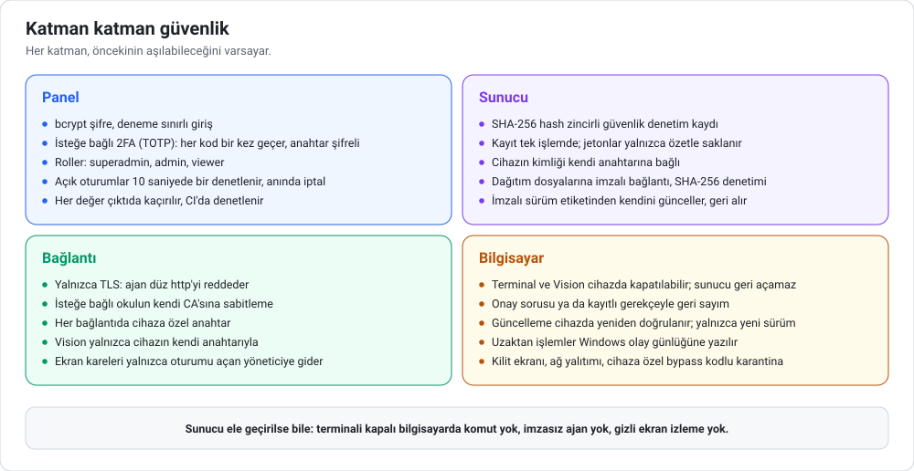
</picture>

Tasarım, sunucunun kendisi de dahil, herhangi bir katmanın aşılabileceğini varsayar:

| Biri POps sunucusunu ele geçirse… | |
| :--- | :--- |
| kurulumda terminali kapatılmış bir bilgisayarda komut çalıştırabilir mi? | **Hayır.** Yetenek politikası bilgisayardadır; sunucu yalnızca kapatabilir. |
| filoya değiştirilmiş bir ajan gönderebilir mi? | **Hayır.** Bilgisayar sürüm imzasını ajanın içine gömülü anahtarla doğrular; imza anahtarı sunucuya hiç gelmez. |
| kişi bilmeden ekranını izleyebilir mi? | **Hayır.** Canlı oturum kullanıcının onayını ister ya da kayıtlı gerekçeyle tam ekran geri sayım gösterir; önizlemeler tepside duyurulur. |
| yaptıklarını sessizce silebilir mi? | **Sessizce değil.** Denetim zinciri değişiklikte kırılır; her bilgisayar uzaktan işlemlerin kaydını kendi Windows olay günlüğünde de tutar. |
| gerçek bir cihazın adıyla sahte cihaz kaydedebilir mi? | **Hayır.** Anahtarı olan bir cihaz, ancak superadmin bir kereliğine izin verirse yeniden kaydolabilir. |

Panelin kendisinde: bcrypt şifreler ve deneme sınırlı giriş, isteğe bağlı TOTP 2FA (her kod bir kez geçer, anahtarlar
şifreli saklanır), roller (superadmin, admin, viewer), 10 saniyede bir yeniden denetlenen ve anında iptal edilebilen
oturumlar, CSRF koruması ve her değişiklikte CI'ın denetlediği çıktı kaçırma.

Daha fazlası: [`SECURITY.md`](SECURITY.md) (tehdit modeli, kalan riskler, bildirim yolu),
[`docs/security.md`](docs/security.md) (her denetim ve işletici kontrol listesi, İngilizce).

---

## 👁 Bilgisayarın başındaki kişiye şeffaflık

POps **tasarımdan şeffaftır** ([karar D-17](docs/decisions.md)):

- **Önce onay.** Rutin bir Vision oturumu, kullanıcı yöneticinin adını ve gerekçeyi gösteren soruyu kabul edince
  başlar. Zorunlu oturum (örneğin sınav sırasında) başlamadan önce tam ekran bir geri sayım gösterir; gerekçesi
  kaydedilir.
- **Gizli hiçbir şey yok.** Tepsi simgesi her zaman görünür; gizli mod ve tuş kaydı yoktur.
- **"BT bu bilgisayarda ne yaptı?"** Tepsi son 30 günün uzaktan oturumlarını, komutlarını ve karantinalarını listeler.
- **Bilgisayarda kalan kayıt.** Uzaktan komutlar, oturumlar ve karantinalar sunucudan bağımsız olarak Windows olay
  günlüğüne de yazılır ("POps Agent" kaynağı).
- **KVKK.** Aydınlatma metni şablonu ve veri envanteri: [`docs/kvkk-aydinlatma.md`](docs/kvkk-aydinlatma.md).

---

## 🔄 Güncelleme: imzalı ve geri alınabilir

<picture>
  <source media="(prefers-color-scheme: dark)" srcset="assets/readme/updates.tr-dark.svg">
  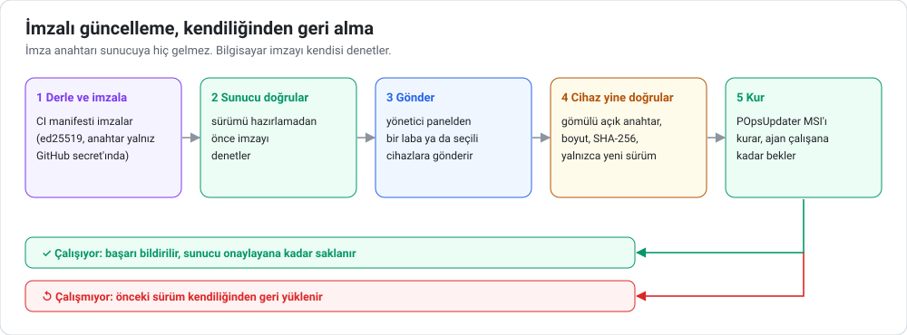
</picture>

Bir güncelleme ancak yeni ajan gerçekten çalışıyorsa başarılı sayılır. Çalışmıyorsa `POpsUpdater`, kimse bilgisayara
dokunmadan önceki sürümü geri koyar; sonuç panele ve Windows olay günlüğüne düşer. Geri alma yolu gerçek makinelerde
tatbikatla denendi. Sunucu kendini de aynı şekilde günceller: en yeni imzalı sürüm etiketine, sağlık kontrolü ve
kendiliğinden geri alma ile ([`docs/self-update.md`](docs/self-update.md)).

---

## ⚡ Performans

<picture>
  <source media="(prefers-color-scheme: dark)" srcset="assets/readme/capacity.tr-dark.svg">
  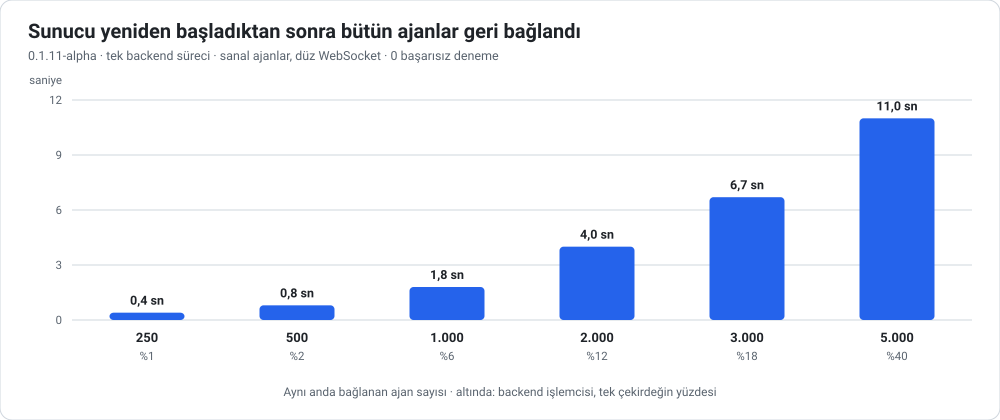
</picture>

0.1.11-alpha ile, tek backend süreci, sanal ajanlar ve ajanın gerçek yeniden bağlanma davranışıyla ölçüldü (8 vCPU
sanal makine, başka sitelerle paylaşılan PostgreSQL). Kararlı durumda 5.000 ajan **tek çekirdeğin yaklaşık %40'ını**
(PostgreSQL %17) ve **~69 MB + ajan başına 0,16 MB** bellek kullandı.

**Bu sayıların henüz kapsamadıkları:** TLS, 0.1.12'deki sağlık bildirimi, 0.1.14'teki toplu sinyal yazımı ve Vision
akışları. Yeni bir ölçüm planlandı. Donanım önerileriyle tam rapor: [`docs/kapasite/README.md`](docs/kapasite/README.md);
ham veri: [`BENCHMARKS.md`](BENCHMARKS.md).

---

## 📸 Ekran görüntüleri

| Genel bakış | Cihazlar |
| :---: | :---: |
| 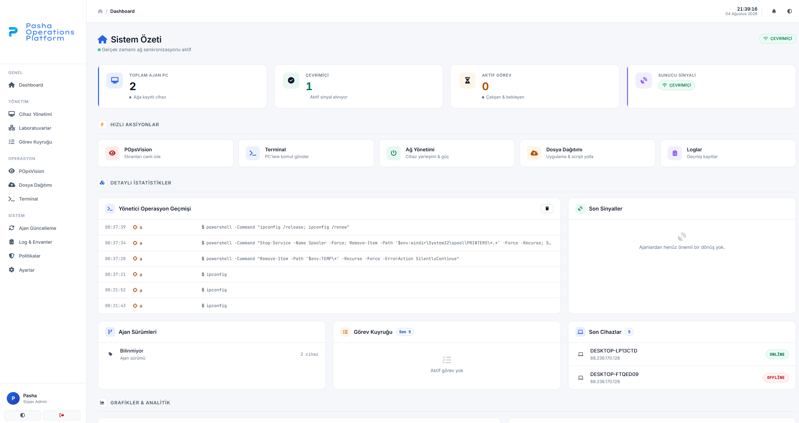 | 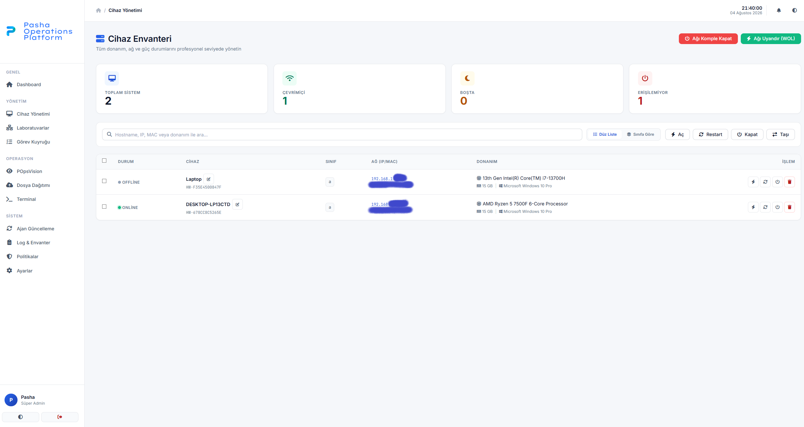 |
| **Vision** | **Yazılım dağıtımı** |
| 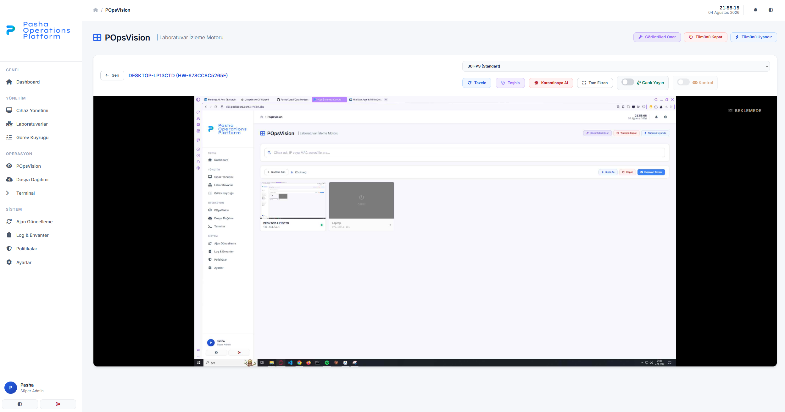 | 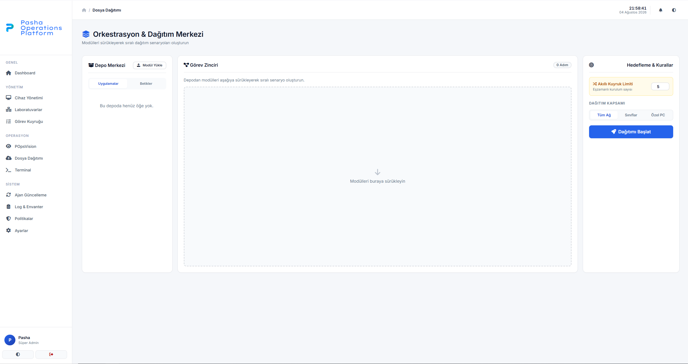 |

<details>
<summary><b>Daha fazla ekran görüntüsü</b></summary>
<br>

| Laboratuvarlar | Terminal |
| :---: | :---: |
| 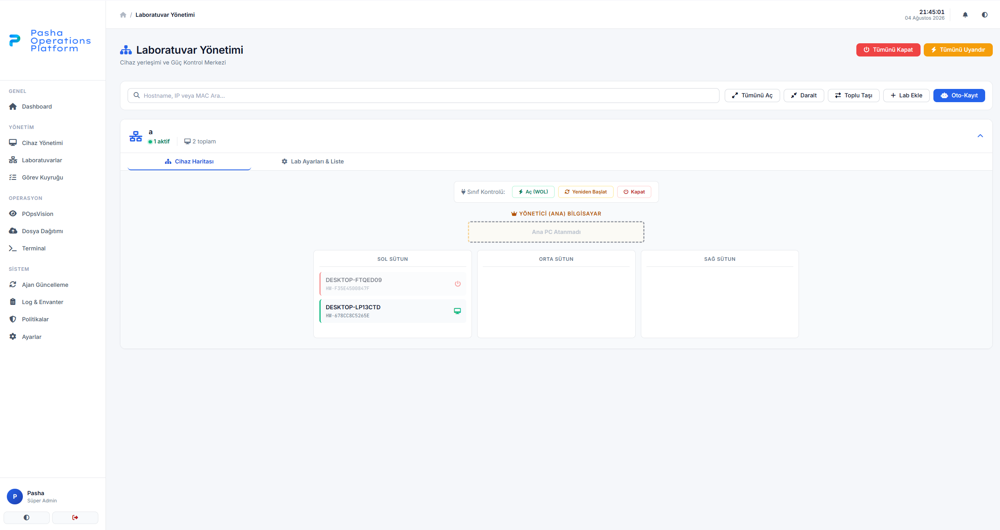 | 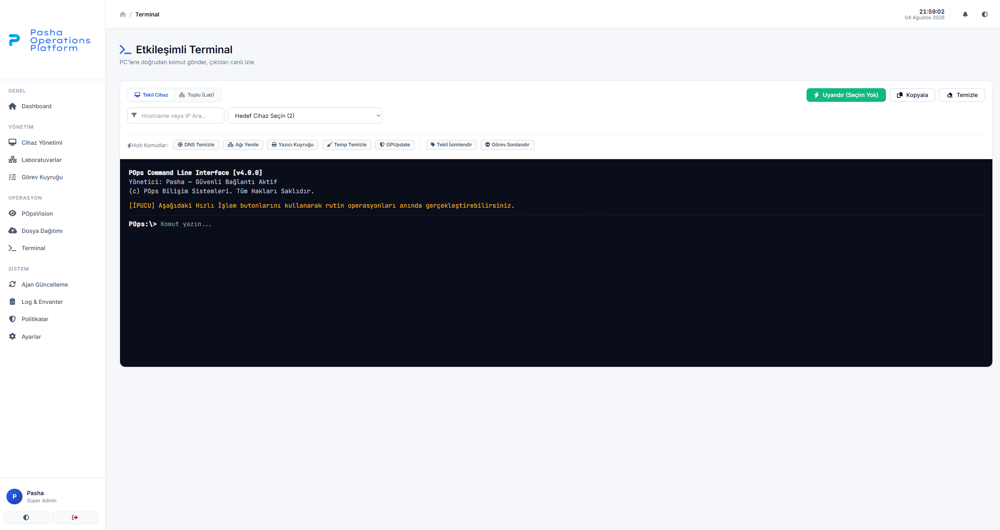 |
| **Görevler** | **Log ve envanter** |
| 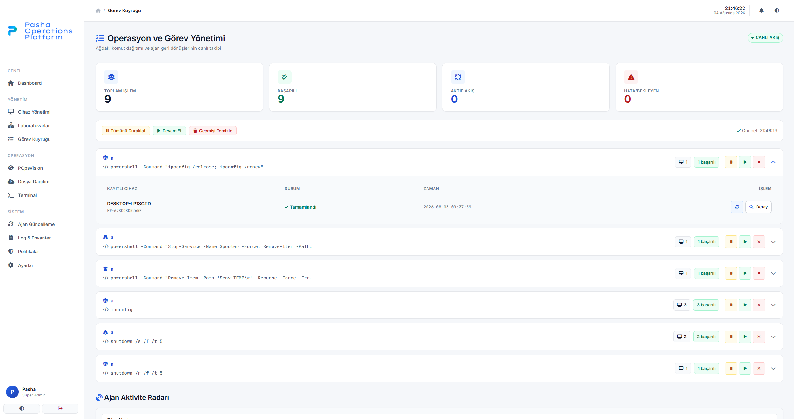 | 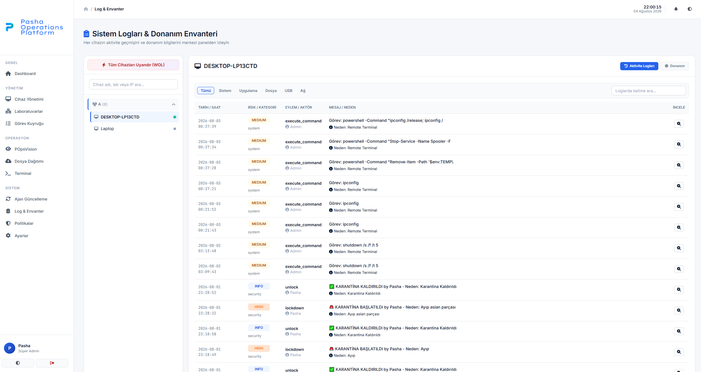 |
| **Politikalar** | **Sistem ve güncelleme** |
| 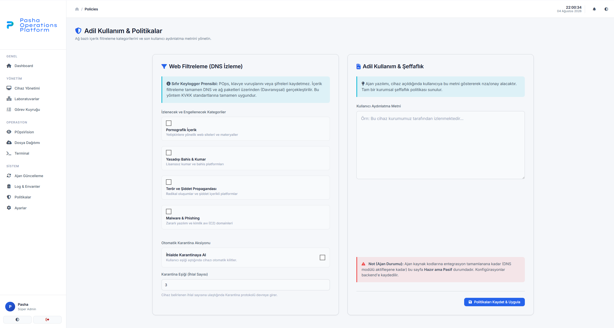 | 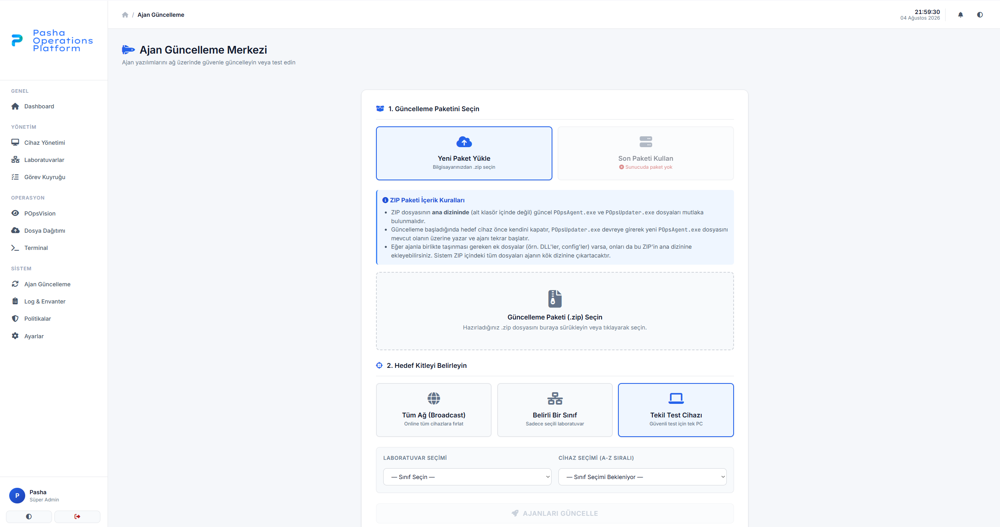 |

</details>

---

## 🚀 Hızlı başlangıç

**1. Sunucu** (systemd'li Linux; AlmaLinux/RHEL/Rocky ve Debian/Ubuntu üzerinde denendi):

```bash
git clone https://github.com/PashaCore/POps.git
cd POps
sudo Installer/server/install.sh
```

Kurulum betiği PostgreSQL'i, Python ortamını, üretilmiş gizli anahtarlarla `.env` dosyasını, servisi, PHP ile
nginx'i ve HTTPS'i (varsayılan olarak okulun kendi sertifika otoritesi, istenirse Let's Encrypt) kurar; sonunda
panelin **admin şifresini** yazar.

**2. Panel:** `https://<sunucunuz>/` adresini açın, `admin` olarak girin, **Ayarlar**'da şifreyi değiştirip 2FA'yı
kurun. **Sistem** sayfasında bir sınıf için **kayıt jetonu** üretin.

**3. Ajan:** her Windows bilgisayarda (ön koşul yok: .NET çalışma zamanı ajanla birlikte gelir), yönetici komut isteminde:

```
msiexec /i POps-Agent-<sürüm>-win-x64.msi /qn SERVER_URL=https://<sunucunuz> ENROLL_TOKEN=<jeton>
```

Bu özelliklere ihtiyaç olmayan bilgisayarlarda `TERMINAL_ENABLED=0` ve/veya `VISION_ENABLED=0` ekleyin. Bilgisayar
birkaç saniye içinde **Cihazlar** sayfasında görünür.

Adım adım (İngilizce): [`docs/quick-start.md`](docs/quick-start.md). Docker Compose seçeneği, GHCR'daki hazır
imajlarla: [`docs/docker.md`](docs/docker.md).

---

## 🧾 Gereksinimler

| Bölüm | Gereksinim |
| :--- | :--- |
| **Sunucu** | systemd'li Linux, PostgreSQL 13+, Python 3.10+ (önerilen 3.12), `curl` eklentili PHP 8, nginx ya da Apache, TLS sertifikalı bir alan adı. Bir okul için küçük bir sanal makine yeter ([boyutlandırma](docs/kapasite/README.md)). |
| **Yönetilen bilgisayarlar** | Windows 10 ya da 11, 64 bit. Başka bir şey gerekmez: ajan kendi .NET 10 çalışma zamanını getirir. |
| **Ağ** | Bilgisayarlardan sunucuya dışa doğru HTTPS (443); vekil sunucular ve güvenlik duvarları WebSocket yükseltmesine izin vermeli. Wake-on-LAN için sunucudan lab ağına UDP yayını gerekir. |
| **Tarayıcı** | Güncel herhangi bir tarayıcı. Panel başka bir adresten bir şey yüklemez (yazı tipleri ve simgeler içindedir); internetsiz ağda da çalışır. |

Dondurma yazılımları (Deep Freeze, Shadow Defender), ajan dondurmadan önce kaydedilirse çalışır
([ayrıntı](Agent/README.md#machines-with-freeze-software)). Bkz.
[`docs/getting-started.md`](docs/getting-started.md#supported-systems).

### Bilinen sınırlar

- **Ekran izleme (Vision)** yalnızca birincil monitörü JPEG kareleriyle gösterir. Uzak Masaüstü ve çok kullanıcılı
  oturumlar, UAC onay ekranı (güvenli masaüstü), oturum açma ekranı ve %100 dışındaki ekran ölçekleme desteklenmez ya
  da denenmedi.
- **CI'da değil, elle doğrulanır:** Windows'ta gerçek MSI güncellemesi ve geri alma (her ajan sürümünde gerçek
  bilgisayarlarda), Vision tüneli ve karantina kilit ekranı. CI; ajan birim testlerini, sunucunun entegrasyon
  testlerini ve dağıtım betiklerini sahte ortamda çalıştırır ([`docs/testing.md`](docs/testing.md)).
- **Tek backend süreci.** Henüz yüksek erişilebilirlik yok; tek süreçte 5.000 sanal ajan ölçüldü
  ([kapasite](docs/kapasite/README.md)). Tek sunucuda birden çok okul ya da ilçe denenmiş bir kurulum değildir.
- **İmzasız Windows dosyaları.** Sürüm manifestleri ed25519 ile imzalanır, sunucu ve bilgisayar doğrular; ama
  çalıştırılabilir dosyaların Authenticode imzası henüz yok, SmartScreen ve bazı antivirüsler uyarabilir
  ([kod imzalama politikası](docs/code-signing.md), İngilizce).
- **Sürüm etiketleri 0.1.22-alpha'dan itibaren SSH ile imzalıdır**; öncekiler imzasızdır. Kendini güncellemenin
  yalnızca imzalı etikete geçmesi için [`keys/allowed_signers`](keys/allowed_signers) dosyasını
  `/etc/pops/allowed_signers` olarak kurun ([`docs/self-update.md`](docs/self-update.md)).
- **DNS** yalnızca tespit edip bildirir; engelleme planlı. **API:** yalnızca oturumla; API jetonu henüz yok.
- **Panel dili:** Türkçe; İngilizce arayüz hazırlanıyor.

---

## 🐧 Linux ve Pardus

**Durum: yol haritasında (üzerinde çalışılıyor), henüz yok.** POps bugün Windows 10 ve 11 bilgisayarları yönetir.
İlk Linux sürümü yalnızca envanteri ve komutları kapsar: Windows ajanıyla aynı protokolü, kaydı, cihaza özel
anahtarı, yetenek politikasını ve imzalı güncellemeyi kullanan bir systemd servisi. Ekran izleme daha sonra gelir.
Hangi dille yazılacağı (.NET, Go ya da Python) henüz kararlaştırılmadı; seçenekler
[yol haritasında](ROADMAP.md#linux-agent-pardus-first) karşılaştırılıyor (İngilizce).

**Türkiye'deki okullar için neden önemli:** pek çok devlet okulu, TÜBİTAK ULAKBİM'in geliştirdiği Debian tabanlı
Pardus'u kullanıyor; sınıflardaki etkileşimli tahtaların birçoğunda da Pardus ETAP çalışıyor. Bu makineler yine
TÜBİTAK ULAKBİM'in geliştirdiği Lider Ahenk ile merkezden yönetilebiliyor. Bir Linux ajanı yazmak yerine ya da ondan
önce POps'u Lider Ahenk ile bütünleştirmek de bir seçenek; henüz değerlendirilmedi. Tarih verilmiyor.

---

## 🗓 Sürüm geçmişi

<picture>
  <source media="(prefers-color-scheme: dark)" srcset="assets/readme/timeline.tr-dark.svg">
  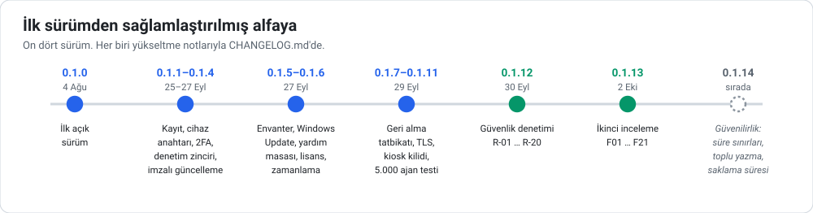
</picture>

Her sürüm, yükseltme notlarıyla [`CHANGELOG.md`](CHANGELOG.md) içindedir. Paketler ve imzalı manifestler
[sürümler sayfasındadır](https://github.com/PashaCore/POps/releases).

---

## ✅ Kalite ve testler

- **Backend:** on iki test takımı; on biri gerçek bir PostgreSQL ve çalışan bir sunucuya karşı: güvenlik
  değişmezleri, 2FA, ajan yetkilendirme, uzaktan kontrol kuralları, cihaz anahtarları, sağlamlaştırma, 20 eşzamanlı
  kayıt, 0.1.11'den 0.1.14'e ajanların bugünkü sunucuyla uyumu, özellikler, yardım masası ve lisanslar, işletim.
  Ajan protokolü JSON Schema'lara ve ortak test vektörlerine karşı denetlenir
  ([`docs/protocol`](docs/protocol/README.md)). flake8 sıfır bulgu.
- **Ajan:** .NET 10 ve .NET Framework 4.7.2 (MSI özel eylemleri) üzerinde yaklaşık 700 xUnit test koşusu; CI'da
  kapsam tabanı.
- **Kurulum ve işletim:** boş veritabanından migration'lar, sınanan yedek ve geri yükleme, TLS aracı, sürüm imzalama,
  dağıtım ve kendini güncelleme betikleri (geri alma, imzalı etiket, güvensiz ayar) CI'da test edilir.
- **Panel:** PHP sözdizimi ve kaçırılmamış HTML çıktısını reddeden bir denetim.
- **Tedarik zinciri:** her değişiklikte CodeQL, Dependabot, commit SHA'sına sabitlenmiş GitHub Actions, yayın işi
  bütün testler geçmeden çalışmayan ed25519 imzalı sürümler.
- **Sahada:** gerçek Windows bilgisayarlarda güncelleme ve geri alma tatbikatları ve sürüm saha testleri.

Testleri yerelde çalıştırmak (İngilizce): [`docs/testing.md`](docs/testing.md).

---

## 🗂 Depo yapısı

| Yol | İçerik |
| :--- | :--- |
| [`Agent/`](Agent) | Windows ajanı (.NET 10): `POps.Agent` servisi, `POpsTray`, `POpsWatchdog`, `POpsUpdater`, ortak kütüphane `POps.Shared`, testler `POps.Tests`. |
| [`Backend/`](Backend) | FastAPI backend: `pops/` paketi, router'lar, migration'lar, testler. |
| [`Dashboard/`](Dashboard) | PHP 8 panel (Türkçe arayüz). |
| [`Installer/`](Installer) | Ajan için WiX MSI; sunucu kurulum, dağıtım, kendini güncelleme, yedek ve TLS betikleri. |
| [`docs/`](docs) | İşletici ve geliştirici belgeleri. |
| [`tools/`](tools) | Sürüm imzalama, yük testi için ajan simülatörü, panelin HTML çıktı denetimi. |
| [`docker/`](docker), [`docker-compose.yml`](docker-compose.yml) | İsteğe bağlı konteyner kurulumu. |
| [`keys/`](keys) | Sürüm açık anahtarı ve anahtar prosedürleri. |

---

## 📚 Belgeler

Belgelerin çoğu İngilizcedir; Türkçe olanlar işaretlidir.

**Okullar için Türkçe rehberler:**

- [Neden POps?](docs/tr/neden-pops.md): okul yönetimi ve BT için; neyi çözer, neyi çözmez, KVKK, maliyet,
  internetsiz çalışma.
- [POps ve Veyon birlikte](docs/tr/veyon-ile-birlikte.md): kim ne yapar, aynı bilgisayara kurulum, tipik bir gün.
- [Pilot okul kurulumu](docs/tr/pilot-okul.md): 10 bilgisayarlık bir laboratuvar için yaklaşık bir saatlik
  kontrol listesi, ölçüm ve geri bildirim formu.
- [Vaka çalışması şablonu](docs/tr/vaka-calismasi-sablonu.md): pilottan sonra sonuçları paylaşmak için.

| Buradan başlayın | İşletin | Anlayın |
| :--- | :--- | :--- |
| [Başlarken](docs/getting-started.md) | [Yapılandırma](docs/configuration.md) | [Mimari](docs/architecture.md) |
| [Hızlı başlangıç](docs/quick-start.md) | [Kurulum ve yayın](docs/deployment.md) | [Tasarım kararları](docs/decisions.md) |
| [Kurulum](docs/installation.md) | [TLS](docs/tls.md) | [Güvenlik](docs/security.md) |
| [SSS](docs/faq.md) | [Yedek ve geri yükleme](docs/backup.md) | [Ajan](docs/agent.md) |
| [Sorun giderme](docs/troubleshooting.md) | [Sunucunun kendini güncellemesi](docs/self-update.md) | [Backend](docs/backend.md) |
| [Kapasite raporu (TR)](docs/kapasite/README.md) | [Docker](docs/docker.md) | [Veritabanı](docs/database.md) |
| | [Panel](docs/dashboard.md) | [REST ve WebSocket API](docs/api.md) |
| | [Vision](docs/vision.md) | [Testler](docs/testing.md) |
| | [KVKK aydınlatma metni (TR)](docs/kvkk-aydinlatma.md) | [Konumlandırma](docs/positioning.md) |
| | | [Kod imzalama politikası](docs/code-signing.md) |
| | | [GLPI aktarımı (tasarım)](docs/integrations/glpi.md) |

---

## 🧭 Yol haritası

Sırada 0.1.14 güvenilirlik turu var: veritabanı süre sınırları, toplu sinyal yazımı, saklama süreleri, disk ve
sertifika uyarıları, uzaktan kontrolde Türkçe klavye. Ardından bir mimari tur geliyor:
- görevler için tam durum makinesi;
- imzalı komutlar ve mTLS;
- yalnızca ekleme yapılabilen bir denetim rolü;
- laboratuvar bazında yetkiler ve yüksek erişilebilirlik;
- Uzak Masaüstü desteği;
- HTTPS üzerinde yeni bir 5.000 ajan ölçümü;
- Windows test makinesinde uçtan uca testler.

Tasarım notlarıyla tam liste (İngilizce): [`ROADMAP.md`](ROADMAP.md).

---

## 🌱 Nereden çıktı

POps bir bitirme projesinden doğdu. İlk sürümü, bir Türk devlet üniversitesinin bilgi işlem dairesine ait gerçek bir
bilgisayar laboratuvarında, dairenin bilgisi dahilinde iki üç ay kadar çalıştı. O makineleri otomatikleştirmek,
envanterlerini tutmak ve bunu klavyenin başındaki kişilere açıkça yapmak bugünkü tasarımı şekillendirdi. Bu depo, o
çalışmanın açık hukuki ve etik sınırlar içinde yeniden tasarlanmış açık kaynak hâlidir.

---

## 🤝 Katkı, güvenlik bildirimi ve lisans

- **Katkı:** [`CONTRIBUTING.md`](CONTRIBUTING.md) ve [Davranış Kuralları](CODE_OF_CONDUCT.md) dosyalarını okuyun.
  Hata bildirimleri, belgeler ve testler de özellikler kadar değerlidir.
- **Güvenlik:** herkese açık issue açmayın; **security@pashacore.com.tr** adresine yazın ([`SECURITY.md`](SECURITY.md)).
- **Lisans:** [Apache 2.0](LICENSE).

### 🏢 Pasha Core hakkında

POps, **Pasha Core** tarafından geliştirilir ve sürdürülür. Mehmet Ali Avcı tarafından yazıldı
([LinkedIn](https://www.linkedin.com/in/p4sha/) · [GitHub](https://github.com/TheP4SHA)).

[🌐 Web sitesi](https://pashacore.com.tr) • [🏢 Şirket LinkedIn](https://www.linkedin.com/company/112521167/) • [👤 Kurucu LinkedIn](https://www.linkedin.com/in/p4sha/) • [🐙 GitHub](https://github.com/PashaCore)

<br/>

*Telif hakkı © 2026 POps — Pasha Operations Platform. [Apache 2.0 Lisansı](LICENSE) ile lisanslanmıştır.*
