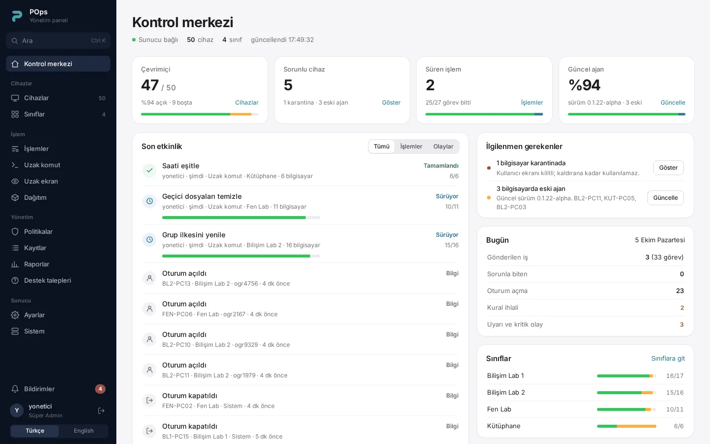
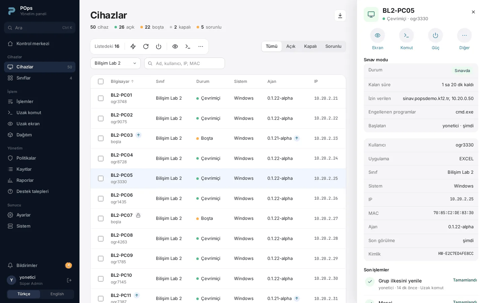
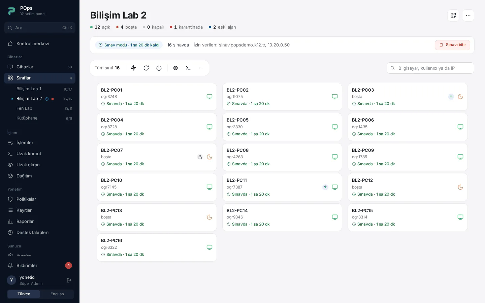
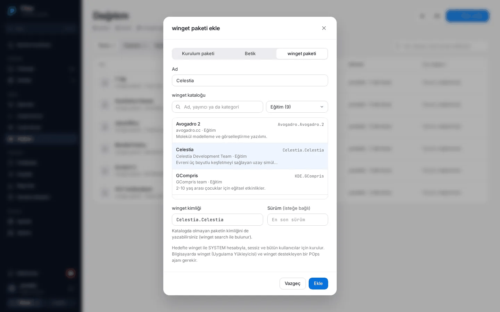
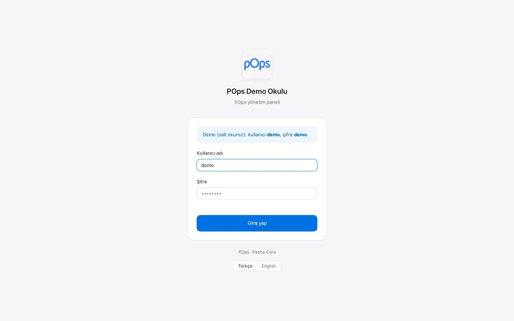
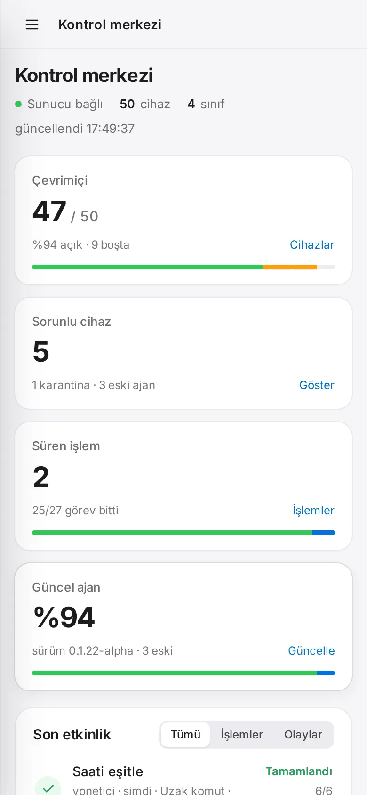

<div align="center">

  

  # POps

  **Okul laboratuvarları ve yönetilen Windows filoları için açık kaynak işletim platformu:** envanter, uzaktan
  destek, yazılım dağıtımı, imzalı güncelleme ve denetim tek sistemde; klavyenin başındaki kişiye karşı şeffaf.

  <br />

  [](https://pashacore.com.tr)
  [](https://github.com/PashaCore/POps/tree/main/docs)
  [](https://github.com/PashaCore/POps/releases)
  [](https://github.com/PashaCore/POps/blob/main/LICENSE)

  [](https://github.com/PashaCore/POps/actions/workflows/ci.yml)
  [](https://github.com/PashaCore/POps/actions/workflows/codeql.yml)
  [](https://scorecard.dev/viewer/?uri=github.com/PashaCore/POps)

  ⭐ **Açık Kaynak** &nbsp;•&nbsp; 🛡️ **Tasarımdan Şeffaf** &nbsp;•&nbsp; ⚡ **Gerçek Zamanlı** &nbsp;•&nbsp; 🏫 **Eğitim ve Ekipler İçin**

  [English](README.md) · **Türkçe**

</div>

<br />

> [!WARNING]
> **Alfa yazılım.** Güncel sürüm [sürümler sayfasındadır](https://github.com/PashaCore/POps/releases/latest).
> Kayıttan imzalı güncellemeye ve kendiliğinden geri almaya kadar bütün yol gerçek Windows bilgisayarlarda denendi; dış
> incelemelerin bulguları madde madde kapatıldı. Yine de POps **büyük ölçekli ya
> da kurumsal üretim ortamı için henüz sağlamlaştırılmış değil**: tehdit modeli ve kalan riskler için
> [`SECURITY.md`](SECURITY.md), sıradaki işler için [`ROADMAP.md`](ROADMAP.md) dosyasına bakın.

> [!NOTE]
> Panelin her sayfası **Türkçe** ve **İngilizce** kullanılabilir; dil tarayıcı başına seçilir. Teknik belgeler ve API
> İngilizcedir; bu sayfa İngilizce README'nin Türkçesidir.

> [!TIP]
> **Kurmadan deneyin:** herkese açık, salt okunur bir demo [demo.pashacore.com.tr](https://demo.pashacore.com.tr)
> adresinde çalışıyor (kullanıcı `demo`, şifre `demo`). 50 bilgisayarlı, iki haftalık geçmişi olan uydurma bir okul
> gösterir ve her gece sıfırlanır. Orada hiçbir şey değiştirilemez.

---

## İçindekiler

- [Bir bakışta](#-bir-bakışta)
- [Neden POps](#-neden-pops)
- [Neler yapabilirsiniz](#-neler-yapabilirsiniz)
- [Nasıl çalışır](#-nasıl-çalışır)
- [Güvenlik](#-güvenlik)
- [Bilgisayarın başındaki kişiye şeffaflık](#-bilgisayarın-başındaki-kişiye-şeffaflık)
- [Güncelleme: imzalı ve geri alınabilir](#-güncelleme-imzalı-ve-geri-alınabilir)
- [Performans](#-performans)
- [Ekran görüntüleri](#-ekran-görüntüleri)
- [Hızlı başlangıç](#-hızlı-başlangıç)
- [Gereksinimler](#-gereksinimler) · [Bilinen sınırlar](#bilinen-sınırlar)
- [Linux ve Pardus](#-linux-ve-pardus)
- [Sürüm geçmişi](#-sürüm-geçmişi)
- [Kalite ve testler](#-kalite-ve-testler)
- [Depo yapısı](#-depo-yapısı)
- [Belgeler](#-belgeler)
- [Yol haritası](#-yol-haritası)
- [Nereden çıktı](#-nereden-çıktı)
- [Katkı, güvenlik bildirimi ve lisans](#-katkı-güvenlik-bildirimi-ve-lisans)

---

## 📌 Bir bakışta

| | |
| :--- | :--- |
| **Tek sunucu, çok laboratuvar** | Tek bir backend süreci, yeniden başladıktan sonra **5.000 sanal ajanı 11 saniyede** geri bağladı; hiçbir deneme başarısız olmadı ([rapor](docs/kapasite/README.md)). İstenirse Redis ile birden çok süreç çalışabilir ([`docs/ha.md`](docs/ha.md)). |
| **Okullar ve ilçeler** | Kurum birimleri (ilçe → okul): her yönetici ve API jetonu yalnızca kendi okullarını görür ve yönetir; sunucu bunu her uç noktada denetler. Active Directory/LDAP ya da OpenID Connect ile giriş. |
| **Bilgisayarlarda açık port yok** | Her bilgisayar sunucuya TLS üzerinden (443) iki bağlantıyı kendisi açar. Yönetici güncellemeler için isteğe bağlı sınıf içi eş önbelleği açmadıkça (varsayılan kapalı; TCP 8817, yalnızca yerel alt ağ) yönetilen bilgisayarda dinleyen bir şey yoktur. |
| **Kendini geri alan güncelleme** | Ajan sürümleri CI'da ed25519 ile imzalanır, sunucu *ve bilgisayarın kendisi* imzayı doğrular; yeni sürüm ayağa kalkmazsa önceki sürüm kendiliğinden geri gelir. |
| **Kim ne yaptı, kanıtıyla** | Güvenlikle ilgili işlemler sunucudaki SHA-256 hash zincirli denetim kaydına ve bilgisayarın kendi Windows olay günlüğüne yazılır. |
| **Kapalı demek kapalı** | Okul, uzaktan terminali, ekran izlemeyi, sınav modunu, dosya aktarımını, güç işlemlerini, mesajları ve eş önbelleğini bilgisayar bazında kapatabilir. Sunucu bunları kapatabilir, asla geri açamaz. |
| **Açıkta incelendi** | Proje sahibinin istediği kod düzeyindeki güvenlik incelemelerinin bulguları (F1…F14, R-01…R-20, F01…F21) ve her birinin düzeltmesi [`CHANGELOG.md`](CHANGELOG.md) içinde izlenir; raporların kendisi yayımlanmadı. |

---

## 🧠 Neden POps

### Sorun

Bir okulun BT ekibi laboratuvarı genellikle birbirinden kopuk araçlarla ayakta tutar: envanter için biri, uzaktan
yardım için biri, kurulum dosyaları için bir paylaşım, lisanslar için bir tablo ve "hangi bilgisayarda kim ne yaptı"
için hiçbir şey. Bu araçlar şirket bilgisayarlarının gizli yönetimi için yapılmıştır. Okulda klavyenin başındaki
kişi çoğu zaman reşit değildir ve KVKK, ekranına bakıldığında bunu bilmesini bekler.

### Çözüm

**POps (Pasha Operations Platform)** envanteri, uzaktan desteği, dağıtımı, güncellemeyi, karantinayı ve denetimi
tek bir web panelinde toplar; şeffaflığı sonradan eklemek yerine baştan tasarıma koyar:

> **Yöneticilerin güçlü araçları olmalı. Kullanıcılar da bu araçlar kullanıldığında her zaman bilmeli.**

POps sınıfın *altındaki* işletim katmanıdır. Veyon gibi ders yönetim yazılımlarının yerini almaya çalışmaz; ikisi
aynı bilgisayarda yan yana çalışabilir: [POps ve Veyon birlikte](docs/tr/veyon-ile-birlikte.md). Okul yönetimi ve BT
için ayrıntılı anlatım: [Neden POps?](docs/tr/neden-pops.md)

---

## ✨ Neler yapabilirsiniz

### Filoyu tanıyın

| Özellik | Ne yapar |
| :--- | :--- |
| **Cihazlar ve laboratuvarlar** | Her bilgisayara donanımdan türetilen kalıcı bir kimlik verilir. Bilgisayarlar laboratuvarlara ayrılır; yeni bilgisayarlar bir laba kendiliğinden düşebilir. Windows bilgisayarlar ve Linux ajanının ilk sürümüyle Linux bilgisayarlar; listede her cihazın sistemi görünür. |
| **Anlık durum** | Çevrimiçi/çevrimdışı, oturum açan kullanıcı, ön plandaki programın adı (pencere başlığı asla alınmaz), sınav durumu ve ajanın kendi sağlığı. |
| **Donanım envanteri** | İşlemci, RAM, anakart, ekran kartı, diskler, işletim sistemi, IP ve MAC. |
| **Yazılım ve Windows Update** | Kurulu programlar (Linux'ta kurulu paketler) ve Windows yama durumu; istenince güncellemeleri kurar. |
| **Lisanslar** | Kurulumları satın alınan koltuk sayısıyla karşılaştırır; süre bitmeden ve aşımda uyarır. |
| **Raporlar** | Filo, güvenlik olayları, yazılım ve güncellemeler; formül güvenli CSV dışa aktarma. |

### Harekete geçin

| Özellik | Ne yapar |
| :--- | :--- |
| **Görev kuyruğu** | Bir bilgisayara, bir laba ya da hepsine komut gönderir; eşzamanlılık sınırı vardır. Duraklat, sürdür, iptal et (bilgisayardaki işlem de durur), yeniden dene. Çıkış kodu ve dürüst durumlar: `Failed`, `Interrupted`, `Unknown`, `Timed Out`. |
| **Terminal** | Tarayıcıdan SYSTEM olarak (Linux'ta `/bin/sh` ile root olarak) komut çalıştırır, çıktıyı gösterir; günlük işler için hızlı butonlar. |
| **Yazılım dağıtımı** | ZIP/MSI/betik adımlarından bir zincir kurup laba gönderin. Dosyalar imzalı bağlantıyla iner, çalışmadan önce SHA-256 özeti denetlenir. |
| **winget paketleri** | 69 okul ve ofis uygulamasını içeren katalogdan paket seçin ya da herhangi bir winget kimliğini, isterseniz sürümüyle yazın. winget paketi SYSTEM olarak, sessizce ve bütün kullanıcılar için kurar. |
| **Zamanlanmış görevler** | Bir kez, her gün ya da seçili günlerde; tek işlemde yazılır, yarım kalmaz. |
| **Vision** | Canlı ekran, uzaktan fare ve klavye (Türkçe klavye); yalnızca kabul edilmiş ya da duyurulmuş oturumda. Vision v2'de bilgisayar ekranı DXGI ile yakalar ve yalnızca değişen bölgeleri ikili (binary) kareler olarak gönderir; izleyen kişi tek ekranı ya da hepsini yan yana seçer, kaliteyi, ölçeği ve saniyede 10 kareye kadar hızı ayarlar, kullanıcının kabul ettiği oturumda panoyla metin (64 KB'a kadar) paylaşabilir. |
| **Sınav modu** | Laboratuvar bazında, en çok 8 saat: bilgisayarlar yalnızca POps sunucusuna, DNS/DHCP'ye ve en çok 50 alan adı, adres ya da ağdan oluşan izin listesine erişir; tepsi mesajınızı gösterir, listelenen programlar kapatılır ve sınav çevrimdışıyken bile vaktinde biter. Lab sayfası her bilgisayarın durumunu gösterir. |
| **Dosya aktarımı** | Seçili bilgisayarların ortak masaüstüne ya da POps gelen kutusuna 200 MB'a kadar dosya gönderin ya da bir bilgisayardan dosya alın; her ikisi de gerekçeyle. Alınan dosyalar 7 gün saklanır. |
| **Güç ve mesaj** | Kapat, yeniden başlat, oturumu kapat ya da kilitle; 10 dakikaya kadar geri sayım ve kullanıcının göreceği bir notla. Oturum açık kullanıcıya isteğe bağlı okundu onayıyla mesaj gönderin. |
| **Wake-on-LAN** | MAC adresi bilinen bir bilgisayarı, bir labı ya da hepsini uyandırır. |
| **Karantina** | Kilit ekranı ve ağ yalıtımı (yalnızca POps sunucusuna erişim kalır). Panelden ya da çevrimdışıyken cihaza özel, bir kez geçen bir kodla kaldırılır. |
| **DNS politikası** | Kategorilere göre listelenen alan adlarına girişi tespit eder; eşiği aşan bilgisayarı karantinaya alabilir. |

### Rahat işletin

| Özellik | Ne yapar |
| :--- | :--- |
| **Yardım masası** | Öğrenci ve personel tepsiden talep açar ("Sorun bildir"); BT panelden yanıtlar. |
| **Bildirimler** | Başarısız güncelleme, ele geçirme denemesi, politika uyarısı, dolan disk ya da süresi biten sertifika zile, e-postaya ya da webhook'a düşer. |
| **Sunucunun kendini güncellemesi** | Backend panelden güncellenir; sağlık kontrolü ve kendiliğinden geri alma ile. Kararlı kanalda en son sürüm etiketine, test sunucusunda istenirse `main`'in son hâline (önizleme kanalı). Tabloları yeniden yazan bir migration'dan önce dağıtım betiği veritabanının dökümünü alır. |
| **Yedekler** | Her gece alınan yedek, her seferinde geçici bir veritabanına açılarak sınanır; isteğe bağlı başka makineye kopya. |
| **Gözlemlenebilirlik** | İstek kimlikli JSON loglar, Prometheus `/metrics`, yük ölçümlerini gösteren tanılama sayfası ve **Sistem → Genel bakış**'ta son 24 saatin, 7 günün ya da 30 günün grafikleri (ajanlar, işlemci ve bellek, API istekleri, görevler, olaylar, veritabanı ve disk). |
| **Saklama süresi** | Eski olay kayıtları, biten görevler ve okunmuş bildirimler takvime göre silinir; denetim zinciri korunur. Her ajan kendi log klasörünü 30 gün ve 200 MB ile sınırlar. |
| **Kurum birimleri** | **Ayarlar → Birimler**'de bir birim ağacı (ilçe → okul). Laboratuvarlar birimlere bağlanır; kullanıcılar ve API jetonları bir kapsam alır ve yalnızca kendi okullarını görür. Birim oluşturana kadar hiçbir şey değişmez. |
| **Dizinle giriş** | Active Directory/LDAP (LDAPS ya da StartTLS) veya OpenID Connect (Microsoft Entra ID, Google, Keycloak …). Gruplar rollere, sayfalara ve birimlere eşlenir; dizine ulaşılamadığında yerel hesaplar çalışmaya devam eder ([Active Directory ile giriş](docs/tr/active-directory-ile-giris.md)). |
| **Modüller** | **Sistem → Modüller** her modülü kurum ve laboratuvar bazında, bağımlılıklarıyla gösterir; bir modülü kapatmadan önce neyin duracağını söyler. |
| **Otomasyon için API** | Sürümlü `/api/v1` ve REST adları, görüntüleyici ya da yönetici rolünde API jetonları (bir kez gösterilir, yalnızca özeti saklanır) ve depodaki OpenAPI dosyası ([`docs/api.md`](docs/api.md), İngilizce). İstek gövdesindeki bilinmeyen alanlar `422` ile reddedilir; zaman damgaları saat farkıyla birlikte ISO 8601 biçimindedir. |
| **GLPI aktarımı** | Bilgisayarlar, kurulu yazılımlar ve yardım masası talepleri bir takvimle ya da istenince GLPI'nin REST API'sine gönderilir. Varsayılan olarak kapalıdır ([`docs/integrations/glpi.md`](docs/integrations/glpi.md), İngilizce). |
| **Birden çok süreç (isteğe bağlı)** | `REDIS_URL` tanımlıysa backend birden çok süreç olarak ya da bir yük dengeleyicinin arkasında birden çok sunucuda, yapışkan oturum (sticky session) gerektirmeden çalışır ([`docs/ha.md`](docs/ha.md), İngilizce). |
| **Kurumunuz** | Giriş sayfasında kurumunuzun adı ve logosu (**Ayarlar → Genel → Kurum**). |
| **İki dil** | Panelin her sayfası Türkçe ve İngilizce, tarayıcı başına seçilir; giriş sayfası siz seçene kadar tarayıcının dilini izler. |

---

## 🏗 Nasıl çalışır

<picture>
  <source media="(prefers-color-scheme: dark)" srcset="assets/readme/architecture.tr-dark.svg">
  
</picture>

- **Tek backend süreci** (Python, FastAPI) bütün ajan, panel ve Vision bağlantılarını tutar; durumu PostgreSQL'de
  saklar. PHP panel yanında nginx ya da Apache ile sunulur; kurulum betiği HTTPS'i okulun kendi sertifika
  otoritesiyle ya da Let's Encrypt ile kurar. İstenirse birden çok süreç ya da sunucu komutları, ekran karelerini,
  oturum izinlerini ve sayaçları **Redis** üzerinden paylaşır ([`docs/ha.md`](docs/ha.md)); Redis çökerse her süreç
  kendi ajanlarına ve panellerine hizmet etmeyi sürdürür.
- **Her Windows bilgisayarda** `POpsAgent` bir Windows servisi olarak çalışır. Bir **komut kanalı** (sinyal, görev,
  sonuç) ve gerektiğinde ekran kareleri için bir **Vision kanalı** açar. `POpsTray` oturum açan kullanıcının
  oturumunda çalışır: onay ister, ekranı yakalar; kilit ekranını, sınav bandını, geri sayımları, mesajları ve yardım
  masasını gösterir; servisle yerel bir pipe üzerinden konuşur. `POpsWatchdog` ikisini ayakta tutar; `POpsUpdater`
  yeni sürümü kurar ve gerekirse geri alır.
- **Linux bilgisayarda** (ilk sürüm) `pops-agent`, dağıtımın kendi paketleriyle Python'da yazılmış bir systemd
  servisidir. Aynı protokolü, kaydı, yetenek politikasını ve imzalı güncellemeyi kullanır; ekran izleme, karantina
  ve tepsi henüz yoktur ([`Agent-Linux/README.md`](Agent-Linux/README.md), İngilizce).
- **Ajanlar dışarıya bağlanır.** Bilgisayarlarda port açmak gerekmez, NAT arkasında da çalışır. Ajan düz `http`'yi
  reddeder ve okulun kendi sertifika otoritesine sabitlenebilir. Tek istisna, güncellemeler için isteğe bağlı sınıf
  içi eş önbelleğidir (aşağıda).
- **Tek protokol, karşılıklı bildirilen özellikler.** Her ajan mesajı [`docs/protocol`](docs/protocol/README.md)
  içinde JSON Schema olarak tanımlıdır; backend ve ajan testleri aynı örnek mesajları kullanır. Ajan desteklediği
  özellikleri `X-Agent-Features` başlığıyla bildirir (`exam`, `files`, `winget`, `power`, `message`, `peer_cache`),
  sunucu da kendi özelliklerini `server_info` içinde listeler. Böylece yeni bir özellik yalnızca onu destekleyen
  ajanlara gönderilir; eski ajanlar atlanır ya da eski komutu alır.

Ayrıntılar (İngilizce): [`docs/architecture.md`](docs/architecture.md), [`docs/agent.md`](docs/agent.md) ve her
tasarım kararının gerekçesi [`docs/decisions.md`](docs/decisions.md).

---

## 🛡 Güvenlik

<picture>
  <source media="(prefers-color-scheme: dark)" srcset="assets/readme/security.tr-dark.svg">
  
</picture>

Tasarım, sunucunun kendisi de dahil, herhangi bir katmanın aşılabileceğini varsayar:

| Biri POps sunucusunu ele geçirse… | |
| :--- | :--- |
| kurulumda kapatılmışsa bir bilgisayarda komut çalıştırabilir, dosya aktarabilir, sınav başlatabilir ya da bilgisayarı kapatabilir mi? | **Hayır.** Yetenek politikası bilgisayardadır; sunucu yalnızca kapatabilir. |
| filoya değiştirilmiş bir ajan gönderebilir mi? | **Hayır.** Bilgisayar sürüm imzasını ajanın içine gömülü anahtarla doğrular; imza anahtarı sunucuya hiç gelmez. Laboratuvardaki bir eşten gelen paket ancak imzalı boyut ve SHA-256 ile eşleşirse kabul edilir. |
| kişi bilmeden ekranını izleyebilir mi? | **Hayır.** Canlı oturum kullanıcının onayını ister ya da kayıtlı gerekçeyle tam ekran geri sayım gösterir; önizlemeler tepside duyurulur. |
| yaptıklarını sessizce silebilir mi? | **Sessizce değil.** Denetim zinciri değişiklikte kırılır; her bilgisayar uzaktan işlemlerin kaydını kendi Windows olay günlüğünde de tutar. |
| gerçek bir cihazın adıyla sahte cihaz kaydedebilir mi? | **Hayır.** Anahtarı olan bir cihaz, ancak superadmin bir kereliğine izin verirse yeniden kaydolabilir. |

Panelin kendisinde: bcrypt şifreler ve deneme sınırlı giriş, isteğe bağlı TOTP 2FA (her kod bir kez geçer, anahtarlar
şifreli saklanır), roller (superadmin, admin, viewer), 10 saniyede bir yeniden denetlenen ve anında iptal edilebilen
oturumlar, CSRF koruması, bilinmeyen istek alanlarının reddi ve her değişiklikte CI'ın denetlediği çıktı kaçırma.
Ayrıca:

- **Dizin ve tek oturum açma (SSO).** LDAP yalnızca LDAPS ya da StartTLS üzerinden, sertifika ve sunucu adı
  doğrulanarak; OpenID Connect ise kod akışı, PKCE, state ve nonce ile ve imzalı kimlik jetonuyla çalışır. Yerel
  hesaplar dizine hiç sorulmaz ve bir dizin ya da OIDC kimliği yerel bir hesabı ele geçiremez; ilk yerel superadmin
  yerel kalır ve 2FA yine uygulanır. Sağlayıcıların gizli anahtarları şifreli saklanır ve API onları hiçbir zaman geri vermez.
- **Kurum birimleri.** Sunucu, kapsamlı bir hesabın birimlerini her uç noktada denetler: panelde, REST API'de, API
  jetonlarında ve panel WebSocket'inde aynı şekilde. Başka bir okulun cihazları `404` döner.
- **Dosya aktarımı.** Her bilgisayar kendi tek kullanımlık jetonunu alır (1 saat geçerli, yalnızca özeti saklanır).
  Gönderme ve alma, panel oturumu açık bir yönetici ister (API jetonları reddedilir); her adım denetim zincirine
  yazılır (yalnızca üst veri, içerik asla). Alınan dosyalar 7 gün saklanır ve yedeklere girmez.
- **Saldırıyla sınanır.** Ajan WebSocket işleyicisi, istek modelleri, imzalı sürüm manifesti ve bildirim ayarları
  CI'da Atheris ile bulanık testten (fuzzing) geçer; ilk koşuların bulduğu hatalar düzeltildi
  ([`docs/fuzzing.md`](docs/fuzzing.md), İngilizce). OpenSSF Scorecard deponun tedarik zincirini her push'ta
  puanlar.

Daha fazlası: [`SECURITY.md`](SECURITY.md) (tehdit modeli, kalan riskler, bildirim yolu),
[`docs/security.md`](docs/security.md) (her denetim ve işletici kontrol listesi, İngilizce).

---

## 👁 Bilgisayarın başındaki kişiye şeffaflık

POps **tasarımdan şeffaftır** ([karar D-17](docs/decisions.md)):

- **Önce onay.** Rutin bir Vision oturumu, kullanıcı yöneticinin adını ve gerekçeyi gösteren soruyu kabul edince
  başlar. Zorunlu oturum (örneğin sınav sırasında) başlamadan önce tam ekran bir geri sayım gösterir; gerekçesi
  kaydedilir.
- **Bilgisayar kilitliyken bile.** Bilgisayar kilitliyken başlayan zorunlu bir oturum, kullanıcının masaüstü geri
  gelir gelmez kapatılamayan bir bant gösterir; masaüstü ekrana gelmeden ondan hiçbir görüntü gönderilmez.
- **Gizli hiçbir şey yok.** Tepsi simgesi her zaman görünür; gizli mod ve tuş kaydı yoktur. Pano yalnızca
  kullanıcının kabul ettiği oturumda paylaşılır ve tepsi bunu söyler.
- **Güç işlemleri ve mesajlar görünür, asla sessiz değildir.** Kapatma, yeniden başlatma, oturum kapatma ya da
  kilitlemeden önce tepsi, yöneticinin notunu seçilen gecikmenin geri sayımıyla ekranın en üstünde gösterir; mesaj
  kendi penceresinde açılır.
- **Sınav modu bir duyurudur, gözetim değildir.** Ağı kısıtlar ve listelenen programları kapatır; tepsi sınav boyunca
  mesajı ve bitiş saatini bir bantta gösterir. POps sınav sırasında ekranı, kamerayı ya da tuş vuruşlarını izlemez,
  kaydetmez, çözümlemez. Bilgisayarın yerel yöneticisi sınav modunu kapatabilir; panel o zaman bilgisayarı
  **Ayrıldı** ya da **Reddetti** olarak gösterir.
- **"BT bu bilgisayarda ne yaptı?"** Tepsi son 30 günün uzaktan oturumlarını, komutlarını, karantinalarını ve dosya
  aktarımlarını listeler.
- **Bilgisayarda kalan kayıt.** Uzaktan komutlar, oturumlar, karantinalar, sınavlar, dosya aktarımları, güç
  işlemleri ve mesajlar sunucudan bağımsız olarak Windows olay günlüğüne de yazılır ("POps Agent" kaynağı); mesaj
  metinleri oraya hiç yazılmaz.
- **Kapalı demek kapalı.** Terminal, Vision, sınav modu, dosya aktarımı, güç işlemleri, mesajlar ve eş önbelleği
  bilgisayarda bir MSI özelliğiyle ayrı ayrı kapatılabilir (`TERMINAL_ENABLED=0`, `VISION_ENABLED=0`,
  `EXAM_ENABLED=0`, `FILES_ENABLED=0`, `POWER_ENABLED=0`, `MESSAGE_ENABLED=0`, `PEER_CACHE_ENABLED=0`). Sunucu da
  bunları kapatabilir ama asla geri açamaz.
- **KVKK.** Aydınlatma metni şablonu ve veri envanteri: [`docs/kvkk-aydinlatma.md`](docs/kvkk-aydinlatma.md).

---

## 🔄 Güncelleme: imzalı ve geri alınabilir

<picture>
  <source media="(prefers-color-scheme: dark)" srcset="assets/readme/updates.tr-dark.svg">
  
</picture>

Bir güncelleme ancak yeni ajan gerçekten çalışıyorsa başarılı sayılır. Çalışmıyorsa `POpsUpdater`, kimse bilgisayara
dokunmadan önceki sürümü geri koyar; sonuç panele ve Windows olay günlüğüne düşer. Geri alma yolu gerçek makinelerde
tatbikatla denendi. Güncelleme sürerken **Sistem → Güncellemeler** her bilgisayarın bildirdiği aşamayı (alındı,
indirildi, doğrulandı, kuruluyor) ya da güncellemeyi neden reddettiğini gösterir. Ajan paketi BITS ile indirir; kesilen
bir indirme kaldığı yerden sürer. İmzalı bir sürüm hem Windows MSI'ını hem Linux `.deb` paketini taşır; her bilgisayar
kendi platformunun paketini alır.

**Sınıf içi eş önbelleği (isteğe bağlı, varsayılan kapalı).** "Sınıf içinde eşten dağıt" açıkken her labda önce bir
bilgisayar güncellenir, labın geri kalanı paketi onu zaten tutan en çok üç bilgisayardan alır; böylece paket okulun
internet bağlantısından lab başına bir kez geçer. Yalnızca bu ayar açıkken, paketi tutan bir bilgisayar en çok 2 saat
boyunca TCP 8817'de, yalnızca kendi alt ağı için dinler; karantinada ya da sınavda hiçbir şey paylaşılmaz.
Manifest her zaman bilgisayarın kendi sunucusundan gelir; bir eşten gelen paket ancak imzalı boyut ve SHA-256 ile
eşleşirse kabul edilir. Tasarım (İngilizce): [`docs/design/peer-cache.md`](docs/design/peer-cache.md).

Sunucu kendini de aynı şekilde, sağlık kontrolü ve kendiliğinden geri alma ile günceller. Kararlı kanalda en yeni
sürüm etiketine geçer (sürümler haftalık çıkar; etiketler SSH ile imzalıdır). Bir test sunucusu bunun yerine `main`'i
izleyebilir (önizleme kanalı). Bkz. [`docs/self-update.md`](docs/self-update.md).

---

## ⚡ Performans

<picture>
  <source media="(prefers-color-scheme: dark)" srcset="assets/readme/capacity.tr-dark.svg">
  
</picture>

0.1.11-alpha ile, tek backend süreci, sanal ajanlar ve ajanın gerçek yeniden bağlanma davranışıyla ölçüldü (8 vCPU
sanal makine, başka sitelerle paylaşılan PostgreSQL). Kararlı durumda 5.000 ajan **tek çekirdeğin yaklaşık %40'ını**
(PostgreSQL %17) ve **~69 MB + ajan başına 0,16 MB** bellek kullandı.

**Bu sayıların henüz kapsamadıkları:** TLS, 0.1.12'deki sağlık bildirimi, 0.1.14'teki toplu sinyal yazımı ve Vision
akışları. Yeni bir ölçüm planlandı. Donanım önerileriyle tam rapor: [`docs/kapasite/README.md`](docs/kapasite/README.md);
ham veri: [`BENCHMARKS.md`](BENCHMARKS.md).

0.1.23'ten iki küçük ölçüm daha: 2.000 ajanda açık bir cihaz listesi, hiçbir şey değişmezken dakikada 14,4 MB yerine
yaklaşık 76 KB çeker (`BENCHMARKS.md`); Redis'li iki süreç 1.000 sanal ajanı 500 / 500 paylaştı ve yeniden başlatılan
bir sürecin bütün ajanları 30 saniye içinde geri bağlandı ([`docs/ha.md`](docs/ha.md#tests-and-measurements)).

---

## 📸 Ekran görüntüleri

Herkese açık demodan (uydurma bir okul, yalnızca demo verisi):

| Kontrol merkezi | Cihazlar ve bir bilgisayarın ayrıntıları |
| :---: | :---: |
|  |  |
| **Sınav sırasında bir laboratuvar** | **Dağıtım: winget paketi ekleme** |
|  |  |

<details>
<summary><b>Daha fazla ekran görüntüsü</b></summary>
<br>

| Giriş sayfası | Telefonda |
| :---: | :---: |
|  |  |

</details>

---

## 🚀 Hızlı başlangıç

**1. Sunucu** (systemd'li Linux; AlmaLinux/RHEL/Rocky ve Debian/Ubuntu üzerinde denendi):

```bash
git clone https://github.com/PashaCore/POps.git
cd POps
sudo Installer/server/install.sh
```

Kurulum betiği PostgreSQL'i, Python ortamını, üretilmiş gizli anahtarlarla `.env` dosyasını, servisi, PHP ile
nginx'i ve HTTPS'i (varsayılan olarak okulun kendi sertifika otoritesi, istenirse Let's Encrypt) kurar; sonunda
panelin **admin şifresini** yazar.

**2. Panel:** `https://<sunucunuz>/` adresini açın, `admin` olarak girin, **Ayarlar**'da şifreyi değiştirip 2FA'yı
kurun. **Sistem** sayfasında bir sınıf için **kayıt jetonu** üretin.

**3. Ajan:** her Windows bilgisayarda (ön koşul yok: .NET çalışma zamanı ajanla birlikte gelir), yönetici komut isteminde:

```
msiexec /i POps-Agent-<sürüm>-win-x64.msi /qn SERVER_URL=https://<sunucunuz> ENROLL_TOKEN=<jeton>
```

Bu özelliklere ihtiyaç olmayan bilgisayarlarda `TERMINAL_ENABLED=0`, `VISION_ENABLED=0` (ya da `EXAM_ENABLED=0`,
`FILES_ENABLED=0`, `POWER_ENABLED=0`, `MESSAGE_ENABLED=0`, `PEER_CACHE_ENABLED=0`) ekleyin. Bilgisayar birkaç saniye
içinde **Cihazlar** sayfasında görünür.

**Linux bilgisayarlar** (ilk sürüm), aynı sürümdeki `.deb` ile:

```
sudo apt install ./pops-agent_<sürüm>_all.deb
sudo pops-agent configure --server https://<sunucunuz> --token <jeton>
```

Adım adım (İngilizce): [`docs/quick-start.md`](docs/quick-start.md). Docker Compose seçeneği, GHCR'daki hazır
imajlarla: [`docs/docker.md`](docs/docker.md).

**0.1.23 öncesi bir sürümden yükseltilen yerel kurulumlar:** önce `Installer/server/pops-deploy-backend` dosyasını
`/usr/local/sbin/pops-deploy-backend` olarak yeniden kurun; böylece dağıtım, `0031` migration'ı büyük tabloları
yeniden yazmadan önce veritabanının dökümünü alır. Her sürümün yükseltme notları [`CHANGELOG.md`](CHANGELOG.md) ve
[`docs/deployment.md`](docs/deployment.md) içindedir (İngilizce).

---

## 🧾 Gereksinimler

| Bölüm | Gereksinim |
| :--- | :--- |
| **Sunucu** | systemd'li Linux, PostgreSQL 13+, Python 3.10+ (önerilen 3.12), `curl` eklentili PHP 8, nginx ya da Apache, TLS sertifikalı bir alan adı. Bir okul için küçük bir sanal makine yeter ([boyutlandırma](docs/kapasite/README.md)). Redis 6 ya da daha yenisi yalnızca birden çok backend süreci çalıştırırsanız gerekir. |
| **Yönetilen bilgisayarlar** | Windows 10 ya da 11, 64 bit. Başka bir şey gerekmez: ajan kendi .NET 10 çalışma zamanını getirir. winget paketleri için bilgisayarda winget (Uygulama Yükleyicisi) olmalı. |
| **Linux bilgisayarlar (ilk sürüm)** | Pardus 23 / Debian 12 ve sonrası, Ubuntu 24.04: dağıtımın `python3`, `python3-websockets` ve `python3-cryptography` paketleriyle çalışan 45 KB'lık bir `.deb` (`apt` bunları kurar). Envanter ve uzak komut; ekran görüntüleme, karantina ve tepsi henüz yok ([`Agent-Linux/README.md`](Agent-Linux/README.md)). |
| **Ağ** | Bilgisayarlardan sunucuya dışa doğru HTTPS (443); vekil sunucular ve güvenlik duvarları WebSocket yükseltmesine izin vermeli. Wake-on-LAN için sunucudan lab ağına UDP yayını gerekir. İsteğe bağlı eş önbelleği, aynı alt ağdaki bilgisayarlar arasında TCP 8817 kullanır. Sunucu bir dizine (LDAPS ya da StartTLS), bir OpenID Connect sağlayıcısına ya da GLPI'ye yalnızca siz ayarlarsanız bağlanır. |
| **Tarayıcı** | Güncel herhangi bir tarayıcı. Panel başka bir adresten bir şey yüklemez (yazı tipleri ve simgeler içindedir); internetsiz ağda da çalışır. |

Dondurma yazılımları (Deep Freeze, Shadow Defender), ajan dondurmadan önce kaydedilirse çalışır
([ayrıntı](Agent/README.md#machines-with-freeze-software)). Bkz.
[`docs/getting-started.md`](docs/getting-started.md#supported-systems).

### Bilinen sınırlar

- **Yeni özellikler yeni Windows ajanını ister.** Sınav modu, dosya aktarımı, winget, güç işlemleri ve mesajlar,
  Vision v2 ve eş önbelleği yalnızca 0.1.23 ya da daha yeni ajanlı bilgisayarlarda çalışır; eski ajanlar tanınır ve
  atlanır (ya da eski kapatma komutunu alır).
- **Henüz gerçek bilgisayarlarda sahada denenmedi:** sınav modu, dosya aktarımı, winget, güç işlemleri ve mesajlar
  birim, protokol ve entegrasyon testleriyle sınanıyor; gerçek Windows laboratuvar bilgisayarlarındaki denemeleri
  henüz yapılmadı.
- **Ekran izleme (Vision):** kareler JPEG'dir (tam kareler ve değişen bölgeler); H.264 ya da başka bir video kodeki
  yoktur. UAC onay ekranı, Ctrl+Alt+Del, kilit ve oturum açma ekranları (güvenli masaüstü) gösterilmez ve
  denetlenemez; izleyen kişi bunun yerine bir uyarı görüntüsü görür
  ([`docs/vision.md`](docs/vision.md#secure-desktop-uac-prompts-logon-screen)). Uzak Masaüstü ve çok kullanıcılı
  oturumlar ve %100 dışındaki ekran ölçekleme desteklenmez ya da denenmedi.
- **CI'da değil, elle doğrulanır:** Windows'ta gerçek MSI güncellemesi ve geri alma (her ajan sürümünde gerçek
  bilgisayarlarda), Vision tüneli ve karantina kilit ekranı. CI; ajan birim testlerini, sunucunun entegrasyon
  testlerini, dağıtım betiklerini sahte ortamda ve paneli gerçek bir tarayıcıda çalıştırır
  ([`docs/testing.md`](docs/testing.md)).
- **Tek sunucuda birden çok okul** kurum birimleriyle yapıldı ve CI'da sınanıyor; ama henüz büyük ölçekte ya da
  gerçek bir ilçede denenmedi. Kapsamlı bir yönetici kendi okullarının bilgisayarlarında yine SYSTEM olarak komut
  çalıştırabilir: kapsam neyi yapabileceğini değil, nerede yapabileceğini sınırlar.
- **Birden çok backend süreci** Redis ile CI'da iki süreçle sınanıyor ve 1.000 sanal ajanla denendi; PostgreSQL ve
  Redis'in kendileri, siz çoğaltmadıkça tek kopyadır ([`docs/ha.md`](docs/ha.md)).
- **İmzasız Windows dosyaları.** Sürüm manifestleri ed25519 ile imzalanır, sunucu ve bilgisayar doğrular; ama
  çalıştırılabilir dosyaların Authenticode imzası henüz yok, SmartScreen ve bazı antivirüsler uyarabilir
  ([kod imzalama politikası](docs/code-signing.md), İngilizce).
- **Sürüm etiketleri 0.1.22-alpha'dan itibaren SSH ile imzalıdır**; öncekiler imzasızdır. Kendini güncellemenin
  yalnızca imzalı etikete geçmesi için [`keys/allowed_signers`](keys/allowed_signers) dosyasını
  `/etc/pops/allowed_signers` olarak kurun ([`docs/self-update.md`](docs/self-update.md)).
- **DNS** yalnızca tespit edip bildirir; engelleme planlı.
- **Sınav modu** standart kullanıcı hesaplı bilgisayarların ağını kısıtlar; bilgisayarın yerel yöneticisi onu
  kapatabilir, telefonlara ve başka cihazlara da etki etmez ([`docs/security.md`](docs/security.md#exam-mode)).
- **Diller:** panel Türkçe ve İngilizcedir; ama İngilizce karşılığı olmayan sunucu iletileri ve Windows ajanının
  kendi metinleri (tepsi, onay pencereleri, kilit ekranı) yalnızca Türkçedir.
- **Linux ajanı (ilk sürüm):** yalnızca envanter, uzak komut, yeniden başlatma ve kapatma ve imzalı güncelleme;
  ekran izleme, karantina, tepsi, kullanıcıya mesaj, oturum kapatma ve kilitleme ve DNS uyarıları şimdilik yalnızca
  Windows'ta. Debian 12 kapsayıcılarında ve CI'da çalıştı, henüz bir Pardus laboratuvarında denenmedi; Windows tarafı
  kayıtlı çift önyüklemeli bir bilgisayar aynı donanım olarak görülür ([`Agent-Linux/README.md`](Agent-Linux/README.md)).

---

## 🐧 Linux ve Pardus

**Durum: ilk sürüm, [`Agent-Linux/`](Agent-Linux/README.md) içinde.** Tek bir `pops-agent_<sürüm>_all.deb` paketi
Pardus 23 ve sonrasında, Debian 12'de ve Ubuntu 24.04'te çalışır. Dağıtımın kendi paketleriyle Python 3'te yazılmış
bir systemd servisidir; sanal ortam ya da `pip` gerekmez (karar
[D-22](docs/decisions.md#d-22-the-linux-agent-is-python-3-on-the-distributions-own-packages), İngilizce). Windows
ajanıyla aynı protokolü, kayıt jetonunu, cihaza özel anahtarı (yalnızca root'un okuyabildiği bir dosya), yetenek
politikasını ve imzalı sürümleri kullanır. Ajan:

- DMI kimliğini, donanım envanterini, kurulu paketleri ve oturum açan kullanıcıyı bildirir;
- uzak komutları `/bin/sh` ile root olarak, Windows'taki sınırlarla çalıştırır ve sonuçları sunucu onaylayana kadar
  saklar;
- paneldeki yeniden başlat ve kapat düğmelerini uygular;
- imzalı sürümden kendini günceller; yeni `.deb` ayağa kalkmazsa öncekine geri döner.

Henüz yok: ekran izleme, karantina, tepsi (mesajlar, yardım masası, duyurular). Debian 12 kapsayıcılarında ve CI'da
çalıştı, henüz bir Pardus laboratuvarında denenmedi. Sıradaki adımlar [yol haritasında](ROADMAP.md#linux-agent-pardus-first)
(İngilizce).

**Türkiye'deki okullar için neden önemli:** pek çok devlet okulu, TÜBİTAK ULAKBİM'in geliştirdiği Debian tabanlı
Pardus'u kullanıyor; sınıflardaki etkileşimli tahtaların birçoğunda da Pardus ETAP çalışıyor. Bu makineler yine
TÜBİTAK ULAKBİM'in geliştirdiği Lider Ahenk ile merkezden yönetilebiliyor. Linux ajanının yanında POps'u Lider Ahenk
ile bütünleştirmek de bir seçenek; henüz değerlendirilmedi. Tarih verilmiyor.

---

## 🗓 Sürüm geçmişi

<picture>
  <source media="(prefers-color-scheme: dark)" srcset="assets/readme/timeline.tr-dark.svg">
  
</picture>

En yeni iki sürüm, ikisi de 5 Ekim 2026'da:

- **0.1.22-alpha:** güncel FastAPI, Starlette ve python-multipart ile Python 3.10+ (bilinen 17 güvenlik açığı
  kapandı), internetsiz çalışan panel, giriş sayfasında kurumun adı ve logosu, GHCR'da Docker imajları, OpenSSF
  Scorecard ve SSH ile imzalanan ilk sürüm etiketi.
- **0.1.23-alpha:** sınav modu, dosya aktarımı, winget, güç işlemleri ve mesajlar, panelde Vision v2, bütün panelin
  İngilizcesi, LDAP/AD ve OpenID Connect ile giriş, kurum birimleri, jetonlu REST API v1, GLPI aktarımı, isteğe bağlı
  Redis'li birden çok süreç, Linux ajanının ilk sürümü ve herkese açık demo.

Her sürüm, yükseltme notlarıyla [`CHANGELOG.md`](CHANGELOG.md) içindedir. Paketler ve imzalı manifestler
[sürümler sayfasındadır](https://github.com/PashaCore/POps/releases).

---

## ✅ Kalite ve testler

0.1.23-alpha sürüm commit'inin CI koşusundaki sayılar:

- **Backend:** `python -m pytest`, `Backend/tests` içindeki 31 test dosyasının hepsini çalıştırır. Bunların 28'i
  gerçek bir PostgreSQL'e ve çalışan bir sunucuya karşı koşan betik takımlarıdır: güvenlik değişmezleri, 2FA, ajan
  yetkilendirme, uzaktan kontrol kuralları, cihaz anahtarları, sağlamlaştırma, eski ajanların bugünkü sunucuyla
  uyumu, özellikler, yardım masası ve lisanslar, işletim, API jetonları, salt okunur demo, dosya aktarımı, sınav modu,
  winget, güç ve mesaj, eş önbelleği, LDAP ve OIDC ile giriş (gerçek bir OpenLDAP ile), sıkı istek gövdeleri, GLPI,
  zaman damgaları ve kurum birimleri. Bunlara sunucusuz 28 birim testi, protokol takımı ve kendi CI işinde Redis'li
  iki süreçlik bir test eklenir. Kapsam tabanı var; flake8 sıfır bulgu.
- **Ajan protokolü:** her mesaj [`docs/protocol`](docs/protocol/README.md) içinde ortak örnek mesajlarla birlikte bir
  JSON Schema'dır; backend'in gerçek işleyicileri, Windows ajanının testleri ve Linux ajanının testleri bunlara
  karşı denetlenir.
- **Bulanık test (fuzzing):** [`fuzz/`](fuzz) içinde dört Atheris hedefi (ajan WebSocket mesajları, istek modelleri,
  imzalı sürüm manifesti, bildirim ayarları), her değişiklikte her biri 60 saniye ([`docs/fuzzing.md`](docs/fuzzing.md),
  İngilizce).
- **Windows ajanı:** 68 xUnit test dosyası, 1.339 test koşusu (1.276'sı .NET 10'da, 63'ü .NET Framework 4.7.2
  üzerindeki MSI özel eylemlerinde); CI'da kapsam tabanı. Ajan, .NET'in önerilen çözümleyicileriyle derlenir ve
  uyarıları hata sayar; nullable denetimi kapalı dosyaların listesi yalnızca kısalabilir.
- **Linux ajanı:** 177 birim testi, iki kez derlenip karşılaştırılan tekrarlanabilir `.deb`, `dpkg -i` ve kaldırma,
  ayrıca TLS üzerinden backend'e karşı uçtan uca bir test.
- **Kurulum ve işletim:** boş veritabanından migration'lar, sınanan yedek ve geri yükleme, TLS aracı, sürüm imzalama,
  dağıtım ve kendini güncelleme betikleri (geri alma, migration öncesi döküm, imzalı etiket, güvensiz ayar) CI'da test
  edilir.
- **Panel:** PHP sözdizimi, kaçırılmamış HTML çıktısını reddeden bir denetim, çeviri denetimi, 41 JavaScript birim
  testi (Node'un test aracı) ve gerçek bir tarayıcıda (Playwright, 10 test dosyası) 56 uçtan uca test: her sayfa
  masaüstü ve telefon genişliğinde ve ana akışlar; konsol hatası ve başka adrese istek olmadan.
- **Tedarik zinciri:** her değişiklikte CodeQL, Dependabot, özetleriyle kilitlenmiş backend bağımlılıkları ve CI
  araçları (`pip --require-hashes`), özetle (digest) sabitlenmiş Docker temel imajları, commit SHA'sına sabitlenmiş
  GitHub Actions, varsayılan olarak salt okunur iş akışı jetonları, yayın işi bütün testler geçmeden çalışmayan
  ed25519 imzalı sürümler, SSH ile imzalı sürüm etiketleri, derleme kaynağı kaydı (provenance) ve SBOM ile yayımlanan
  Docker imajları ve OpenSSF Scorecard.
- **Belgeler:** README, ROADMAP ya da `docs/` eski bir sürümü en son sürüm diye anarsa ya da başka bir Python veya
  PostgreSQL alt sınırı yazarsa CI başarısız olur.
- **Sahada:** gerçek Windows bilgisayarlarda güncelleme ve geri alma tatbikatları ve sürüm saha testleri.

Testleri yerelde çalıştırmak (İngilizce): [`docs/testing.md`](docs/testing.md).

---

## 🗂 Depo yapısı

| Yol | İçerik |
| :--- | :--- |
| [`Agent/`](Agent) | Windows ajanı (.NET 10): `POps.Agent` servisi, `POpsTray`, `POpsWatchdog`, `POpsUpdater`, ortak kütüphane `POps.Shared`, testler `POps.Tests`. |
| [`Agent-Linux/`](Agent-Linux) | Pardus/Debian için Linux ajanı (Python 3): `pops_agent/` paketi, `.deb` derleyici, systemd birimi, testler. |
| [`Backend/`](Backend) | FastAPI backend: `pops/` paketi, router'lar, migration'lar, testler. |
| [`Dashboard/`](Dashboard) | PHP 8 panel (Türkçe ve İngilizce arayüz); sayfa betikleri `Dashboard/assets/pages/` içinde, İngilizce metinler `Dashboard/lang/en/` içinde. |
| [`Installer/`](Installer) | Ajan için WiX MSI; sunucu kurulum, dağıtım, kendini güncelleme, yedek ve TLS betikleri. |
| [`docs/`](docs) | İşletici ve geliştirici belgeleri, örnek mesajlarıyla JSON Schema olarak ajan protokolü ([`docs/protocol`](docs/protocol/README.md)), tasarım notları ([`docs/design`](docs/design)), GLPI aktarımı ([`docs/integrations`](docs/integrations)), Türkçe rehberler ([`docs/tr`](docs/tr)) ve OpenAPI dosyası. |
| [`fuzz/`](fuzz) | Atheris bulanık test hedefleri ve başlangıç girdileri ([`docs/fuzzing.md`](docs/fuzzing.md)). |
| [`tools/`](tools) | Sürüm imzalama, bağımlılık kilitleri, OpenAPI dışa aktarma, yük testi için ajan simülatörü, demo filosu, panelin HTML çıktı ve çeviri denetimleri, belgelerdeki sürüm denetimi. |
| [`tests/`](tests) | Panelin uçtan uca testleri (`tests/e2e/`, Playwright) ve JavaScript birim testleri (`tests/unit-js/`). |
| [`deploy/demo/`](deploy/demo/README.md) | Herkese açık salt okunur demo: Compose yığını, örnek veri ve gece sıfırlama. |
| [`docker/`](docker), [`docker-compose.yml`](docker-compose.yml) | İsteğe bağlı konteyner kurulumu. |
| [`.github/`](.github) | CI, yayın, CodeQL, Scorecard ve kilit yenileme iş akışları; `.github/requirements/` içinde özetleriyle kilitlenmiş CI araç gereksinimleri. |
| [`keys/`](keys) | Sürüm açık anahtarı, `allowed_signers` ile etiket imzalama açık anahtarı ve anahtar prosedürleri. |

---

## 📚 Belgeler

Belgelerin çoğu İngilizcedir; Türkçe olanlar işaretlidir.

**Okullar için Türkçe rehberler:**

- [Neden POps?](docs/tr/neden-pops.md): okul yönetimi ve BT için; neyi çözer, neyi çözmez, KVKK, maliyet,
  internetsiz çalışma.
- [POps ve Veyon birlikte](docs/tr/veyon-ile-birlikte.md): kim ne yapar, aynı bilgisayara kurulum, tipik bir gün.
- [Pilot okul kurulumu](docs/tr/pilot-okul.md): 10 bilgisayarlık bir laboratuvar için yaklaşık bir saatlik
  kontrol listesi, ölçüm ve geri bildirim formu.
- [Vaka çalışması şablonu](docs/tr/vaka-calismasi-sablonu.md): pilottan sonra sonuçları paylaşmak için.
- [Active Directory ile giriş](docs/tr/active-directory-ile-giris.md): panele okulun AD hesaplarıyla (ya da Entra ID,
  Google, Keycloak ile) giriş; gruplar, LDAPS sertifikası, sorun giderme.

| Buradan başlayın | İşletin | Anlayın |
| :--- | :--- | :--- |
| [Başlarken](docs/getting-started.md) | [Yapılandırma](docs/configuration.md) | [Mimari](docs/architecture.md) |
| [Hızlı başlangıç](docs/quick-start.md) | [Kurulum ve yayın](docs/deployment.md) | [Tasarım kararları](docs/decisions.md) |
| [Kurulum](docs/installation.md) | [TLS](docs/tls.md) | [Güvenlik](docs/security.md) |
| [SSS](docs/faq.md) | [Yedek ve geri yükleme](docs/backup.md) | [Ajan](docs/agent.md) |
| [Sorun giderme](docs/troubleshooting.md) | [Sunucunun kendini güncellemesi](docs/self-update.md) | [Backend](docs/backend.md) |
| | [Docker](docs/docker.md) | [Veritabanı](docs/database.md) |
| [Kapasite raporu (TR)](docs/kapasite/README.md) | [Panel](docs/dashboard.md) | [REST ve WebSocket API](docs/api.md) |
| [Linux ajanı](Agent-Linux/README.md) | [Vision](docs/vision.md) | [Testler](docs/testing.md) |
| | [KVKK aydınlatma metni (TR)](docs/kvkk-aydinlatma.md) | [Konumlandırma](docs/positioning.md) |
| | [Herkese açık demo](deploy/demo/README.md) | [Kod imzalama politikası](docs/code-signing.md) |
| | [Birden çok süreç (Redis)](docs/ha.md) | [Ajan protokolü](docs/protocol/README.md) |
| | [GLPI aktarımı](docs/integrations/glpi.md) | [Panel dilleri](docs/i18n.md) |
| | | [Bulanık test (fuzzing)](docs/fuzzing.md) |
| | | [Tasarım: sınıf içi eş önbelleği](docs/design/peer-cache.md) |
| | | [Tasarım: birden çok süreç](docs/design/worker-split.md) |

---

## 🧭 Yol haritası

Sırada önce SignPath Foundation üzerinden Authenticode kod imzalama var. Ardından yeni özelliklerin pilot okullarda
sahada denenmesi ve bir mimari tur geliyor:
- görevler için tam durum makinesi;
- imzalı komutlar ve mTLS;
- yalnızca ekleme yapılabilen bir denetim rolü;
- Uzak Masaüstü desteği;
- HTTPS üzerinde yeni bir 5.000 ajan ölçümü;
- Windows test makinesinde uçtan uca testler.

Linux için sırada ekran izleme, karantina ve tepsi var.

Tasarım notlarıyla tam liste (İngilizce): [`ROADMAP.md`](ROADMAP.md).

---

## 🌱 Nereden çıktı

POps bir bitirme projesinden doğdu. İlk sürümü, bir devlet üniversitesinin bilgi işlem birimine ait gerçek bir
bilgisayar laboratuvarında, birimin bilgisi dahilinde iki üç ay kadar çalıştı. O makineleri otomatikleştirmek,
envanterlerini tutmak ve bunu klavyenin başındaki kişilere açıkça yapmak bugünkü tasarımı şekillendirdi. Bu depo, o
çalışmanın açık hukuki ve etik sınırlar içinde yeniden tasarlanmış açık kaynak hâlidir.

---

## 🤝 Katkı, güvenlik bildirimi ve lisans

- **Katkı:** [`CONTRIBUTING.md`](CONTRIBUTING.md) ve [Davranış Kuralları](CODE_OF_CONDUCT.md) dosyalarını okuyun. İlk katkı için küçük işler [`good first issue`](https://github.com/PashaCore/POps/issues?q=is%3Aissue+is%3Aopen+label%3A%22good+first+issue%22) etiketini taşır; Türkçe yazılmış olanlar (çeviri, Türkçe rehber, Pardus'ta deneme, okul gözüyle geri bildirim) [`türkçe`](https://github.com/PashaCore/POps/issues?q=is%3Aissue+is%3Aopen+label%3At%C3%BCrk%C3%A7e) etiketindedir. Bkz. CONTRIBUTING, *Türkçe katkı*.
  Hata bildirimleri, belgeler ve testler de özellikler kadar değerlidir.
- **Güvenlik:** herkese açık issue açmayın; **security@pashacore.com.tr** adresine yazın ([`SECURITY.md`](SECURITY.md)).
- **Lisans:** [Apache 2.0](LICENSE).

### 🏢 Pasha Core hakkında

POps, **Pasha Core** tarafından geliştirilir ve sürdürülür. Mehmet Ali Avcı tarafından yazıldı
([LinkedIn](https://www.linkedin.com/in/p4sha/) · [GitHub](https://github.com/TheP4SHA)).

[🌐 Web sitesi](https://pashacore.com.tr) • [🏢 Şirket LinkedIn](https://www.linkedin.com/company/112521167/) • [👤 Kurucu LinkedIn](https://www.linkedin.com/in/p4sha/) • [🐙 GitHub](https://github.com/PashaCore)

<br/>

*Telif hakkı © 2026 POps — Pasha Operations Platform. [Apache 2.0 Lisansı](LICENSE) ile lisanslanmıştır.*
