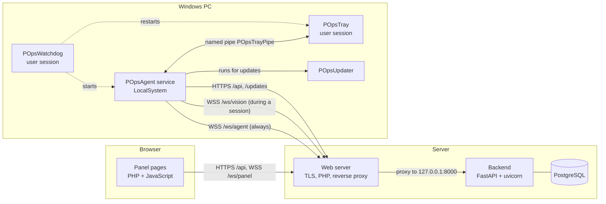

# Architecture

POps has three parts: a **web panel** for administrators, a **central server** (API, WebSocket hub and database),
and an **agent** on every managed Windows PC. Agents keep a permanent outbound connection to the server, so the
server can reach PCs behind NAT without opening ports on them.

## Components

### Web panel

PHP 8 pages in `Dashboard/` with plain JavaScript. PHP signs the user in (server to server, through
`POPS_API_INTERNAL_URL`), keeps the session and checks page access; the pages then call the API and the panel
WebSocket directly from the browser on the same origin. See [`dashboard.md`](dashboard.md).

### Backend

A FastAPI application (`Backend/server.py`) served by uvicorn, with the code in the `Backend/pops/` package and
`Backend/system_routes.py`. It provides the REST API, three WebSocket endpoints, the static download folders and
the task queue, and it applies database migrations at startup. A background loop runs every 30 seconds: it
queues scheduled tasks that are due and raises a notification for agent updates that were never answered.
Notifications are stored for the panel's bell and, if configured, sent by e-mail or webhook. Code layout:
[`backend.md`](backend.md). Endpoints: [`api.md`](api.md).

Some state is kept only in the backend process's memory: which agents and panels are connected, the Vision
sockets, remote-control session grants, pending screenshot requests, updates waiting for a result, and the
notification de-duplication and rate counters. Everything else is in PostgreSQL
([`database.md`](database.md)). Because of the in-memory state the backend runs as a single worker.

### Database

PostgreSQL, accessed with asyncpg. The schema is created and upgraded only by numbered SQL migrations.

### Agent

Four .NET 8 programs installed by one MSI ([`agent.md`](agent.md)):

- **POpsAgent** (Windows service, LocalSystem): server connection, commands, inventory, quarantine, updates.
- **POpsTray** (user session): everything the user sees, screen capture and remote input.
- **POpsWatchdog** (user session): keeps the tray and the service running.
- **POpsUpdater**: installs signed updates and rolls back failed ones.

## Communication

| From → to | Channel | Authentication | Purpose |
| --- | --- | --- | --- |
| Browser → backend | HTTPS `/api/…` | JWT in the `pops_jwt` cookie (+ `X-Requested-With`) or `Authorization: Bearer` | All panel actions. |
| Browser ↔ backend | WSS `/ws/panel` | `pops_jwt` cookie | Task output, update and capability events, screen previews and frames; remote input to PCs. |
| PHP → backend | HTTP `POPS_API_INTERNAL_URL` | username/password (+ TOTP) | Login only. |
| Agent ↔ backend | WSS `/ws/agent/{hw_id}` | enrollment token, then per-device secret | Heartbeats every 5 s, commands and their results, update results, capabilities. |
| Agent ↔ backend | WSS `/ws/vision/{hw_id}` | same | Live frames and remote input, only during a remote-control session. |
| Agent → backend | HTTPS `/api/agent_policies`, `/api/inventory/{hw_id}` | `X-Agent-Id` + `X-Agent-Secret` (inventory) | Policy (every 60 s), hardware inventory. |
| Agent → backend | HTTPS `/updates/<msi>`, `/download/<file>?sig=…` | none for updates (the agent verifies the signed manifest); a signed link for deployment files, whose SHA-256 the deployment script checks | Signed update package, deployment files. |
| Service ↔ tray | named pipe `POpsTrayPipe` | the service checks the client is the installed `POpsTray.exe` | Consent, notices, lock screen, capture, remote input. |
| Backend → GitHub | HTTPS | none | Version check and signed release download (optional; works offline without it). |
| Backend → mail server, webhook | SMTP, HTTP(S) `POST` | SMTP login from `.env` | Notifications, only if configured. |

All traffic between PCs and the server is TLS; the agent refuses a plain `http://` server that is not on the same
machine.

## Main flows

### Enrollment and connection

1. A superadmin creates an enrollment token (bound to a lab, with an expiry and a number of uses).
2. The MSI writes the server URL and the token on the PC.
3. The service connects to `/ws/agent/{hw_id}` with the token. The server reconciles the hardware fingerprint
   (it may assign a different ID), consumes one use of the token, moves the device to the token's lab, stores the
   SHA-256 of a new device secret and sends the secret to the agent.
4. Later connections present the secret. Once `enforce_agent_auth` is on, connections without valid credentials
   are rejected with `4401` and audited.

### Running a command

1. An admin queues commands on the Deployment or Terminal page or in the Vision diagnostics dialog
   (`POST /api/deploy_orchestration`), or a scheduled task becomes due; each step becomes one task per target PC,
   recorded with the requesting user.
2. The queue sends `execute` to idle online PCs, at most `concurrent_limit` at a time, and writes each dispatch to
   the hash-chained audit log.
3. The service runs the command as SYSTEM (unless the terminal capability is off) and returns the output. The
   backend stores it, pushes it to the panels (`terminal_output`) and dispatches the next task.

### Remote-control session

An admin opens a recorded session with a reason; the PC's user accepts it (or sees a mandatory countdown); the
tray captures the screen and the service streams it over `/ws/vision`; the backend forwards frames only to that
admin. Details: [`vision.md`](vision.md).

### Signed agent update

1. CI builds the release and signs `manifest.json` (SHA-256 of every file, version, tag, time) with an ed25519 key
   held only in GitHub secrets.
2. A superadmin stages the release on the server (download from GitHub or upload). The server verifies the
   signature with `keys/pops_release_ed25519.pub.pem` and the SHA-256 of each file.
3. The server sends `update_agent` with the signed manifest to the chosen online agents and serves the MSI at
   `/updates/`.
4. Each agent verifies the signature with its compiled-in key, refuses a version that is not newer, downloads and
   checks the MSI, and hands it to `POpsUpdater`, which installs it, waits for a health signal and rolls back on
   failure. The result is reported back and written to the audit log.

A compromised server can trigger an update only to a genuinely signed, newer release.

### Server self-update

The backend (not root) writes a request file; a root systemd path unit fetches `origin/main` and runs the deploy
script, which health-checks the new code and restores the previous code if the check fails. Details:
[`self-update.md`](self-update.md).

## Design rules

- **Transparent by design.** Remote sessions ask for consent or show a notice with the reason; previews are
  announced on the tray; the tray is always visible; there is no keystroke logging.
- **The PC has the last word on dangerous capabilities.** The server can switch terminal and Vision off but never
  on.
- **Updates are trusted by signature, not by source.** Neither the server nor the download location can make an
  agent install an unsigned or older package.
- **Security-relevant actions are recorded in a log agents cannot write,** chained with SHA-256 so changes are
  detectable.
- **No secrets in code.** Server secrets come from `.env`; agent secrets live in a SYSTEM-only folder.

## Repository layout

| Path | Contents |
| --- | --- |
| `Backend/` | FastAPI backend, migrations, `setup_env.py`, tests. |
| `Dashboard/` | PHP panel (`public` is a symlink to it). |
| `Agent/` | .NET agent projects and unit tests. |
| `Installer/agent/` | WiX MSI project and custom actions. |
| `Installer/server/` | `install.sh`, nginx example, `pops-deploy-backend`, self-update script and systemd units. |
| `docker/`, `docker-compose.yml` | Optional container setup ([`docker.md`](docker.md)). |
| `keys/` | Release public key. |
| `tools/` | `sign_release.py` (release signing), `agent_simulator.py` (load test). |
| `.github/workflows/` | CI (`ci.yml`), release (`release.yml`), CodeQL. |
| `VERSION` | Single version source for the server, the agent and the MSI. |
