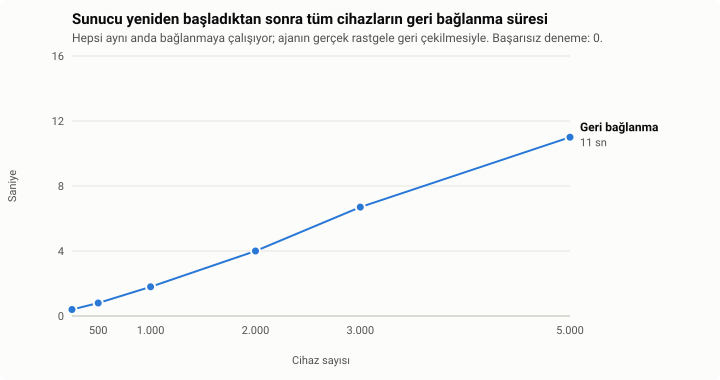
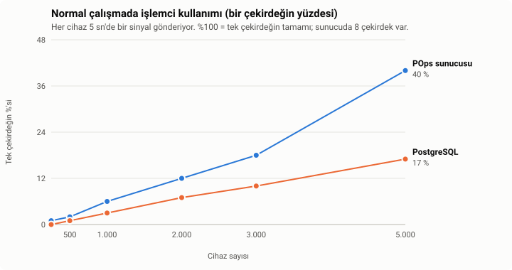
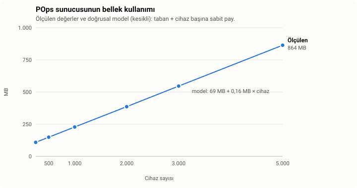
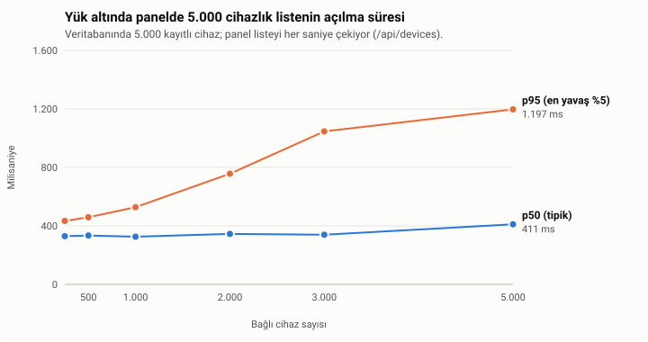
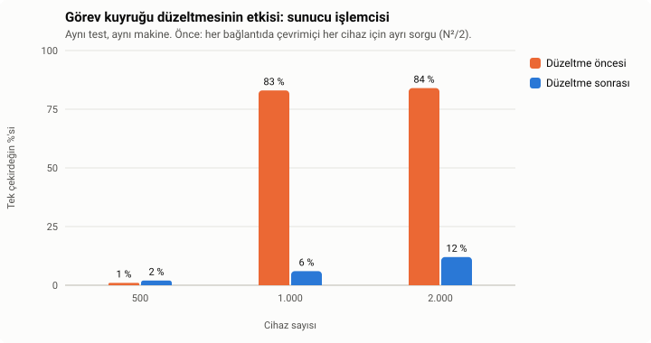

# POps Kapasite ve Donanım Raporu

**Ölçüm tarihi:** 29 Eylül 2026 · **Sürüm:** 0.1.11-alpha · **Ham veri:** [`olcum.json`](olcum.json) ·
**Grafikler:** [`tools/bench_charts.py`](../../tools/bench_charts.py) ile bu veriden üretilir.

Bu rapor "binlerce cihazı yönetir" gibi bir iddia değil, **tekrarlanabilir bir ölçümdür**. Kullanılan donanım,
senaryo ve komutlar aşağıda; her kurum aynı testi kendi sunucusunda koşup kendi sayılarını görebilir. Ölçülen ile
tahmin edilen her yerde ayrı yazılmıştır.

## Özet

- **Tek sunucu, tek süreç 5.000 cihazı taşıyor.** Sunucu yeniden başladığında 5.000 cihazın hepsi **11 saniyede**,
  tek bir başarısız deneme olmadan geri bağlandı.
- **Normal çalışmada yük düşük.** 5.000 cihazda POps sunucusu bir işlemci çekirdeğinin **%40**'ını, veritabanı
  **%17**'sini kullanıyor. Test makinesinde 8 çekirdek var; yani makinenin toplam gücünün yaklaşık **%7**'si.
- **Bellek öngörülebilir:** yaklaşık **69 MB + cihaz başına 0,16 MB**. 5.000 cihazda 864 MB.
- **Ölçüm bir darboğaz buldu ve düzeltildi.** Önceki sürümlerde 1.000 cihazdan itibaren sunucu işlemcisi %83–84'e
  çıkıyordu; sebep, her bağlantıda çevrimiçi her cihaz için ayrı veritabanı sorgusu atan görev kuyruğuydu. Düzeltme
  0.1.11'de.
- **İyileştirilecek nokta:** 5.000 cihazlık listenin panelde açılması tipik olarak 0,3–0,4 sn, yük altında en yavaş
  %5'te 1,2 sn'ye çıkıyor. Liste sayfalanınca düzelecek (bkz. [Yol haritası](#8-iyileştirme-yol-haritası)).

## 1. Neyi ölçtük

En zor an, **sunucunun yeniden başladığı andır**: güncelleme, elektrik kesintisi ya da bakım sonrası bütün
bilgisayarlar aynı anda yeniden bağlanmaya çalışır. Test bu anı canlandırır:

1. Veritabanına önce 5.000 cihaz kaydedilir (gerçek bir ilçe kurulumu gibi, cihazlar sunucuda zaten tanınıyor).
2. Sunucu yeniden başlatılır.
3. N sanal ajan **aynı anda** bağlanmaya çalışır. Bağlanamayan, gerçek ajanın (0.1.8+) yaptığının aynısını yapar:
   rastgele bir süre bekleyip yeniden dener (0 ile min(60 sn, 2 sn × 2^deneme) arası).
4. Hepsi bağlandıktan sonra 40 saniye boyunca ölçülür: her cihaz 5 saniyede bir sinyal gönderir (gerçek ajanla
   aynı), sunucu her sinyalde veritabanına yazar.

Her N için iki tur yapıldı: **yalnızca ajanlar** ve **ajanlar + panel açık** (bir yönetici paneli açık tutuyor,
5.000 cihazlık liste her saniye yenileniyor; gerçek panel 5 sn'de bir yeniler, yani bu tur gerçekten ağırdır).

## 2. Test ortamı

| | |
|---|---|
| İşlemci | AMD EPYC 7642, sanal makine, **8 vCPU** |
| Bellek | 11,7 GB |
| İşletim sistemi | AlmaLinux 9.8 |
| Veritabanı | PostgreSQL 13.23, **başka sitelerle paylaşımlı** (sonuçları olumsuz yönde etkiler) |
| POps | 0.1.11-alpha, **tek süreç (tek uvicorn worker)**, veritabanı havuzu 20 bağlantı |
| Simülatör | Aynı makinede, tek Python süreci ([`tools/agent_simulator.py`](../../tools/agent_simulator.py)) |

Simülatörün aynı makinede çalışması, sunucunun kullanabileceği işlemciyi azaltır; gerçek kurulumda cihazlar ayrı
makinelerdir. Ağ gecikmesi ise bu testte yoktur (bkz. [Sınırlar](#7-ölçülmeyenler-ve-sınırlar)).

## 3. Sonuçlar

### 3.1 Yeniden başlatmadan sonra geri bağlanma

<picture>
  <source media="(prefers-color-scheme: dark)" srcset="toparlanma-koyu.svg">
  
</picture>

| Cihaz | 250 | 500 | 1.000 | 2.000 | 3.000 | 5.000 |
|---|---:|---:|---:|---:|---:|---:|
| Hepsinin bağlanma süresi | 0,4 sn | 0,8 sn | 1,8 sn | 4,0 sn | 6,7 sn | 11,0 sn |
| Başarısız bağlanma denemesi | 0 | 0 | 0 | 0 | 0 | 0 |

Süre cihaz sayısıyla doğru orantılı büyüyor (saniyede ~450–500 yeni bağlantı) ve hiçbir cihaz reddedilmiyor.

### 3.2 İşlemci

<picture>
  <source media="(prefers-color-scheme: dark)" srcset="islemci-koyu.svg">
  
</picture>

| Cihaz | 250 | 500 | 1.000 | 2.000 | 3.000 | 5.000 |
|---|---:|---:|---:|---:|---:|---:|
| POps sunucusu (yalnız ajanlar) | %1 | %2 | %6 | %12 | %18 | %40 |
| PostgreSQL | %0 | %1 | %3 | %7 | %10 | %17 |
| POps sunucusu (panel açık, liste her saniye) | %17 | %18 | %21 | %28 | %37 | %57 |

Yüzdeler **tek bir çekirdeğe** göredir (%100 = bir çekirdeğin tamamı). POps tek süreç olarak çalıştığı için bir
çekirdek, sunucu tarafının üst sınırıdır; 5.000 cihazda panel açıkken bile bunun yarısı kullanılıyor.

### 3.3 Bellek

<picture>
  <source media="(prefers-color-scheme: dark)" srcset="bellek-koyu.svg">
  
</picture>

| Cihaz | 250 | 500 | 1.000 | 2.000 | 3.000 | 5.000 |
|---|---:|---:|---:|---:|---:|---:|
| POps sunucusu (RSS) | 109 MB | 149 MB | 228 MB | 386 MB | 546 MB | 864 MB |

Ölçümlere oturan doğrusal model: **bellek ≈ 69 MB + 0,16 MB × cihaz**. Bu yalnızca POps sunucusudur; PostgreSQL,
işletim sistemi ve panel (nginx + PHP) ayrıca bellek ister (bkz. [Donanım önerisi](#5-donanım-önerisi)).

### 3.4 Veritabanı yükü

| Cihaz | 250 | 500 | 1.000 | 2.000 | 3.000 | 5.000 |
|---|---:|---:|---:|---:|---:|---:|
| Sinyal yazması (saniyede) | 50 | 92 | 179 | 398 | 586 | 875 |
| PostgreSQL işlemcisi | %0 | %1 | %3 | %7 | %10 | %17 |

Her cihaz 5 saniyede bir "çevrimiçiyim" yazar: **cihaz başına saniyede 0,2 yazma**. 5.000 cihazda beklenen 1.000
yazma/sn yerine 875 ölçüldü; fark, aynı makinedeki tek süreçlik simülatörün 5.000 bağlantıyı sürerken geride
kalmasından. Paylaşımlı bir PostgreSQL bile bu yükü rahat taşıyor; yine de 5.000 cihaz üstü için SSD disk şart.

### 3.5 Panel tepki süresi

<picture>
  <source media="(prefers-color-scheme: dark)" srcset="panel-koyu.svg">
  
</picture>

| Bağlı cihaz | 250 | 500 | 1.000 | 2.000 | 3.000 | 5.000 |
|---|---:|---:|---:|---:|---:|---:|
| 5.000 cihazlık liste, tipik (p50) | 330 ms | 334 ms | 326 ms | 345 ms | 340 ms | 411 ms |
| 5.000 cihazlık liste, en yavaş %5 (p95) | 434 ms | 459 ms | 528 ms | 757 ms | 1.046 ms | 1.197 ms |
| Sağlık ucu, en yavaş %5 | 27 ms | 240 ms | 159 ms | 286 ms | 161 ms | 176 ms |

Listenin tamamı her istekte hazırlandığı için 5.000 kayıtta tipik açılış 0,3–0,4 sn. Liste hazırlanırken sunucu
kısa bir an başka isteklere bekletiyor; en basit uçta bile en yavaş %5'in 150–290 ms'ye çıkması bundandır. Ajan
bağlantıları bundan etkilenmiyor (tüm testlerde başarısız deneme 0), ama panel için
[iyileştirme](#8-iyileştirme-yol-haritası) listede.

### 3.6 Ölçümün bulduğu darboğaz

<picture>
  <source media="(prefers-color-scheme: dark)" srcset="duzeltme-koyu.svg">
  
</picture>

İlk ölçümde 1.000 cihazdan itibaren sunucu işlemcisi %83–84'e çıktı ve istemciler gittikten dakikalar sonra bile
düşmedi. Sebep: her ajan bağlandığında görev kuyruğu, **çevrimiçi her cihaz için ayrı bir veritabanı sorgusu**
atıyordu; N cihaz aynı anda gelince bu yaklaşık N²/2 sorgu ediyor (2.000 cihazda ~2 milyon). Önceki raporda
görülen "500 cihazlık fırtınada bağlantı düşüyor" bulgusunun asıl nedeni buydu, tek süreç olması değil.

Düzeltme (0.1.11): bekleyen görev yoksa kuyruk tek ucuz sorguyla çıkıyor; varsa bütün boştaki cihazların
görevleri tek sorguda alınıyor; aynı anda gelen çağrılar üst üste yığılmıyor. Aynı test, aynı makine: 1.000
cihazda %83 → %6, 2.000 cihazda %84 → %12.

## 4. Cihaz başına maliyet

| Kaynak | Cihaz başına | 5.000 cihazda |
|---|---|---|
| POps sunucusu işlemcisi | ~%0,008 çekirdek | %40 çekirdek |
| PostgreSQL işlemcisi | ~%0,0035 çekirdek | %17 çekirdek |
| POps sunucusu belleği | ~0,16 MB (+69 MB taban) | 864 MB |
| Veritabanı yazması | 0,2 yazma/sn | ~1.000 yazma/sn |
| Ağ (sinyal) | ~100 bayt / 5 sn | ~100 KB/sn |

## 5. Donanım önerisi

Aşağıdaki değerler POps sunucusu, PostgreSQL, işletim sistemi ve panel (nginx + PHP) **birlikte** aynı makinede
çalıştığında içindir ve ölçülen değerlerin en az iki katı pay bırakır.

| Cihaz sayısı | Örnek | vCPU | Bellek | Disk | Dayanak |
|---|---|---:|---:|---|---|
| 500'e kadar | Tek okul | 2 | 4 GB | 40 GB SSD | **Ölçüldü** |
| 2.000'e kadar | Birkaç okul, küçük ilçe | 4 | 8 GB | 60 GB SSD | **Ölçüldü** |
| 5.000'e kadar | İlçe | 4 | 8 GB | 100 GB SSD | **Ölçüldü** |
| 10.000'e kadar | Büyük ilçe, il | 8 | 16 GB | 200 GB SSD | Tahmin (aşağıdaki not) |
| 10.000 üstü | İl geneli | — | — | — | Önce [yol haritasındaki](#8-iyileştirme-yol-haritası) iyileştirmeler |

**10.000 cihaz notu:** Doğrusal uzatıldığında POps sunucusu tek çekirdeğin ~%80'ine, bellek ~1,7 GB'a, veritabanı
~2.000 yazma/sn'ye çıkar. Tek süreç için sınıra yakın olduğundan bu ölçekten önce sinyallerin toplu yazılması
(yazmayı 6–12 kat azaltır) yapılmalı ve ölçüm tekrarlanmalıdır.

Disk: veritabanı küçük kalır (bugün birkaç on MB); diskin çoğunu ajan paketleri ve gece yedekleri kaplar. Her yedek
sunucudaki ajan paketlerini de içerir (sunucuda tutulan her ajan sürümü için ~80 MB); saklama ayarları için
[`../backup.md`](../backup.md) içindeki *Retention* bölümüne bakın. Yedeğin bir kopyasının **başka bir makinede** tutulması önerilir (bkz. [`../backup.md`](../backup.md)).

Uzaktan ekran izleme (Vision) bu tabloya dahil değildir: her açık izleme oturumu, cihaz başına en fazla 5 kare/sn
görüntüyü sunucu üzerinden taşır ve ayrıca ağ ile işlemci ister. Aynı anda çok sayıda cihaz izlenecekse ağ
kapasitesi buna göre planlanmalıdır.

## 6. Güvenilirlik

- Bütün turlarda **0 başarısız bağlantı** ve **0 panel hatası**.
- Sunucu tek süreç olduğu için süreç çökerse bütün cihazlar bağlantıyı kaybeder; systemd sunucuyu birkaç saniyede
  yeniden başlatır ve 3.1'deki tablo geri bağlanma süresini gösterir (5.000 cihaz için 11 sn). Bu, bir **yedeklilik**
  konusudur, kapasite değil: kesintisiz çalışma gerekiyorsa ikinci sunucu ve paylaşılan durum (Redis) gerekir.
  Bugünkü sayılar için kapasite açısından gerekli değildir.

## 7. Ölçülmeyenler ve sınırlar

- **Gerçek ağ:** Cihazlar ve sunucu aynı makinedeydi; okul ağındaki gecikme ve paket kaybı test edilmedi. Gecikme
  sunucu yükünü artırmaz, ama bağlanma sürelerini uzatır.
- **Uzaktan ekran izleme (Vision):** Kare aktarımı ölçülmedi.
- **Çok sayıda panel kullanıcısı:** Tek panel, her saniye yenilenen liste ile ölçüldü.
- **Kimlik doğrulama:** Test ajanları anahtarsız (geçiş kipinde) bağlandı; anahtarlı bağlantı, bağlantı başına bir
  indeksli sorgu ve bir SHA-256 ekler (ihmal edilebilir).
- **Paylaşımlı veritabanı:** PostgreSQL aynı anda başka sitelere de hizmet veriyordu; ayrılmış bir sunucuda sonuçlar
  daha iyi olur.

## 8. İyileştirme yol haritası

| İyileştirme | Etkisi | Ne zaman gerekir |
|---|---|---|
| Cihaz listesinin sayfalanması / hazırlanmasının ayrı iş parçacığına alınması | Panel 5.000 cihazda 0,4 sn yerine anında; diğer isteklerdeki kısa beklemeler kalkar | 2.000+ cihaz |
| Sinyallerin toplu yazılması ("son görülme" bellekte, 30–60 sn'de bir toplu) | Veritabanı yazması 6–12 kat azalır | 10.000 cihaza yaklaşırken |
| Bağlanırken donanım kimliği eşleştirmesinin yalnızca ilk bağlantıda / değişiklikte yapılması | Yeniden başlatma sonrası geri bağlanma hızlanır | 10.000+ |
| İkinci sunucu + paylaşılan durum (Redis) | Sunucu çökse bile kesinti olmaz | Kesintisiz çalışma şartı varsa |

## 9. Kendi sunucunuzda tekrarlamak

Canlı veritabanına karşı **çalıştırmayın**; boş bir test veritabanı ve ayrı bir port kullanın.

```bash
# 1) Boş test veritabanı ve geçici sunucu (ör. 8099 portunda, tek süreç)
export DB_HOST=127.0.0.1 DB_PORT=5432 DB_USER=<kullanıcı> DB_PASS=<parola> DB_NAME=pops_bench JWT_SECRET=bench
cd Backend && python migrate.py && python -m uvicorn server:app --host 127.0.0.1 --port 8099 &
SERVER_PID=$!
ulimit -n 65536

# 2) Isınma: cihazları bir kez kaydet
python ../tools/agent_simulator.py --n 5000 --url ws://127.0.0.1:8099 --ramp 0.004 --duration 3 --reconnect

# 3) Sunucuyu yeniden başlatıp fırtına: hepsi aynı anda, gerçek ajanın geri çekilmesiyle
kill $SERVER_PID; python -m uvicorn server:app --host 127.0.0.1 --port 8099 & SERVER_PID=$!
python ../tools/agent_simulator.py --n 5000 --url ws://127.0.0.1:8099 --ramp 0 --reconnect \
    --duration 40 --hb 5 --server-pid $SERVER_PID
```

Çıktıda `all_connected_after` geri bağlanma süresini, `server cpu` ve `rss` sunucu yükünü, `failed_attempts`
başarısız denemeleri verir. Sonuçları `olcum.json` biçiminde kaydedip `python tools/bench_charts.py` ile bu
rapordaki grafikleri kendi verinizle üretebilirsiniz.
