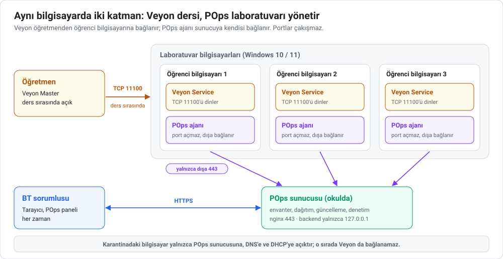

# POps ve Veyon birlikte nasıl kullanılır?

Okullarda POps'tan söz edildiğinde ilk duyulan cümle çoğu zaman "biz zaten Veyon kullanıyoruz" olur. İkisi aynı işi
yapmaz ve aynı bilgisayarda yan yana çalışabilir:

> **Veyon, öğretmenin dersi yönetme aracıdır. POps, BT ekibinin laboratuvarı işletme katmanıdır.**

Öğretmen Veyon'u ders başında açar; ekranları izler, kendi ekranını sınıfa yansıtır, gerektiğinde ekranları kilitler
ve ders bitince kapatır. POps ise bilgisayarlar açık olduğu sürece arka planda çalışır: envanter, yazılım dağıtımı,
güncelleme, uzaktan destek, karantina ve "kim ne yaptı" kaydı.

<picture>
  <source media="(prefers-color-scheme: dark)" srcset="../../assets/readme/veyon.tr-dark.svg">
  
</picture>

## Kim ne yapar?

| İş | Kim | Araç |
| :--- | :--- | :--- |
| Ders sırasında öğrenci ekranlarını izlemek | Öğretmen | Veyon |
| Kendi ekranını sınıfa yansıtmak | Öğretmen | Veyon |
| Dikkati toplamak için ekranları kilitlemek | Öğretmen | Veyon |
| Ders içinde bir öğrencinin ekranında yardım etmek | Öğretmen | Veyon |
| Arızalı bir bilgisayara uzaktan destek | BT | POps: **Vision** (kullanıcının onayıyla) ya da **Uzak komut** |
| Programları kurmak ve güncellemek | BT | POps: **Dağıtım** |
| Donanım ve yazılım envanteri, lisans takibi | BT | POps: **Kayıtlar**, **Raporlar** |
| Windows güncellemelerini izlemek ve kurmak | BT | POps |
| Kapalı bilgisayarları açmak | BT | POps: Wake-on-LAN |
| Güvenlik olayında bilgisayarı ağdan ayırmak | BT | POps: **Karantina** |
| Arıza bildirmek | Öğrenci, öğretmen | POps: tepsideki **Sorun bildir** |
| Kim, ne zaman, ne yaptı? | BT, okul yönetimi | POps: denetim kaydı ve bilgisayardaki olay günlüğü |
| Veyon'u kurmak, güncellemek, yapılandırmasını dağıtmak | BT | POps: **Dağıtım** (aşağıda) |

Kısacası: **ders** Veyon'da, **laboratuvarın kendisi** POps'ta.

## Aynı bilgisayara kurulum

### Portlar çakışmaz

POps ajanı bilgisayarda hiçbir ağ portu dinlemez. Sunucuya kendisi, dışa doğru 443 numaralı porttan bağlanır.
Veyon ise öğrenci bilgisayarında bir port dinler, öğretmen bilgisayarı ona bağlanır. İkisinin kullandığı portlar
ayrıdır:

| Bileşen | Nerede çalışır | Dinlediği port | Açtığı bağlantı |
| :--- | :--- | :--- | :--- |
| Veyon Service | Öğrenci bilgisayarı | TCP 11100 (Veyon sunucu portu) | — |
| Veyon Master | Öğretmen bilgisayarı | TCP 11400 (ekran yansıtma, demo sunucusu) | Öğrenci bilgisayarlarına TCP 11100 |
| POps ajanı (servis ve tepsi) | Öğrenci bilgisayarı | Yok | POps sunucusuna TCP 443: komut kanalı ve gerektiğinde Vision kanalı (WebSocket, TLS) |
| POps servis ile tepsi arası | Öğrenci bilgisayarı | Ağ portu değil: yerel adlandırılmış kanal `POpsTrayPipe` | — |
| POps Wake-on-LAN | Sunucu (ve aynı labdaki açık bir bilgisayar) | — | UDP 9, yerel ağa yayın |
| POps sunucusu | Okuldaki Linux sunucu | 443 (HTTPS) ve 80 (HTTPS'e yönlendirme); backend yalnızca `127.0.0.1:8000` | — |

Veyon port numaraları Veyon'un varsayılanlarıdır ve Veyon Configurator'da değiştirilebilir
([Veyon belgeleri](https://docs.veyon.io/en/latest/admin/troubleshooting.html)). Veyon, varsayılan ayarıyla
Windows Güvenlik Duvarı'na kendi istisnasını ekler. POps ise güvenlik duvarına yalnızca karantina sırasında kural
ekler (aşağıya bakın). POps tarafındaki ayrıntılar: [`docs/agent.md`](../agent.md),
[`docs/getting-started.md`](../getting-started.md#what-you-need).

### Kurulum sırası

1. **Dondurma yazılımı varsa** (Deep Freeze, Shadow Defender) bilgisayarları çözün. İki aracı da dondurmadan önce
   kurup yapılandırın; dondurulmuş bilgisayarda sonradan yapılan her ayar yeniden başlatınca kaybolur. POps için
   ayrıntı: [`Agent/README.md`](../../Agent/README.md#machines-with-freeze-software).
2. **POps ajanını kurun** ve bilgisayarların panelde göründüğünü denetleyin:
   [Pilot okul kurulumu](pilot-okul.md#kurulum-günü-yaklaşık-1-saat).
3. **Veyon'u POps ile dağıtın** (isteğe bağlı ama pratik). **Dağıtım** sayfası içinde `install.bat` bulunan bir
   ZIP'i bilgisayarlara indirir, açar ve `install.bat`'ı SYSTEM olarak çalıştırır. Örnek bir paket:

   ```
   veyon-ogrenci.zip
   ├── install.bat
   ├── veyon-<sürüm>-win64-setup.exe     Veyon'un sitesinden indirilen kurulum dosyası
   ├── veyon-ogrenci.json               Veyon Configurator'dan dışa aktarılan yapılandırma
   └── ogretmen_public_key.pem          yalnızca GENEL anahtar (anahtar dosyasıyla kimlik doğrulamada)
   ```

   `install.bat`:

   ```bat
   @echo off
   rem Öğrenci bilgisayarı: Veyon Master kurulmaz, yapılandırma kurulumdan sonra içe aktarılır.
   "%~dp0veyon-<sürüm>-win64-setup.exe" /S /NoMaster /ApplyConfig=%~dp0veyon-ogrenci.json
   if errorlevel 1 exit /b %errorlevel%
   rem Anahtar dosyasıyla kimlik doğrulama kullanıyorsanız genel anahtarı içe aktarın.
   rem Kurulum klasörü farklıysa yolu değiştirin.
   "%ProgramFiles%\Veyon\veyon-cli.exe" authkeys import ogretmen/public "%~dp0ogretmen_public_key.pem"
   exit /b %errorlevel%
   ```

   - `/S`, `/NoMaster` ve `/ApplyConfig=` Veyon kurulum programının parametreleridir; `/ApplyConfig` mutlak yol
     ister, `%~dp0` bunu sağlar ([Veyon kurulum belgesi](https://docs.veyon.io/en/latest/admin/installation.html),
     [veyon-cli](https://docs.veyon.io/en/latest/admin/cli.html)). Komutları kendi Veyon sürümünüzün belgesiyle
     karşılaştırın.
   - **Özel anahtarı asla bu pakete koymayın.** Özel anahtar yalnızca öğretmen bilgisayarlarında durur ve oraya
     elle kurulur. POps'a yüklenen dosyalar sunucuda saklanır ve imzalı bir bağlantıyla indirilebilir.
   - Önce **tek bir bilgisayara** gönderin. Sonuç **İşlemler** sayfasında görünür; bilgisayarda ilerleme
     `C:\POpsLogs\deploy_trace.txt` dosyasına yazılır. Sorun yoksa bütün laba gönderin.
   - Çıkış kodu 0 ve 3010 başarı sayılır. **Bitince yeniden başlat** seçeneğini ders saatinde kullanmayın.
4. **Öğretmen bilgisayarına** Veyon Master'ı Veyon belgelerine göre kurun. Öğretmen bilgisayarı da POps ile
   yönetiliyorsa, uzaktan terminal ve ekran izlemenin orada gerekip gerekmediğine karar verin (aşağıda).

## Dikkat edilecekler

- **Karantina Veyon'u da keser.** POps karantinası kilit ekranı açar ve Windows Güvenlik Duvarı'na kurallar ekler:
  bilgisayar yalnızca POps sunucusuna, DNS'e ve DHCP'ye erişebilir. Bu sırada öğretmen o bilgisayara Veyon ile
  bağlanamaz. Karantina kalkınca kurallar silinir ve güvenlik duvarının önceki durumu geri yüklenir.
- **Sınav modu da Veyon'u kesebilir.** POps sınav modu karantinanın ağ yalıtımını kullanır: sınav süresince
  bilgisayar yalnızca POps sunucusuna, DNS'e, DHCP'ye ve izin listesindeki adreslere erişir. Sınav sırasında öğretmen
  Veyon ile izlemek istiyorsa öğretmen bilgisayarının IP adresini izin listesine ekleyin ve sınavdan önce bir
  bilgisayarda deneyin. Sınav modu ekranı izlemez; ders içi izleme yine Veyon'un işidir.
- **İki ayrı kilit, iki ayrı amaç.** Veyon'un ekran kilidi ders içindir. POps karantinası bir güvenlik olayı içindir
  (örneğin zararlı yazılım şüphesi); denetim kaydına gerekçesiyle yazılır. Karantinayı ders disiplini için
  kullanmayın.
- **Ekranı iki araç da görebilir; gerekmiyorsa birini kapatın.** Öğretmenlerin Veyon kullandığı bir labda BT'nin de
  ekran görmesi gerekmiyorsa POps Vision'ı kapatabilirsiniz:
  - kurulumda `VISION_ENABLED=0`: bilgisayarın kendisinde kilitlenir, sunucu geri açamaz;
  - ya da sunucuda o laba özel `vision` modülünü kapatarak: geri açılabilir. Bunun için bugün panelde bir sayfa
    yoktur; superadmin `POST /api/modules/vision` ile `{"enabled": false, "lab": "<lab adı>"}` gönderir
    ([`docs/api.md`](../api.md#modules-and-install-profiles)).
- **Şeffaflık kuralları araca göre değişir.** POps'un onay, duyuru ve "son 30 gün" listesi yalnızca POps
  oturumları için geçerlidir. Veyon oturumunda öğrencinin ne gördüğü Veyon'un kendi ayarlarına bağlıdır.
- **KVKK aydınlatma metninde ikisini de anın.** Öğretmenin ders sırasında Veyon ile ekran izleyebildiğini, BT'nin
  POps ile onaylı ya da duyurulu destek oturumu açabildiğini yazın. Şablon: [`kvkk-aydinlatma.md`](../kvkk-aydinlatma.md).
- **Öğretmen ve personel bilgisayarları.** Bu bilgisayarlarda uzaktan terminale ve ekran izlemeye çoğu zaman
  gerek yoktur. POps ajanını `TERMINAL_ENABLED=0 VISION_ENABLED=0` ile kurarsanız envanter, güncelleme ve yardım
  masası çalışmaya devam eder; sunucu ele geçirilse bile o bilgisayarda komut çalıştırılamaz.

## Tipik bir gün

Örnek bir okul günü; saatler yalnızca fikir vermek içindir.

| Saat | Kim | Ne olur |
| :--- | :--- | :--- |
| 07.45 | BT | POps'ta **Kontrol merkezi**'ne ve **Bildirimler**'e bakar: gece çalışan görevlerin sonuçları, çevrimdışı bilgisayarlar, başarısız güncellemeler, dolan disk ya da süresi biten sertifika uyarıları. Kapalı kalan bilgisayarları Wake-on-LAN ile açar. |
| 08.30 | Öğretmen | Derste Veyon Master'ı açar, öğrenci ekranlarını izler, bir örneği kendi ekranından sınıfa yansıtır. Ders bitince kapatır. POps bu sırada arka planda çalışır; BT'nin yapacağı bir şey yoktur. |
| 10.15 | Öğrenci, BT | Teneffüste bir öğrenci tepsideki **Sorun bildir** ile "yazıcı çıktı vermiyor" yazar. BT talebi **Destek talepleri**'nde görür, **Uzak komut**'taki **Yazıcı kuyruğunu sıfırla** komutunu o bilgisayara gönderir ve talebi yanıtlar. |
| 12.30 | BT | Öğretmenin istediği programı **Dağıtım** ile bütün laba gönderir. Kapalı bilgisayarlar için **Kapalılar açılınca kursun** seçeneğini açar. |
| 14.00 | BT | Bir öğretmen, bir bilgisayarda programın açılmadığını söyler. BT **Vision**'da **Kullanıcıya sor** seçeneğiyle bir oturum açar; bilgisayardaki kişi kabul edince ekranı görür ve sorunu çözer. Oturum, gerekçesiyle denetim kaydına ve bilgisayarın olay günlüğüne yazılır; tepsideki "son 30 gün" listesinde de görünür. |
| Gece | POps | Zamanlanmış bir görev (örneğin geçici dosyaların temizlenmesi) bilgisayarlarda çalışır; sunucunun yedeği alınır ve sınanır. |

## Sık sorulanlar

**Veyon'u kaldırıp yalnızca POps kullanabilir miyiz?** Önermiyoruz. POps'ta ekran yansıtma, sınıfa demo ya da
öğretmen odaklı bir ders ekranı yoktur; POps bir ders aracı değildir.

**POps, Veyon'un yaptığı bağlantıları görür ya da engeller mi?** Hayır. Karantina dışında POps, Veyon'un
bağlantılarına karışmaz.

**İkisi bilgisayarı yavaşlatır mı?** Bunu ölçmedik. POps ajanının sunucu tarafındaki yükü
[kapasite raporunda](../kapasite/README.md) ölçülmüştür; bilgisayardaki kaynak kullanımına dair bir ölçüm henüz
yoktur. Pilotunuzda gözlemlerinizi paylaşırsanız bu bölümü güncelleriz.

Karşılaştırmanın İngilizce aslı: [`docs/positioning.md`](../positioning.md). POps'un ne olduğu ve ne olmadığı:
[Neden POps?](neden-pops.md)
